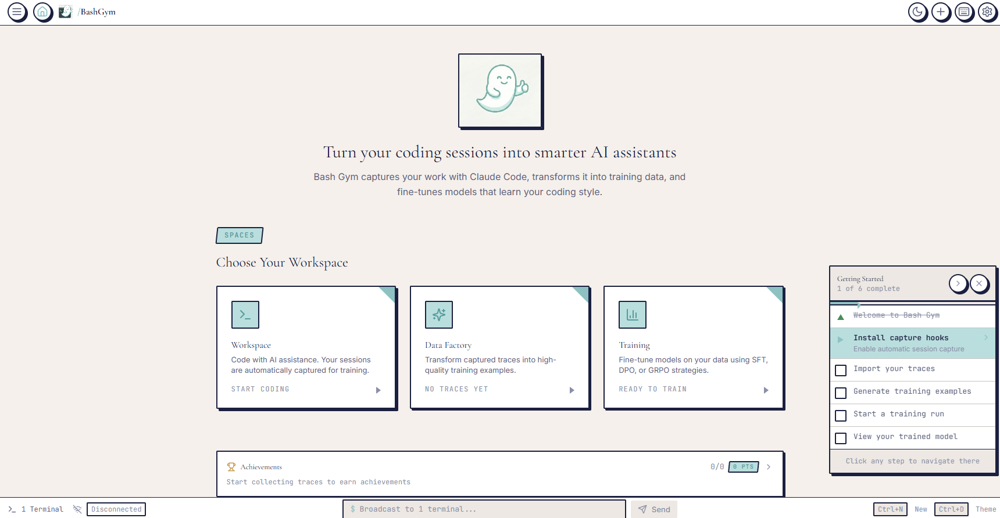

# Bash Gym

**A Self-Improving Agentic Development Gym**



Bash Gym trains smaller language models (SLMs) from agent execution traces. It implements a continuous improvement flywheel where your daily Claude Code usage automatically generates training data for your own personalized coding assistant.

```
ACT (Arena) → VERIFY (Judge) → SYNTHESIZE (Factory) → TRAIN (Gym) → DEPLOY
     ↑                                                                  |
     +------------------------------------------------------------------+
```

---

## Table of Contents

- [Key Features](#key-features)
- [Execution Modes](#execution-modes)
- [Quick Start](#quick-start)
- [Architecture Overview](#architecture-overview)
- [Project Structure](#project-structure)
- [Frontend Dashboard](#frontend-dashboard)
- [Benchmarking Suite](#benchmarking-suite)
- [Data Creation & Synthesis](#data-creation--synthesis)
- [Evaluation & LLM-as-Judge](#evaluation--llm-as-judge)
- [Safety & Guardrails](#safety--guardrails)
- [Observability & Profiling](#observability--profiling)
- [Training System](#training-system)
- [Model Registry](#model-registry)
- [Model Routing](#model-routing)
- [HuggingFace Integration](#huggingface-integration)
- [API Reference](#api-reference)
- [Python API](#python-api)
- [Configuration](#configuration)
- [Docker](#docker)
- [Testing](#testing)
- [Security](#security)
- [Data Flow](#data-flow)

---


## Key Features

| Feature | Description |
|---------|-------------|
| **Autonomous Trace Capture** | Hooks into Claude Code to automatically capture execution traces |
| **6-Metric Quality Framework** | Comprehensive trace scoring for training data quality |
| **Privacy by Design** | PII detection across 20+ types with differential privacy support |
| **Multiple Training Strategies** | SFT, DPO, GRPO, RLVR, and distillation |
| **Model Registry** | Full lifecycle tracking with lineage, metrics, and artifacts |
| **Progressive Routing** | Confidence-based handoff from teacher to student models |
| **Real-Time Dashboard** | Electron + React frontend with WebSocket updates |
| **Multi-Cloud Deployment** | Export to HuggingFace, NVIDIA NIM, Ollama |
| **Comprehensive Benchmarks** | HumanEval, MBPP, BigCodeBench, SWE-bench, and more |
| **Safety Guardrails** | Injection detection, content moderation, dangerous command blocking |

---

## Execution Modes

Bash Gym supports two execution modes. **Native mode is the default** for daily use.

| Mode | Where Claude Runs | Use Case |
|------|-------------------|----------|
| **Native** | On your PC directly | Real projects, daily tasks, desktop control |
| **Sandbox** | Docker containers | Autonomous batch runs for training data |

### Native Mode (Default - Your Daily Use)

Claude Code runs directly on your system, working on your real projects and files. The hooks silently capture successful executions to build your personalized training dataset.

```
Your PC
├── Your Projects/              # Claude works here directly
├── Desktop tasks/              # Bash commands, file operations
└── bashgym/data/               # Traces collected automatically
    ├── gold_traces/            # Successful executions → training data
    └── failed_traces/          # For DPO training (learn from mistakes)
```

**No Docker required.** Just use Claude Code normally - Bash Gym learns from your workflow.

### Sandbox Mode (Optional - Bulk Training)

For autonomous batch runs where you want to generate lots of training data safely:
- Runs agents in isolated Docker containers
- Network-isolated, resource-limited
- Use when running many autonomous tasks without supervision

---

## Quick Start

```bash
# Clone and setup
git clone https://github.com/your-org/bashgym.git
cd bashgym

# Install dependencies
pip install -r requirements.txt

# For training capabilities
pip install -r requirements-training.txt

# Configure environment
cp .env.example .env
# Edit .env with your API keys

# Install hooks for native mode (captures your Claude Code usage)
cp bashgym/hooks/*.py ~/.claude/hooks/

# Start the API server
uvicorn bashgym.api.routes:app --host 0.0.0.0 --port 8002

# Start the frontend (in another terminal)
cd frontend && npm install && npm run dev
```

---

## Architecture Overview

### The Ouroboros Flywheel

```
┌──────────────────────────────────────────────────────────────────────┐
│                       THE OUROBOROS FLYWHEEL                          │
│                                                                        │
│    ┌─────────┐    ┌─────────┐    ┌───────────┐    ┌─────────┐        │
│    │   ACT   │───▶│ VERIFY  │───▶│ SYNTHESIZE│───▶│  TRAIN  │        │
│    │ (Arena) │    │ (Judge) │    │ (Factory) │    │  (Gym)  │        │
│    └─────────┘    └─────────┘    └───────────┘    └─────────┘        │
│         ▲                                              │              │
│         │                                              │              │
│         └──────────────── DEPLOY ◀─────────────────────┘              │
│                           (Router)                                     │
└──────────────────────────────────────────────────────────────────────┘
```

### Layer Architecture

| Layer | Module | Purpose | Key Components |
|-------|--------|---------|----------------|
| **Arena** | `bashgym.arena` | Execution & instrumentation | Sandbox, Runner, Hooks |
| **Judge** | `bashgym.judge` | Verification & evaluation | Verifier, Evaluator, Guardrails, Benchmarks |
| **Factory** | `bashgym.factory` | Data synthesis | DataFactory, TraceProcessor, SafeSynthesizer, SchemaBuilder |
| **Gym** | `bashgym.gym` | Training & routing | Trainer, Environment, Router |
| **Models** | `bashgym.models` | Registry & lifecycle | Profile, Registry, Evaluator |
| **Observability** | `bashgym.observability` | Profiling & tracing | AgentProfiler |
| **Integrations** | `bashgym.integrations` | External services | NeMo, HuggingFace, Bashbros |
| **API** | `bashgym.api` | REST & WebSocket | Routes, Schemas, WebSocket |

---

## Project Structure

```
bashgym/
├── bashgym/                           # Main Python package
│   ├── __init__.py
│   ├── config.py                      # Configuration management
│   ├── secrets.py                     # Secret handling
│   ├── main.py                        # CLI entry point
│   │
│   ├── arena/                         # Execution layer
│   │   ├── runner.py                  # Claude Code CLI wrapper
│   │   └── sandbox.py                 # Docker sandbox manager
│   │
│   ├── judge/                         # Verification layer
│   │   ├── verifier.py                # Test execution engine
│   │   ├── evaluator.py               # NeMo Evaluator (LLM-as-Judge)
│   │   ├── guardrails.py              # NeMo Guardrails (safety checks)
│   │   ├── benchmarks.py              # Standard code benchmarks
│   │   ├── benchmark_loader.py        # Benchmark dataset loading
│   │   └── verify.sh                  # Default verification script
│   │
│   ├── factory/                       # Data synthesis layer
│   │   ├── data_factory.py            # Main trace-to-example pipeline
│   │   ├── trace_processor.py         # Quality scoring & normalization
│   │   ├── quality_calculator.py      # 6-metric quality breakdown
│   │   ├── example_generator.py       # Session segmentation
│   │   ├── safe_synthesizer.py        # Privacy-preserving PII handling
│   │   ├── synthetic_generator.py     # Task generation from patterns
│   │   ├── pattern_extractor.py       # Extract reusable task patterns
│   │   ├── schema_builder.py          # Fluent API for synthetic data
│   │   └── prompt_optimizer.py        # MIPROv2-style prompt optimization
│   │
│   ├── gym/                           # Training layer
│   │   ├── trainer.py                 # SFT/DPO/GRPO with Unsloth
│   │   ├── environment.py             # Gymnasium RL environment
│   │   └── router.py                  # Teacher/Student model routing
│   │
│   ├── models/                        # Model registry
│   │   ├── profile.py                 # Rich model metadata
│   │   ├── registry.py                # Model tracking & comparison
│   │   └── evaluator.py               # Custom evaluation sets
│   │
│   ├── hooks/                         # Claude Code instrumentation
│   │   ├── post_tool_use.py           # Tool capture hook
│   │   ├── pre_tool_use.py            # Pre-execution hook
│   │   ├── stop.py                    # Session finalization
│   │   └── notification.py            # User notifications
│   │
│   ├── observability/                 # Performance tracking
│   │   └── profiler.py                # Agent profiler (Phoenix, Langfuse, OTEL)
│   │
│   ├── core/                          # Core utilities
│   │   └── instrumentation.py         # Unified guardrails + profiler
│   │
│   ├── inference/                     # Model inference
│   │   └── model_loader.py            # Load trained models
│   │
│   ├── trace_capture/                 # Trace import system
│   │   ├── core.py                    # Base trace import logic
│   │   ├── detector.py                # Auto-detect trace sources
│   │   ├── adapters/                  # Agent adapters
│   │   │   ├── claude_code.py         # Claude Code adapter
│   │   │   └── opencode.py            # OpenCode adapter
│   │   ├── importers/                 # Source importers
│   │   │   └── claude_history.py      # Import from ~/.claude/projects/
│   │   └── setup.py                   # Hook installation
│   │
│   ├── integrations/                  # External integrations
│   │   ├── nemo_client.py             # NVIDIA NeMo SDK wrapper
│   │   ├── bashbros.py                # Bashbros integration
│   │   └── huggingface/               # HuggingFace integration
│   │       ├── client.py              # Main client
│   │       ├── datasets.py            # Dataset management
│   │       ├── inference.py           # Inference API
│   │       ├── jobs.py                # Cloud training jobs
│   │       └── spaces.py              # Spaces deployment
│   │
│   ├── providers/                     # Model providers
│   │   ├── detector.py                # Provider detection
│   │   └── ollama.py                  # Ollama integration
│   │
│   └── api/                           # REST API
│       ├── routes.py                  # Main endpoints
│       ├── factory_routes.py          # Factory endpoints
│       ├── models_routes.py           # Model registry endpoints
│       ├── hf_routes.py               # HuggingFace endpoints
│       ├── integration_routes.py      # Bashbros integration
│       ├── observability_routes.py    # Profiler endpoints
│       ├── websocket.py               # Real-time updates
│       ├── schemas.py                 # Pydantic models
│       └── system_info.py             # System info utilities
│
├── frontend/                          # Electron + React UI
│   ├── src/
│   │   ├── App.tsx
│   │   ├── components/                # 52+ React components
│   │   ├── services/                  # API clients
│   │   ├── stores/                    # State management
│   │   └── hooks/                     # React hooks
│   └── electron/                      # Electron main process
│
├── tests/                             # Test suite
├── docker/                            # Docker configuration
│   ├── Dockerfile.arena
│   ├── Dockerfile.sandbox
│   └── docker-compose.yml
│
├── data/                              # Runtime data (gitignored)
│   ├── gold_traces/                   # High-quality traces (≥90% success)
│   ├── silver_traces/                 # Good traces (≥75% success)
│   ├── bronze_traces/                 # Acceptable traces (≥60% success)
│   ├── failed_traces/                 # Failed attempts (<60% success)
│   ├── traces/                        # Pending classification
│   ├── training_batches/              # SFT/DPO datasets
│   ├── models/                        # Trained models
│   └── profiler_traces/               # Performance traces
│
├── requirements.txt                   # Core dependencies
├── requirements-training.txt          # ML dependencies
├── pyproject.toml
└── .env.example                       # Environment template
```

---

## Frontend Dashboard

The Bash Gym frontend is an Electron + React application with real-time WebSocket updates.

### Dashboard Sections

| Section | Components | Purpose |
|---------|-----------|---------|
| **Training** | TrainingDashboard, TrainingConfig, LossCurve, MetricsGrid, EpochProgress, TrainingLogs, SystemInfoPanel | Monitor training progress, view loss curves, track system resources |
| **Models** | ModelBrowser, ModelCard, ModelProfile, ModelComparison, LineageTree, ModelTrends | Browse trained models, view lineage, compare performance |
| **Factory** | FactoryDashboard, SyntheticGenerator | Generate synthetic data, manage datasets |
| **Traces** | TraceBrowser | Explore gold/silver/bronze/failed traces, view quality metrics |
| **Router** | RouterDashboard | Monitor teacher/student routing decisions and performance |
| **Evaluator** | EvaluatorDashboard | Run benchmarks, view evaluation results |
| **Guardrails** | GuardrailsDashboard | Monitor safety checks, PII redaction events |
| **Profiler** | ProfilerDashboard | View performance traces, analyze latency |
| **HuggingFace** | HFDashboard, CloudTraining, DatasetBrowser, SpaceManager | Cloud training, Spaces deployment, dataset management |
| **Integration** | IntegrationDashboard | Bashbros linking, trace sync, model export |
| **Terminal** | TerminalGrid, TerminalPane, TerminalNode, MasterControlPanel, CanvasView | Multi-view execution environment with file drop |
| **Files** | FileBrowser, FileTreeItem | File exploration and preview |
| **Flywheel** | FlywheelVisualization, FlywheelMini | Visual pipeline representation |

### Starting the Frontend

```bash
cd frontend
npm install
npm run dev
```

The frontend connects to the API server at `http://localhost:8002` by default.

---

## Benchmarking Suite

Bash Gym includes a comprehensive benchmarking system for evaluating model performance.

### Supported Benchmarks

| Benchmark | Description | Samples | Metric |
|-----------|-------------|---------|--------|
| **HumanEval** | Python function synthesis | 164 | pass@k |
| **MBPP** | Python programming problems | 974 | pass@k |
| **BigCodeBench** | Comprehensive code evaluation | Multi-language | pass@k |
| **BFCL** | Function calling accuracy | Various | AST accuracy |
| **SWE-bench** | Real-world software engineering | GitHub issues | Resolution rate |
| **GSM8K** | Math reasoning | 8.5K | Accuracy |
| **ARC** | Scientific reasoning | 7.7K | Accuracy |
| **HellaSwag** | Commonsense reasoning | 10K | Accuracy |
| **Toxigen** | Toxicity detection | Various | Safety score |
| **BBQ** | Bias detection | Various | Bias score |

### Running Benchmarks

```python
from bashgym.judge.benchmarks import BenchmarkRunner, BenchmarkConfig, BenchmarkType

config = BenchmarkConfig(
    benchmark_type=BenchmarkType.HUMANEVAL,
    num_samples=100,
    pass_k=[1, 5, 10],
    timeout_per_sample=30,
    model_name="my-finetuned-model"
)

runner = BenchmarkRunner(config)

# Define your model's generation function
async def my_generate(prompt: str) -> str:
    return generated_code

# Run the benchmark
result = await runner.run_benchmark(my_generate)

print(f"Pass@1: {result.pass_at_k[1]:.2%}")
print(f"Pass@5: {result.pass_at_k[5]:.2%}")
print(f"Pass@10: {result.pass_at_k[10]:.2%}")
```

### Comparing Multiple Models

```python
models = {
    "baseline": baseline_generate_fn,
    "finetuned-v1": finetuned_v1_generate_fn,
    "finetuned-v2": finetuned_v2_generate_fn,
}

results = await runner.compare_models(models, BenchmarkType.HUMANEVAL)

for model_name, result in results.items():
    print(f"{model_name}: pass@1={result.pass_at_k[1]:.2%}")
```

---


## Data Creation & Synthesis

The Factory layer provides comprehensive tools for creating high-quality training data.

### Quality Metrics (6 Components)

| Metric | Weight | Description |
|--------|--------|-------------|
| **Success Rate** | 30% | Percentage of successful steps |
| **Verification Score** | 25% | Test passing rate |
| **Complexity Score** | 15% | Tool diversity + pattern complexity |
| **Length Score** | 10% | Bell curve around ideal length |
| **Tool Diversity** | 10% | Unique tools used |
| **Efficiency Score** | 10% | Output quality ratio |

### Trace Classification

| Status | Criteria | Location |
|--------|----------|----------|
| **Gold** | ≥90% success, ≥0.75 quality | `data/gold_traces/` |
| **Silver** | ≥75% success, ≥0.55 quality | `data/silver_traces/` |
| **Bronze** | ≥60% success, ≥0.40 quality | `data/bronze_traces/` |
| **Failed** | <60% success | `data/failed_traces/` |

### Data Factory

```python
from bashgym.factory import DataFactory, DataFactoryConfig
from pathlib import Path

config = DataFactoryConfig(
    quality_threshold=0.7,
    max_turns_per_example=20,
    redact_sensitive_data=True,
    add_thinking_tags=True
)

factory = DataFactory(config)

# Process traces into training examples
examples, dpo_examples = await factory.process_trace_directory(
    gold_dir=Path("data/gold_traces"),
    failed_dir=Path("data/failed_traces")
)

# Save training batches
factory.save_training_batch(examples, "sft")
factory.save_dpo_batch(dpo_examples, "dpo")
```

### Schema Builder (Synthetic Data Generation)

Create rich synthetic datasets using a fluent API:

```python
from bashgym.factory.schema_builder import SchemaBuilder, DataDesignerClient

schema = (
    SchemaBuilder("coding_tasks")
    .uuid("task_id", description="Unique task identifier")
    .category("language", ["python", "javascript", "rust", "go"])
    .category("difficulty", ["easy", "medium", "hard"], weights=[0.4, 0.4, 0.2])
    .llm(
        "task_description",
        prompt="Generate a {{ difficulty }} {{ language }} coding task.",
        depends_on=["language", "difficulty"]
    )
    .code(
        "reference_solution",
        task_description="task_description",
        language="{{ language }}",
        depends_on=["task_description", "language"]
    )
    .with_rows(1000)
    .build()
)

client = DataDesignerClient()
records = await client.generate(schema, output_path=Path("data/synthetic/tasks.jsonl"))
```

### Safe Synthesizer (Privacy-Preserving)

```python
from bashgym.factory.safe_synthesizer import (
    SafeSynthesizer, SafeSynthesizerConfig, ReplacementStrategy
)

config = SafeSynthesizerConfig(
    epsilon=8.0,  # Differential privacy budget
    pii_types=["email", "phone", "ssn", "api_key", "credit_card"],
    default_strategy=ReplacementStrategy.SYNTHETIC,
    use_llm_classification=True
)

synthesizer = SafeSynthesizer(config)

# Process dataset with privacy guarantees
processed_data, privacy_report = await synthesizer.process_dataset(
    data=my_dataset,
    text_fields=["message", "notes"]
)

print(f"Records with PII: {privacy_report.records_with_pii}")
print(f"Disclosure Risk: {privacy_report.disclosure_risk}")
```

### PII Types Detected

| Category | Types |
|----------|-------|
| **Personal** | `person`, `email`, `phone`, `ssn`, `passport`, `driver_license` |
| **Financial** | `credit_card`, `bank_account`, `iban` |
| **Location** | `address`, `zip_code`, `city`, `country`, `ip_address` |
| **Medical** | `mrn`, `health_plan`, `medical_condition` |
| **Digital** | `username`, `password`, `api_key`, `auth_token`, `url` |

### Prompt Optimizer (MIPROv2)

```python
from bashgym.factory.prompt_optimizer import (
    PromptOptimizer, PromptOptConfig, OptimizationIntensity
)

config = PromptOptConfig(
    intensity=OptimizationIntensity.MEDIUM,
    max_bootstrapped_demos=4,
    num_candidates=10
)

optimizer = PromptOptimizer(config)

result = await optimizer.optimize_prompt(
    original_prompt="You are a code reviewer. Review the code.",
    eval_examples=[{"input": "def f():", "expected_output": "Missing docstring"}],
    eval_fn=eval_fn,
    optimization_goals="Provide detailed, actionable code review feedback"
)

print(f"Improvement: {result.improvement:.2%}")
print(f"Optimized Prompt: {result.optimized_prompt}")
```

---

## Evaluation & LLM-as-Judge

The Judge layer includes NeMo Evaluator integration for comprehensive model evaluation.

### LLM-as-Judge Scoring

```python
from bashgym.judge.evaluator import EvaluatorClient, EvaluatorConfig

evaluator = EvaluatorClient(EvaluatorConfig())

# Score a response on multiple metrics
scores = await evaluator.judge_response(
    prompt="Write a function to check if a number is prime",
    response="def is_prime(n): ...",
    metrics=["correctness", "code_quality", "helpfulness"]
)

for score in scores:
    print(f"{score.metric}: {score.score:.2f} - {score.reasoning}")
```

### Available Metrics

| Metric | Description |
|--------|-------------|
| `helpfulness` | How helpful for completing the task |
| `correctness` | Technical correctness |
| `coherence` | Logical flow and clarity |
| `complexity` | Appropriate complexity level |
| `verbosity` | Conciseness vs verbosity |
| `safety` | Absence of harmful content |
| `code_quality` | Code cleanliness and best practices |
| `task_completion` | How completely the task was accomplished |

### Agentic Trace Evaluation

```python
metrics = await evaluator.evaluate_agentic_trace(
    trace=[
        {"action": {"type": "bash", "content": "ls -la"}, "observation": {"success": True}},
        {"action": {"type": "edit", "content": "..."}, "observation": {"success": True}},
    ],
    task_description="Fix the bug in utils.py"
)

print(f"Tool Call Accuracy: {metrics['tool_call_accuracy']:.2%}")
print(f"Goal Accuracy: {metrics['goal_accuracy']:.2%}")
print(f"Efficiency: {metrics['efficiency']:.2%}")
```

---

## Safety & Guardrails

The Judge layer includes NeMo Guardrails integration for comprehensive safety checks.

### NemoGuard Features

```python
from bashgym.judge.guardrails import NemoGuard, GuardrailsConfig

config = GuardrailsConfig(
    injection_detection=True,
    content_moderation=True,
    code_safety=True,
    pii_filtering=True,
    blocked_topics=["politics", "religion"]
)

guard = NemoGuard(config)

# Check input for safety
input_result = await guard.check_input("User input here...")
if not input_result.passed:
    print(f"Blocked: {input_result.blocked_reason}")

# Check command safety
cmd_result = await guard.check_command("rm -rf /tmp/test")
print(f"Command Safe: {cmd_result.passed}")
```

### Guardrail Types

| Type | Description |
|------|-------------|
| **Injection Detection** | Detects prompt injection attempts |
| **Content Moderation** | Filters violence, hate speech, illegal content |
| **Topic Control** | Enforces allowed/blocked topics |
| **Code Safety** | Blocks dangerous commands and patterns |
| **PII Filter** | Detects and redacts personal information |

### Blocked Command Patterns

```python
# Default blocked commands
blocked_commands = [
    "rm -rf /", "rm -rf /*",       # System destruction
    ":(){:|:&};:",                  # Fork bomb
    "dd if=/dev/zero",             # Disk wipe
    "mkfs.",                        # Filesystem format
    "> /dev/sda",                  # Direct disk write
    "chmod -R 777 /",              # Dangerous permissions
    "sudo rm -rf",                 # Privileged destruction
]

# Blocked patterns (regex)
blocked_patterns = [
    r"curl.*\|.*sh",              # Remote code execution
    r"wget.*\|.*bash",            # Remote code execution
]
```

---

## Observability & Profiling

The observability layer provides comprehensive profiling and tracing for agent workflows.

### Agent Profiler

```python
from bashgym.observability.profiler import (
    AgentProfiler, ProfilerConfig, ObservabilityBackend, SpanKind
)

config = ProfilerConfig(
    backend=ObservabilityBackend.LOCAL,  # or PHOENIX, LANGFUSE, OPENTELEMETRY
    profile_tokens=True,
    profile_latency=True,
    trace_sampling_rate=1.0
)

profiler = AgentProfiler(config)

# Start a trace
trace_id = profiler.start_trace("Debug Python script", metadata={"user": "dev"})

# Record operations with spans
with profiler.span("analyze_error", SpanKind.LLM_CALL) as span:
    span.set_tokens(input_tokens=500, output_tokens=200)

# Record tool calls
profiler.record_tool_call(
    tool_name="read_file",
    tool_input="script.py",
    tool_output="def main(): ...",
    success=True,
    latency_ms=50
)

# End trace and get summary
trace = profiler.end_trace()
summary = profiler.get_trace_summary(trace_id)

print(f"Duration: {summary['duration_ms']:.0f}ms")
print(f"LLM Calls: {summary['llm_calls']['count']}")
print(f"Total Tokens: {summary['llm_calls']['total_tokens']}")
```

### Supported Backends

| Backend | Description |
|---------|-------------|
| `LOCAL` | Save traces to local JSON files |
| `PHOENIX` | Export to Arize Phoenix |
| `LANGFUSE` | Export to Langfuse |
| `OPENTELEMETRY` | Export via OpenTelemetry |

---

## Training System

The Gym layer provides comprehensive model training capabilities.

### Training Strategies

| Strategy | Description | Use Case |
|----------|-------------|----------|
| **SFT** | Supervised Fine-Tuning | Learning from gold traces |
| **DPO** | Direct Preference Optimization | Learning from pass/fail pairs |
| **GRPO** | Group Relative Policy Optimization | RL with verifiable rewards |
| **RLVR** | RL with Verifiable Rewards | Verification-guided training |
| **Distillation** | Knowledge transfer | Teacher-to-student distillation |

### Running Training

```python
from bashgym.gym import Trainer, TrainerConfig, TrainingStrategy

config = TrainerConfig(
    base_model="Qwen/Qwen2.5-Coder-1.5B-Instruct",
    strategy=TrainingStrategy.SFT,
    num_epochs=3,
    batch_size=4,
    learning_rate=2e-5,
    use_lora=True,
    lora_r=16,
    lora_alpha=32,
    auto_export_gguf=True,
    gguf_quantization="q4_k_m"
)

trainer = Trainer(config)

# SFT Training
run = trainer.train_sft(
    dataset_path="data/training_batches/sft_batch.jsonl",
    callback=lambda m: print(f"Epoch {m['epoch']}: Loss={m['loss']:.4f}")
)

# DPO Training
run = trainer.train_dpo(
    dataset_path="data/training_batches/dpo_batch.jsonl"
)

print(f"Output: {run.output_path}")
print(f"GGUF: {run.gguf_path}")
```

### Output Formats

| Format | File | Description |
|--------|------|-------------|
| LoRA Adapters | `adapter_model.safetensors` | Lightweight (~50MB) |
| Merged Model | `merged/` | Full weights (16-bit) |
| GGUF | `model-q4_k_m.gguf` | Quantized for inference |

### RL Environment

Gymnasium-compatible environment for RL training:

```python
from bashgym.gym import BashGymEnv, GymEnvConfig, Action, ActionType

config = GymEnvConfig(
    max_steps=50,
    use_sandbox=False,
    reward_on_verification=1.0,
    step_penalty=-0.01
)

env = BashGymEnv(config)
obs = env.reset(task="Implement quicksort")

while not env.done:
    action = Action(ActionType.BASH, "python -c 'print(1)'")
    obs, reward, done, info = env.step(action)
```

---

## Model Registry

The Models layer provides full lifecycle tracking for trained models.

### Model Profile

```python
from bashgym.models.profile import ModelProfile
from bashgym.models.registry import ModelRegistry

registry = ModelRegistry()

# Register a new model
profile = ModelProfile(
    name="my-coder-v1",
    base_model="Qwen/Qwen2.5-Coder-1.5B-Instruct",
    strategy="sft",
    tags=["python", "debugging"],
    training_traces=["trace_001", "trace_002"]
)

model_id = registry.register(profile)
```

### Model Profile Captures

| Category | Fields |
|----------|--------|
| **Identity** | name, tags, description |
| **Lineage** | base_model, strategy, training_traces, source_repos |
| **Training** | config, loss_curves, metrics, duration |
| **Artifacts** | checkpoints, LoRA adapters, merged models, GGUF exports |
| **Evaluations** | benchmarks, custom_eval_results, history |
| **Operational** | size, latency, deployment_status |

### Model Comparison

```python
# Compare multiple models
comparison = registry.compare_models(
    model_ids=["model_001", "model_002", "model_003"],
    metrics=["humaneval_pass1", "mbpp_pass1", "latency_ms"]
)

for model_id, metrics in comparison.items():
    print(f"{model_id}: HumanEval={metrics['humaneval_pass1']:.2%}")
```

---

## Model Routing

Routes requests between Teacher (Claude) and Student (fine-tuned) models.

```python
from bashgym.gym import ModelRouter, RouterConfig, RoutingStrategy

router = ModelRouter(RouterConfig(
    strategy=RoutingStrategy.PROGRESSIVE,
    student_sample_rate=0.2,
    max_student_rate=0.9,
    confidence_threshold=0.7
))

# Route a request
decision = router.route("Refactor authentication module")
print(f"Model: {decision.selected_model}")
print(f"Complexity: {decision.task_complexity:.2f}")

# Generate with automatic routing
response = await router.generate(
    prompt="Fix the bug in utils.py",
    system_prompt="You are a helpful coding assistant."
)

# Update routing based on performance
router.update_student_performance(success_rate=0.85)
```

### Routing Strategies

| Strategy | Description |
|----------|-------------|
| `TEACHER_ONLY` | Always use teacher model |
| `STUDENT_ONLY` | Always use student model |
| `CONFIDENCE_BASED` | Route based on student confidence |
| `TASK_COMPLEXITY` | Simple tasks to student, complex to teacher |
| `PROGRESSIVE` | Gradually increase student usage |
| `RANDOM_SAMPLE` | Random sampling for A/B testing |

---

## HuggingFace Integration

Full HuggingFace ecosystem integration for cloud training, datasets, and deployment.

### Features

| Feature | Description |
|---------|-------------|
| **Cloud Training** | Submit training jobs to HuggingFace Spaces |
| **Dataset Management** | Upload and manage training datasets |
| **Inference API** | Use HuggingFace endpoints for inference |
| **Spaces Deployment** | Deploy interactive demos |
| **Pro Detection** | Unlock premium features with Pro subscription |

### Cloud Training

```python
from bashgym.integrations.huggingface import HFClient

client = HFClient()

# Submit a training job
job = await client.submit_training_job(
    dataset_repo="username/my-traces",
    base_model="Qwen/Qwen2.5-Coder-1.5B-Instruct",
    hardware="a10g-small"
)

# Monitor progress
status = await client.get_job_status(job.job_id)
print(f"Status: {status.state}")
```

### Dataset Upload

```python
# Upload training data
await client.upload_dataset(
    repo_id="username/bash-gym-traces",
    data_path=Path("data/training_batches/sft_batch.jsonl")
)
```

---

## API Reference

The API server provides REST and WebSocket endpoints.

### Start API Server

```bash
# Development
uvicorn bashgym.api.routes:app --host 0.0.0.0 --port 8002 --reload

# Production
uvicorn bashgym.api.routes:app --host 0.0.0.0 --port 8002 --workers 4
```

API documentation: `http://localhost:8002/docs`

### REST Endpoints

#### System
| Method | Endpoint | Description |
|--------|----------|-------------|
| `GET` | `/api/health` | Health check |
| `GET` | `/api/stats` | System statistics |
| `GET` | `/api/system/info` | Hardware & GPU info |

#### Tasks
| Method | Endpoint | Description |
|--------|----------|-------------|
| `POST` | `/api/tasks` | Submit new task |
| `GET` | `/api/tasks/{task_id}` | Get task status |
| `GET` | `/api/tasks` | List all tasks |
| `POST` | `/api/tasks/{task_id}/cancel` | Cancel task |

#### Training
| Method | Endpoint | Description |
|--------|----------|-------------|
| `POST` | `/api/training/start` | Start training run |
| `GET` | `/api/training/{run_id}` | Get training status |
| `GET` | `/api/training` | List training runs |
| `POST` | `/api/training/{run_id}/pause` | Pause training |
| `POST` | `/api/training/{run_id}/cancel` | Cancel training |
| `GET` | `/api/training/{run_id}/logs` | Stream training logs |

#### Models
| Method | Endpoint | Description |
|--------|----------|-------------|
| `GET` | `/api/models` | List trained models |
| `GET` | `/api/models/{model_id}` | Get model profile |
| `POST` | `/api/models/{model_id}/export` | Export model |
| `POST` | `/api/models/{model_id}/evaluate` | Run evaluation |
| `GET` | `/api/models/compare` | Compare models |

#### Traces
| Method | Endpoint | Description |
|--------|----------|-------------|
| `GET` | `/api/traces` | List traces |
| `GET` | `/api/traces/{trace_id}` | Get trace details |
| `POST` | `/api/traces/{trace_id}/promote` | Promote to gold |
| `POST` | `/api/traces/{trace_id}/demote` | Demote to failed |

#### Factory
| Method | Endpoint | Description |
|--------|----------|-------------|
| `POST` | `/api/factory/synthetic/generate` | Start synthetic generation |
| `GET` | `/api/factory/jobs/{job_id}` | Get generation progress |
| `GET` | `/api/factory/examples` | List generated examples |

#### Benchmarks
| Method | Endpoint | Description |
|--------|----------|-------------|
| `GET` | `/api/benchmarks` | List available benchmarks |
| `POST` | `/api/benchmarks/run` | Run benchmark |
| `GET` | `/api/benchmarks/{run_id}` | Get results |

#### HuggingFace
| Method | Endpoint | Description |
|--------|----------|-------------|
| `GET` | `/api/hf/status` | Check HF integration |
| `POST` | `/api/hf/cloud-training/submit` | Submit cloud job |
| `POST` | `/api/hf/spaces/create` | Deploy to Spaces |
| `GET` | `/api/hf/datasets` | List datasets |

#### Integration
| Method | Endpoint | Description |
|--------|----------|-------------|
| `GET` | `/api/integration/status` | Bashbros status |
| `GET` | `/api/integration/settings` | Get settings |
| `POST` | `/api/integration/settings` | Update settings |
| `POST` | `/api/integration/link` | Link bashbros |

#### Observability
| Method | Endpoint | Description |
|--------|----------|-------------|
| `GET` | `/api/observability/traces` | List profiler traces |
| `GET` | `/api/observability/guardrail-events` | Get guardrail events |

### WebSocket Messages

Connect to `ws://localhost:8002/ws` for real-time updates.

| Category | Message Types |
|----------|--------------|
| **Training** | `training:progress`, `training:complete`, `training:failed`, `training:log` |
| **Tasks** | `task:status`, `task:complete` |
| **Traces** | `trace:added`, `trace:promoted`, `trace:demoted` |
| **Router** | `router:stats`, `router:decision` |
| **Verification** | `verification:result` |
| **Guardrails** | `guardrail:blocked`, `guardrail:warn`, `guardrail:pii_redacted` |
| **HuggingFace** | `hf:job:started`, `hf:job:complete`, `hf:space:deployed` |
| **Integration** | `integration:trace:synced`, `integration:model:exported` |

---

## Python API

### Basic Usage

```python
from bashgym import BashGym, Trainer, BashGymEnv
from bashgym.config import get_settings

# Initialize
settings = get_settings()
gym = BashGym()

# Run a task
result = await gym.run_task(
    task_prompt="Implement a binary search function",
    repository_url="https://github.com/example/repo.git"
)

# Train on accumulated traces
if result["verification_passed"]:
    trainer = Trainer()
    run = trainer.train_sft("data/training_batches/sft_batch.jsonl")
    print(f"Training complete: {run.output_path}")
```

---

## Configuration

### Environment Variables

Copy `.env.example` to `.env` and configure:

| Variable | Required | Default | Description |
|----------|----------|---------|-------------|
| `ANTHROPIC_API_KEY` | Yes | - | Claude API key |
| `NVIDIA_API_KEY` | No | - | NVIDIA NIM API key |
| `HF_TOKEN` | No | - | HuggingFace token |
| `BASE_MODEL` | No | `Qwen/Qwen2.5-Coder-1.5B-Instruct` | Base model for fine-tuning |
| `AUGMENTATION_PROVIDER` | No | `anthropic` | Data augmentation provider |
| `ROUTING_STRATEGY` | No | `confidence_based` | Model routing strategy |
| `USE_NEMO_GYM` | No | `false` | Enable cloud training |

### Available Models

#### Claude 4.5 Models (Teacher)
| Model | API ID | Use Case |
|-------|--------|----------|
| **Claude Opus 4.5** | `claude-opus-4-5-20251101` | Best quality |
| **Claude Sonnet 4.5** | `claude-sonnet-4-5-20250929` | Recommended |
| **Claude Haiku 4.5** | `claude-haiku-4-5-20251001` | Fast |

#### Fine-Tuning Base Models (Student)
| Model | Parameters | Use Case |
|-------|------------|----------|
| `Qwen/Qwen2.5-Coder-1.5B-Instruct` | 1.5B | Default, fast training |
| `Qwen/Qwen2.5-Coder-7B-Instruct` | 7B | Better quality |
| `meta-llama/Llama-3.2-3B-Instruct` | 3B | Alternative |

---

## Docker

### Build Containers

```bash
cd docker
docker-compose build
```

### Run Services

```bash
docker-compose up -d

# View logs
docker-compose logs -f

# Stop
docker-compose down
```

---

## Testing

```bash
# Run all tests
pytest tests/ -v

# With coverage
pytest tests/ --cov=bashgym --cov-report=html

# Run specific module tests
pytest tests/test_benchmarks.py -v
pytest tests/test_data_factory.py -v
```

---

## Security

| Feature | Description |
|---------|-------------|
| **Sandboxing** | All agent execution in network-isolated Docker containers |
| **Resource Limits** | Memory and CPU constraints on sandboxes |
| **Command Blocking** | Blocks rm -rf, fork bombs, disk operations |
| **API Key Protection** | Sensitive values hidden in logs and responses |
| **PII Detection** | Automatic detection and redaction |
| **Injection Detection** | Prompt injection attack prevention |
| **Content Moderation** | Filtering of harmful content |

---

## Data Flow

```
1. YOUR DAILY CLAUDE CODE USAGE (Native Mode)
   └─▶ You use Claude Code normally on your projects
   └─▶ Hooks silently capture tool usage (post_tool_use.py)

2. SESSION END
   └─▶ stop.py processes the trace
   └─▶ Checks for verification markers

3. AUTOMATIC DATA COLLECTION
   └─▶ Gold traces (≥90% success) → gold_traces/
   └─▶ Silver traces (≥75% success) → silver_traces/
   └─▶ Bronze traces (≥60% success) → bronze_traces/
   └─▶ Failed traces (<60%) → failed_traces/ (for DPO)

4. DATA SYNTHESIS
   └─▶ TraceProcessor normalizes and scores traces
   └─▶ DataFactory creates training examples
   └─▶ SafeSynthesizer ensures privacy compliance

5. PERIODIC TRAINING
   └─▶ Run training on accumulated traces
   └─▶ Unsloth fine-tunes your personal SLM
   └─▶ Auto-exports to GGUF

6. EVALUATION
   └─▶ BenchmarkRunner evaluates on HumanEval, MBPP, etc.
   └─▶ EvaluatorClient runs LLM-as-Judge scoring
   └─▶ NemoGuard validates safety

7. DEPLOYMENT
   └─▶ New model registered with ModelRegistry
   └─▶ Progressive handoff from Teacher to Student
```

---

## License

MIT License - see LICENSE file for details.
