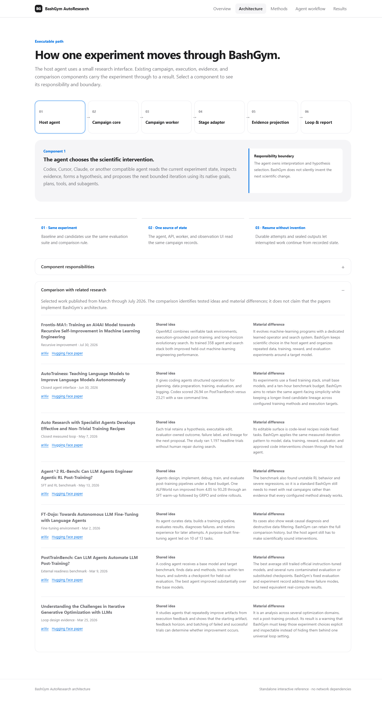

# BashGym

BashGym runs repeatable model-training and evaluation experiments through an
AI coding agent.

The researcher states an objective. Codex, Cursor, Claude, or another agent
evaluates the starting model, inspects failures, changes one part of the data or
training process, runs a candidate, compares it with the current reference, and
continues while the evidence supports another experiment. BashGym executes and
records those experiments so the loop can be inspected and resumed.

[](https://ghostpeony.github.io/bashgym/autoresearch-architecture.html)

[Open the interactive architecture](https://ghostpeony.github.io/bashgym/autoresearch-architecture.html) to
explore the experiment loop, training methods, agent integrations, and
baseline-versus-candidate comparisons. The same standalone page is also
[included in the repository](docs/autoresearch-architecture.html) for offline use.


## AutoResearch loop

```text
research objective + fixed held-out evaluation
                        │
                        ▼
                 evaluate baseline
                        │
                        ▼
inspect failures → revise data, recipe, reward, evaluator, or code
                        │
                        ▼
                train one candidate
                        │
                        ▼
evaluate on the same tasks → compare metrics and regressions
                        │
              ┌─────────┴─────────┐
              ▼                   ▼
        next experiment      stop and report
```

The host agent owns hypothesis formation and scientific judgment. BashGym
owns the experiment mechanics: model and dataset identity, stage scheduling,
attempts, retries, evaluation records, candidate comparisons, stopping rules,
and reports.

## What an agent can do

BashGym exposes a small research command surface:

```text
research prepare
research onboard
research state
research wait
research start
research submit-iteration
research conclude-family
research report
```

The agent keeps using its native goal, plan, editor, terminal, browser, tasks,
and subagents. `research state` returns the objective, current experiment,
latest comparison, finding, next action, and resume identity. The agent uses
that evidence to submit a baseline or one candidate change.

Install the reviewed Agent Skills bundle for the host you use:

```bash
bashgym operator skills install --host codex
bashgym operator skills check --host codex

# Claude Code
bashgym operator skills install --host claude

# Project-local Agent Skills, including Cursor-compatible discovery
bashgym operator skills install --host agents
```

Installing a skill does not start an experiment or replace the agent's own
planning tools.

## Models, datasets, and methods

A campaign binds the exact model, dataset, evaluator, and installed stage
programs selected by the researcher. BashGym does not choose or download a
model implicitly.

Training data may be:

- a researcher-provided dataset;
- verified agent or tool-use traces;
- chosen/rejected preference pairs;
- generated examples that pass validation and decontamination;
- executable environment tasks with deterministic verification.

The direct trainer implements:

| Method                  | Use it when                                                             |
| ----------------------- | ----------------------------------------------------------------------- |
| SFT                     | You have verified prompt and target-response examples.                  |
| DPO                     | You have preferred and rejected responses for the same prompt.          |
| GRPO                    | You can sample response groups and score them with a useful reward.     |
| RLVR                    | Task completion can be checked with deterministic verification.         |
| Teacher-output training | A teacher can produce verified targets for an SFT dataset.              |
| Session distillation    | You want to learn from localized mistakes and recovery hints in traces. |

AutoResearch runs the training method provided by its registered stage
program. The existence of a method in the direct trainer does not automatically
make it available to every campaign installation.

The current direct `distillation` generator is an offline teacher-output/SFT
compatibility path; it does not yet prove logit distillation with a wired
teacher KL loss. The [training strategy guide](docs/training/strategy-guide.md)
records that boundary.

## Evaluation and comparison

Every candidate is evaluated against the same held-out suite used for the
baseline. The campaign records the configured primary metric and the comparison
with the current reference. Terminal and tool-using model studies can also use
held-out task success, verifier pass rate, valid tool-call rate, recovery,
pass@k, regression checks, and runtime or resource measurements.

The Canvas and AutoResearch view show the same experiment state, including
current work, history, metrics, failures, decisions, and artifact references.
They are observation surfaces; the host agent still chooses the next
scientific intervention.

## Install

Requirements:

- Python 3.10 or newer;
- Node.js 22 LTS or newer for the frontend;
- a compatible Python/PyTorch/trainer environment for real training.

```bash
git clone https://github.com/GhostPeony/bashgym.git
cd bashgym

python -m venv .venv
# Windows: .\.venv\Scripts\Activate.ps1
# macOS/Linux: source .venv/bin/activate

python -m pip install -e .
python -m pip install -e ".[training]"  # when this checkout runs training

cd frontend
npm ci
cd ..
```

Copy `.env.example` to `.env` and add only the credentials required by the
features you select.

Start the application:

```bash
# Windows
.\dev.ps1

# macOS/Linux
./dev.sh
```

Or run the two processes separately:

```bash
python run_backend.py
cd frontend && npm run dev
```

The API serves generated OpenAPI documentation at
`http://localhost:8003/api/docs`.

## Start an experiment

First verify the installed command and inspect the registered experiment
context:

```bash
bashgym --help
bashgym research prepare --help
```

Preparation discovers registered model, data, evaluation, training, and
execution choices. Start without a session ID, save the returned `session_id`,
then pass it back to resume that exact setup session:

```bash
bashgym research prepare \
  --workspace-id <workspace> \
  --credential-ref <secret-store-key> \
  --json

bashgym research prepare \
  --workspace-id <workspace> \
  --session-id <returned-session-id> \
  --credential-ref <secret-store-key> \
  --json
```

Once those choices are exact, use a reviewed local onboarding contract to
preview the complete preparation, then apply the same contract:

```bash
bashgym research onboard --contract <onboarding.json> --json
bashgym research onboard --contract <onboarding.json> --apply --json
```

The onboarding contract must explicitly choose `max_attempts`, `budget_unit`,
`max_total_cost`, and `minimum_improvement`. Attempts include the fixed baseline
and candidate experiments. The selected values must fit inside the installed
template's approved ceilings; BashGym does not silently choose them.

The apply command can register or acquire the exact model on the selected
execution target, activate the installation, start the resident API and worker,
sync the registered bindings, complete guided setup, and create one `READY`
campaign. It is resumable and stops before `research start`.

Inspect that `READY` campaign with `research state`, present its exact contract,
and wait for a later explicit Start. The same state and wait commands continue
the agent after Start:

```bash
bashgym research state \
  --workspace-id <workspace> \
  --credential-ref <secret-store-key> \
  --campaign <campaign-id> \
  --json

bashgym research wait --help
bashgym research submit-iteration --help
bashgym research conclude-family --help
bashgym research report --help
```

The state response distinguishes two kinds of evidence. Passive diagnostics
such as fixed-suite failure categories, checkpoint trajectories, deterministic
data-quality summaries, and recorded training metrics are derived from work
that already ran. A budgeted diagnostic action is a separate experiment used
only when a decision-relevant measurement is still missing. When an optional
diagnostic runner is installed, `diagnostic_capabilities` reports its exact
runner identity, limits, evidence sources, and measurement names. The agent may
still propose a new bounded probe outside that matrix; the runner must report
it as unsupported rather than BashGym silently choosing another experiment.

BashGym also ships an optional aggregate diagnostic runner for five common
questions: fixed-budget plasticity, reward-integrity canaries, preference-data
integrity, fixed-suite teacher-versus-student gaps, and paired session-recovery
lift. It derives measurements from already-produced immutable summaries; it
does not read raw rows, run teacher inference, or invent a probe. Activation
pins those summaries and a separate diagnostic reservation. An installation
may instead pin its own runner when a question requires executable
measurements that the built-in runner cannot provide.

The exact setup, proposal file, start, resume, and report commands are in the
[AutoResearch campaign guide](docs/training/autoresearch-campaign.md).

Before Start, define what each evaluation signal means. Choose one primary
objective, declare only genuinely non-negotiable metrics as protected gates
with explicit regression tolerances, retain other metrics and error slices as
informational evidence, and state whether the hypothesis needs repeated seeds
or robustness variants. A regression in an informational metric is a tradeoff,
not automatically a failed experiment. BashGym reserves failure for invalid or
unverifiable execution and predeclared protected-gate breaches; completed
results can instead be clear improvements, acceptable tradeoffs, mixed
evidence, or no demonstrated gain.

For a single known training job instead of a repeated experiment loop, use:

```bash
bashgym training plan --help
bashgym training start --help
```

## Current architecture boundaries

- Durable campaigns currently execute registered SSH stage programs. The
  direct trainer is a separate execution path.
- BashGym does not contain a second resident planner that invents hypotheses;
  the connected coding agent performs that reasoning.
- Campaign keep/discard requires the configured primary metric to clear its
  improvement threshold and every configured protected metric to remain within
  its allowed regression. Informational regressions and standalone diagnostics
  remain visible to the agent but are not silently converted into hard gates.
- Data Designer utilities generate and validate candidate data, but the hidden
  legacy schema-search API is not the current campaign data-build path.
- Planning and smoke commands prove a contract or integration path, not model
  improvement.

See [BashGym architecture](docs/PLATFORM_OVERVIEW.md) for the code-level path and
the current simplification priorities.

## Documentation

- [Architecture](docs/PLATFORM_OVERVIEW.md) — executable components, boundaries, and data flow.
- [Getting started](docs/GETTING_STARTED.md) — first direct training workflow.
- [Training data](docs/TRAINING_DATA_GUIDE.md) — formats, curation, traces, and generated data.
- [Training strategy](docs/training/strategy-guide.md) — SFT, DPO, GRPO/RLVR, distillation, and evaluation requirements.
- [AutoResearch campaigns](docs/training/autoresearch-campaign.md) — exact preparation, iteration, resume, and report commands.
- [Metrics runbook](docs/training/metrics-runbook.md) — interpret losses, rewards, pass@k, and regressions.
- [Frontend design](docs/FRONTEND_DESIGN_GUIDELINES.md) — UI tokens and component patterns.

Specialist references cover the TMax terminal-RL recipe, session distillation,
world-model diagnostics, and the training glossary under `docs/training/`.

## Project structure

```text
bashgym/
  api/                 FastAPI routes and request boundaries
  campaigns/           AutoResearch state, scheduling, workers, evidence, reports
  eval/                held-out, pass@k, regression, and release evaluation
  factory/             trace processing and data generation
  gym/                 direct SFT, DPO, GRPO/RLVR, and distillation training
  mcp/                 agent-facing research tools
  preferences/         preference and reward-data validation
frontend/
  src/components/      Canvas, AutoResearch, training, data, and evaluation views
assistant/workspace/skills/
                       portable BashGym Agent Skills
tests/                 unit and integration tests
```

## Development

```bash
python -m pytest -q
python -m ruff check bashgym tests
python -m black --check bashgym tests

cd frontend
npm run typecheck
npm test
npm run web:build
```

## License

MIT
