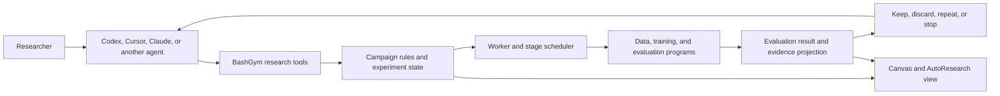

# BashGym architecture

BashGym coordinates repeated model-training and evaluation experiments through
an existing coding agent. The agent analyzes results and chooses the next
scientific intervention. BashGym executes the registered stages, preserves the
experiment record, compares candidates, and returns the next action.

The Canvas and AutoResearch view display the experiment. They are not a second
experiment engine and they do not choose hypotheses.

## One iteration

1. The agent reads the objective, fixed evaluation, current reference model,
   previous candidates, failure evidence, budget, and stop rules.
2. If no baseline exists, the agent submits the starting model for the fixed
   evaluation.
3. The agent groups failures and chooses one supported change to the dataset,
   training recipe, reward, evaluator, or training code.
4. BashGym validates the proposal against the current reference and schedules
   the required stages.
5. The registered programs build data when requested, train the candidate, and
   evaluate it on the same held-out tasks.
6. BashGym verifies the result lineage, records the configured primary metric,
   and compares the candidate with the current reference.
7. The agent reads the comparison, regressions, and failure slices, then
   proposes the next experiment or stops.
8. BashGym exports the experiment history and report.

## Executable path

| Responsibility          | Code                                                                                                              | What it does                                                                                                                               |
| ----------------------- | ----------------------------------------------------------------------------------------------------------------- | ------------------------------------------------------------------------------------------------------------------------------------------ |
| Agent tools             | `bashgym/mcp/campaign_server.py`, `bashgym/cli.py`                                                                | Exposes preparation, state/wait, Start, iteration submission, family conclusions, and reports.                                            |
| HTTP boundary           | `bashgym/api/campaign_routes.py`                                                                                  | Creates, starts, reads, mutates, and exports campaigns.                                                                                    |
| Experiment rules        | `bashgym/campaigns/autoresearch.py`                                                                               | Requires a baseline, binds a candidate to the current reference, limits the declared change, records keep/discard, and applies stop rules. |
| Proposal checks         | `bashgym/campaigns/proposals.py`                                                                                  | Checks stage shape, registered runtimes, recipe contracts, and code-lineage requirements.                                                  |
| Stage scheduling        | `bashgym/campaigns/runtime.py`                                                                                    | Produces an evaluation-only baseline or candidate data-build, training, and evaluation actions.                                            |
| Worker                  | `bashgym/campaigns/worker.py`, `worker_service.py`                                                                | Leases work, schedules and runs stages, reconciles restarts, and completes actions.                                                        |
| Stage adapter           | `bashgym/campaigns/remote.py`                                                                                     | Runs pinned programs in the registered training environment and retains large datasets, logs, checkpoints, and evaluation files there.     |
| Result ingestion        | `bashgym/campaigns/autoresearch_evidence.py`                                                                      | Verifies model, dataset, evaluator, attempt, and artifact lineage and commits the normalized evaluation result.                            |
| Mechanical continuation | `bashgym/campaigns/autoresearch_loop.py`                                                                          | Ingests completed evaluations, retries mechanical failures, applies stop rules, or reports that agent judgment is required.                |
| Agent projection        | `bashgym/campaigns/agent_brief.py`                                                                                | Projects the current objective, work, comparison, finding, next action, and resume identity.                                               |
| Observation             | `frontend/src/components/training/AutoResearchControlRoom.tsx`, `frontend/src/components/canvas/CampaignNode.tsx` | Renders current work, history, evidence, and actions from the same campaign state.                                                         |

## Agent and BashGym responsibilities

The host agent owns scientific judgment:

- inspect failed tasks and traces;
- form a hypothesis;
- curate or generate a dataset revision;
- choose one training, reward, evaluator, or code change;
- interpret aggregate metrics and regressions;
- decide whether another experiment is justified.

BashGym owns deterministic experiment mechanics:

- model, dataset, evaluator, recipe, and source identities;
- baseline and candidate relationships;
- stage scheduling, retries, and restart recovery;
- run, attempt, metric, evaluation, and artifact records;
- candidate comparison and stopping rules;
- state and report projection for the agent and UI.

`AutoResearchLoopCoordinator` intentionally does not invent the next
hypothesis. It returns `agent_action_required`; Codex, Cursor, Claude, or another
host agent uses its native goal, plan, tools, and subagents to do that work.

## Models, data, and training methods

AutoResearch is not tied to one model family or one dataset source. A campaign
binds the exact model, dataset, evaluator, and installed stage programs selected
for that experiment.

Training data can come from:

- researcher-provided datasets;
- verified agent or tool-use traces;
- preference pairs;
- generated examples that pass validation and decontamination;
- executable environments with deterministic verification.

The direct training system in `bashgym/gym/trainer.py` implements SFT, DPO,
GRPO, RLVR, session distillation, and an offline teacher-output/SFT
compatibility path. It does not yet wire teacher logits into a proven KL-loss
distillation run. A durable campaign
does not call that class directly. Its installed training entrypoint determines
which methods are executable for that campaign. Method support must therefore
be checked at the selected installation, not inferred from the existence of a
trainer class elsewhere in the repository.

The campaign evaluator keeps held-out data outside the training recipe. The
same evaluation suite and metric definition are used for the baseline and each
candidate so that the comparison remains meaningful.

## Evaluation

The campaign decision currently consumes the configured primary scalar metric
from a completed, lineage-verified evaluation. BashGym also contains standalone
evaluation code for holdouts, pass@k, bootstrap comparisons, reward-hacking
canaries, spurious-reward analysis, and release gates. Those standalone checks
are useful evidence, but they are not all wired into the campaign keep/discard
decision yet.

For terminal or tool-using models, a useful comparison normally includes:

- held-out task success;
- deterministic verifier pass rate;
- valid tool-call rate;
- recovery after failed actions;
- pass@k when multiple attempts are sampled;
- protected regressions and runtime or resource changes.

See [strategy-guide.md](training/strategy-guide.md) for method selection and
[metrics-runbook.md](training/metrics-runbook.md) for metric interpretation.

## Current implementation boundaries

These are code boundaries, not roadmap labels:

- The durable campaign executor is currently the registered SSH stage adapter.
  The direct trainer and its separate SSH implementation are a different path.
- There is no resident model that autonomously proposes scientific changes.
  The host agent supplies that reasoning through the research tools.
- `tests/campaigns/test_autoresearch_discovery_loop.py` proves the complete
  scheduling, evaluation, comparison, repeat, stop, and report wiring with a
  deterministic fake stage adapter. It is orchestration evidence, not evidence
  that a real model improved.
- The typed TMax recipe is an argument contract. It becomes real training only
  when an installed runner consumes it. The NeMo RL runner currently rejects
  the optional SFT composition.
- Data Designer utilities can generate and validate candidate data, but the
  legacy schema-search API is not the current AutoResearch data-build path.
- DPPO launchers and several backend integrations produce plans or smoke
  evidence; they are not interchangeable with an executed campaign training
  stage.

### Executor adapters

Each stage runs through an executor adapter keyed by executor kind. Built-in
kinds register in code; a third-party package can register additional kinds
through the `bashgym.campaign_executors` entry-point group, one adapter per
executor kind. An adapter implements `kind`, `allowed_stages`,
`reuses_completed_results`, `tick`, `reconcile`, and `repair_allowed`. An
executor kind that is not registered is rejected at spec validation and at
materialization; there is no unregistered fallback.

## Architecture cleanup priorities

The code currently has duplicate execution and evaluation paths. The shortest
way to simplify it is:

1. Define one stage-job interface implemented by local, SSH, and hosted
   adapters, then have both direct training and campaigns use it.
2. Keep one small agent driver: read state, inspect evidence, submit one change,
   wait, and repeat. Do not add a second planner inside BashGym.
3. Feed the existing holdout, pass@k, uncertainty, contamination, and regression
   results through one campaign evaluation decision contract.

## Read next

- [GETTING_STARTED.md](GETTING_STARTED.md) — install and run a first experiment.
- [TRAINING_DATA_GUIDE.md](TRAINING_DATA_GUIDE.md) — dataset formats, sources, and quality checks.
- [strategy-guide.md](training/strategy-guide.md) — choose SFT, DPO, GRPO, RLVR, or distillation.
- [autoresearch-campaign.md](training/autoresearch-campaign.md) — exact campaign commands and lifecycle.
- [metrics-runbook.md](training/metrics-runbook.md) — inspect training and evaluation evidence.
