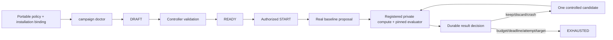

# Durable AutoResearch Campaigns

Status: installation-bound readiness and registered-training slice, July 2026.

For the NVIDIA-facing capability comparison and integration roadmap, see
[BashGym AutoResearch: Current Capability and NVIDIA NeMo Alignment](bashgym-autoresearch-nvidia-brief.md).

This is BashGym's authoritative path for new AutoResearch work. The older
`/api/autoresearch/*` endpoints remain prototype compatibility surfaces and are
explicitly non-durable.

## Contract



The control loop requires:

- an immutable objective, target-model contract, approved data scope, compute
  profile, evaluation plan, budget, and stop rules;
- controller-owned validation that stops at `READY`;
- a separate authenticated actor start gate;
- a real baseline before candidate search;
- exactly one changed variable and an incumbent parent for each candidate;
- exact proposal, study, attempt, artifact/evaluation, and result identities;
- explicit `real` versus `simulated` provenance;
- durable keep, discard, crash, and ineligible decisions;
- restart-safe state derived from SQLite, not conversation memory.

A fake executor can prove orchestration, sealing, metric ingestion, and restart
recovery. It cannot establish a baseline, become the incumbent, or support a
quality claim.

## One AutoResearch control plane, many models and trainers

AutoResearch is not attached to the star-count experiment, Gemma, or NeMo. The
controller operates on model, data, evaluator, compute, and trainer identities.
Once those identities are registered, the same baseline-first research loop
applies to language models, vision-language models, embedding models, and future
open models using any approved BashGym trainer.

| Capability | Every registered BashGym model | Additional NeMo RL/Gym capability |
|---|---:|---:|
| Agent intake, objective, hypothesis, and stop rules | Yes | No change |
| Durable campaign, attempts, budgets, leases, cancellation, and recovery | Yes | Reused unchanged |
| Local or private-SSH compute binding | Yes | Reused unchanged |
| Artifact sealing, evaluation, experiment ledger, and keep/discard decision | Yes | Reused unchanged |
| Workspace canvas, CLI, API, and Hermes/Codex projection | Yes | Reused unchanged |
| Trainer recipe and model loader | Per registered backend/model | NeMo RL recipe adapter |
| Ray placement, vLLM generation actors, and policy-to-generation refit | No | Optional NeMo RL |
| Gym agent/resources servers and isolated multi-turn sessions | No | Optional NeMo Gym |
| Message-level generation token IDs and behavior logprobs | Backend-dependent | NeMo Gym/NeMo RL contract |

Bringing a model file into a cache does not safely activate it. A new trainable
model needs an immutable base revision, a compatible trainer/runtime recipe, a
dataset and evaluator binding, and an approved compute profile. `campaign
doctor` verifies these before a real definition can launch. Inference quants and
served deployment artifacts cannot silently stand in for trainable bases.

This registration boundary is universal; the remaining productization work is
to make it guided and nearly automatic. The target flow is: discover an
operator-approved local model, classify its artifact and capabilities, propose
compatible installed trainers, generate the installation bindings, run doctor,
then execute a bounded smoke. It must never select or download an example model
merely because a backend recipe mentions one.

## First no-GPU test

Run the production campaign worker slice against an isolated temporary database:

```bash
bashgym campaign control-smoke --json
```

This test executes:

1. campaign creation and controller validation;
2. authenticated start;
3. explicit baseline submission;
4. scheduler selection and fake execution;
5. sealed artifact and loss-metric ingestion;
6. simulated result recording;
7. an `ineligible` decision;
8. repository reopen and state recovery.

The final state must still request a **real** baseline.
Pass `--output-dir <directory>` to retain the isolated database and sealed
artifacts for inspection. Without it, BashGym removes the temporary smoke data
after validation.

## Authenticated operator surface

The normal campaign CLI now exposes the durable path:

```bash
bashgym campaign templates \
  --workspace-id <workspace> --credential-ref <refresh-secret-ref> --json

bashgym campaign doctor \
  --workspace-id <workspace> --credential-ref <refresh-secret-ref> \
  --template <installation-template-id> --json

bashgym campaign create \
  --workspace-id <workspace> --credential-ref <refresh-secret-ref> \
  --template autoresearch-control-smoke-v1 \
  --campaign <campaign-id> --title "AutoResearch control smoke" \
  --idempotency-key <stable-create-key> --json

bashgym campaign autoresearch \
  --workspace-id <workspace> --credential-ref <refresh-secret-ref> \
  --campaign <campaign-id> --json

bashgym campaign start \
  --workspace-id <workspace> --credential-ref <refresh-secret-ref> \
  --campaign <campaign-id> --expected-version <ready-version> \
  --idempotency-key <stable-start-key> --json

bashgym campaign propose \
  --workspace-id <workspace> --credential-ref <refresh-secret-ref> \
  --campaign <campaign-id> --expected-version <version> \
  --proposal examples/autoresearch/control-smoke-baseline.json \
  --autoresearch-role baseline \
  --idempotency-key <stable-proposal-key> --json
```

No quality-claiming model template is selected by the package. A real campaign
must be materialized from an installation-owned binding that resolves an
operator-selected trainable model revision together with its approved data,
compute, and evaluation contracts. Missing or stale bindings fail closed; BashGym
does not fall back to an example model.

Installation-owned definitions live under
`~/.bashgym/campaigns/autoresearch-templates/*.json`. Each real definition must
identify an immutable trainable-base revision, approved dataset version, exact
ledger evaluation suite/primary metric, and logical compute contract. The
resident worker profile separately owns private transport, credentials, pinned
scripts and inputs, capacity policy, and budget reservation.

Create that definition without hand-authoring JSON:

```bash
bashgym campaign setup-autoresearch \
  --template <installation-template-id> \
  --objective "<measurable research objective>" \
  --model-ref 'hf://<organization>/<trainable-model>@<immutable-revision>' \
  --target-contract <model-contract-id> \
  --task <task-id> \
  --dataset-version <ledger-dataset-version-id> \
  --compute-profile <registered-private-compute-profile-id> \
  --source-repository-profile <registered-source-profile-id> \
  --project <ledger-project-id> \
  --evaluation-suite <ledger-evaluation-suite-id> \
  --primary-metric <exact-metric-id> \
  --metric-direction maximize \
  --budget-unit gpu_hours \
  --budget-limit <bounded-limit> \
  --max-attempts <bounded-count> \
  --minimum-improvement <minimum-delta> \
  --json
```

There is no model default. The command requires an exact 40/64-character content
revision (or SHA-256 digest), writes atomically, is idempotent by definition
digest, and refuses to overwrite a different binding unless `--replace` is
explicit. Its receipt contains the exact target-model digest and secret-free
ledger/evaluator/compute identities needed by the worker profile. It does not
store a host, user, key, remote path, or credential.

`campaign doctor` reports `materializable` only when the model, data, evaluator,
and registered compute profile all match. It reports `launch_ready` only when
those bindings match and the resident controller is online. A quality-claiming
template that is not materializable is rejected before campaign creation.

Proposals request only `executor_kind: registered_training`. The controller
resolves that logical request to an installation-owned private-compute profile
and persists the concrete executor contract. The profile is bound to the digest
of the full target-model contract; a different base revision or an inference
quant cannot silently satisfy it. Hosted compute is optional and is never a
fallback for this path.

After a real baseline becomes the incumbent, submit a candidate with:

```bash
--autoresearch-role candidate --parent-proposal <incumbent-proposal-id>
```

Recording a completed, campaign-linked evaluation through the experiment-ledger
API now automatically attempts authoritative AutoResearch ingestion. The ledger
write remains durable even when campaign prerequisites are temporarily
incomplete; its response reports `ingested`, `deferred`, or `not_applicable`.

Use the CLI only to reconcile a deferred result or replay an existing result:

```bash
bashgym campaign autoresearch-result \
  --workspace-id <workspace> --credential-ref <refresh-secret-ref> \
  --campaign <campaign-id> --project <ledger-project-id> \
  --evaluation-result <evaluation-result-id> \
  --idempotency-key <stable-result-key> --json
```

Neither path accepts caller-authored real metric/cost JSON. BashGym derives
the proposal role, study, run, action, all terminal attempts, primary metric,
evaluation suite, model/data/environment context, provenance, settled spend,
and sealed artifact hash match from the campaign and experiment ledgers. The
result ID and recorded time are server-owned. The old raw REST result boundary
is retained only for explicitly simulated compatibility results.

## Workspace canvas

The existing campaign canvas node remains the view layer. It reconstructs from
the campaign database after reload and projects:

- objective and campaign authority state;
- explicit real-baseline status;
- current hypothesis and falsification criterion;
- remaining budget;
- latest ledger or AutoResearch decision;
- current versus planned next action;
- attempts, metrics, sealed artifacts, events, and experiment-ledger evidence.
- resident-controller health as `online`, `stale`, or `offline`, independently
  from the campaign lifecycle.

The canvas does not maintain a second AutoResearch state machine. It reads the
same campaign/ledger projection used by CLI and API clients. Simulated outcomes
remain visible but never render as the baseline.

## What we adopted from NVIDIA

NVIDIA's workflow gets several operating principles right:

- validate the full model/data/runtime path with a smoke before long research;
- make the objective, method, environment, baseline, and time budget explicit;
- persist session context across compaction and disconnects;
- use one concrete hypothesis per experiment and preserve lineage;
- take the authoritative metric from the recipe/evaluator;
- record launcher, job, runtime, memory, metric, status, and artifact evidence;
- check stop rules before and after every run;
- never discard a meaningful idea based only on an underpowered smoke;
- keep the researcher responsible for goals, milestones, steering, and final
  interpretation.

Sources:

- [NVIDIA AutoResearch workflow article](https://developer.nvidia.com/blog/?p=119368)
- [NVIDIA NeMo RL Auto Research skill](https://github.com/NVIDIA/skills/blob/main/skills/nemo-rl-auto-research/SKILL.md)
- [NVIDIA NeMo RL](https://github.com/NVIDIA-NeMo/RL)
- [NVIDIA NeMo Gym](https://github.com/NVIDIA-NeMo/Gym)

## Where BashGym is stronger

The NVIDIA skill uses per-hypothesis git branches plus an untracked TSV ledger.
BashGym keeps git lineage where code changes require it, but its operational
truth is a typed, authenticated, append-only campaign database with optimistic
concurrency, idempotency, authority checks, budget reservations, sealed
artifacts, cursor events, and workspace-scoped projections. This is safer for
Hermes/Codex coordination and more suitable for a product UI.

The BashGym operator and training skills also already encode project selection,
tracking identity, protected-evaluation policy, artifact retention, compute
activation, Hugging Face publication authority, and GBrain curation.

## Remaining milestones

The standard registered-training path has completed one bounded real baseline
and controlled candidate on a fixed held-out suite. The remaining work is:

1. Extend the guided setup command beyond its completed definition installer so
   it can create/verify ledger records, a protected executor profile, and the
   resident-worker service without asking users to hand-author JSON.
2. Complete model onboarding so a newly approved local open model can produce
   model/trainer/data/evaluator/compute bindings without hand-authored JSON.
3. Run the first live NeMo Gym trajectory/refit smoke and bounded GRPO candidate
   only when an already-installed, operator-approved model passes the pinned
   NeMo runtime's compatibility doctor.
4. Convert actual Gym output into the exact token/refit campaign evidence receipt;
   process success alone is not proof that policy and generation weights matched.
5. Feed named reward components into a real GDPO trainer and compare the consumed
   advantages against BashGym's provider-neutral reference math.
6. Complete the fresh-clone/productization path: installer, secret setup,
   installation bindings, sample project, worker-service bootstrap, readiness
   validation, and first-run doctor.

NeMo Gym bundle, launch, token, refit, and campaign-evidence contracts now exist,
but no live refit is claimed until a compatible approved model executes them.
