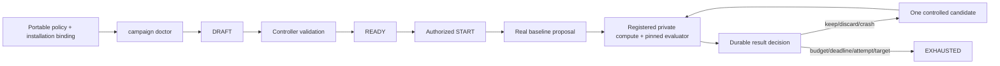

# Durable AutoResearch Campaigns

Status: installation-bound readiness and registered-training slice, July 2026.

For the NVIDIA-facing capability comparison and integration roadmap, see
[BashGym AutoResearch: Current Capability and NVIDIA NeMo Alignment](bashgym-autoresearch-nvidia-brief.md).

This is BashGym's authoritative path for new AutoResearch work. The older
`/api/autoresearch/*` endpoints remain prototype compatibility surfaces and are
explicitly non-durable.

## Choose this path when the experiment needs a durable record

**Direct Training** is the normal way to start one selected training job and
watch that run's logs and metrics. It is appropriate when the operator already
knows the model, data, recipe, and execution target to use.

**AutoResearch** is the durable control plane around a sequence of comparable
training and evaluation studies. Before it can start, it records an immutable
objective; an exact model, data, evaluator, and compute contract; budget and
stop rules; and an authenticated authority boundary. It requires a real
baseline, then permits a candidate only with one declared changed variable and
an incumbent parent. Results, decisions, and restart recovery live in the
campaign and experiment ledgers rather than in a terminal session or chat.

The no-GPU control smoke proves that control-plane behavior. It does **not**
prove model quality, a trainer integration, a local GPU setup, or the readiness
of your hardware.

## Fresh clone: what you need and what BashGym will not choose

For a fresh fork or clone, install Python 3.10+, Node.js 18+ LTS, Git, and the
native build prerequisites for the frontend. A GPU, provider key, model, and
dataset are not required for the control smoke. They are required only for a
real campaign on the backend you explicitly select.

```bash
git clone https://github.com/GhostPeony/bashgym.git
cd bashgym
python -m venv .venv
# Windows: .\.venv\Scripts\Activate.ps1
# macOS/Linux: source .venv/bin/activate
python -m pip install -e .
python -m pip install -e ".[training]"
cd frontend && npm ci && cd ..
cp .env.example .env
```

The training extra and frontend install are optional for the control-only CLI
smoke, but are needed for their respective local features. The copied `.env`
does not select a model or add credentials. Supply provider credentials only
for integrations you choose.

There is no repository-owned default or assumed model. For a real campaign,
the operator selects an existing trainable base and pins an immutable
40- or 64-character content revision (or SHA-256 digest), an approved dataset
version, evaluator suite and primary metric, logical source profile, registered
private-compute profile, budget, and stop rules. A cache hit, adapter, GGUF, or
other inference quant is not a substitute for that trainable base. BashGym
does not scan caches or download a substitute model during model inspection or
setup.

Start with commands that are safe on a new installation:

```bash
bashgym --help
bashgym campaign control-smoke --json
bashgym campaign inspect-model-artifact --help
bashgym campaign setup-autoresearch --help
bashgym campaign activate-autoresearch --help
bashgym campaign doctor --help
```

After `activate-autoresearch --apply` registers the exact ledger and
private-compute evidence, project those records into guided setup with a
read-only plan:

```bash
bashgym campaign sync-autoresearch-registry \
  --workspace-id <workspace-id> \
  --template <installed-template-id> --json
```

The bounded plan contains only logical binding IDs and `reachable` or `unknown`
state. It never searches model caches, infers trainability, downloads a model,
or exposes host, user, path, key, or credential data. If no installation ID is
supplied in plan mode, BashGym generates a reviewable `ins_<32-hex>` identity in
the plan without writing it. Apply is explicit and idempotent, and requires that
reviewed value rather than silently generating a different identity:

```bash
bashgym campaign sync-autoresearch-registry \
  --workspace-id <workspace-id> \
  --installation-id ins_<32-hex> \
  --template <installed-template-id> \
  --controller-owner-id <controller-id> \
  --controller-lease-key-ref <secret-reference> \
  --apply --json
```

A conflicting installation authority fails without partially changing bindings.

`control-smoke` uses an isolated temporary database unless `--output-dir` is
given. It does not need an API key, GPU, or model. Keep `--output-dir` only
when you need to inspect the smoke database and sealed artifacts afterwards.

### Register the local or private SSH target

The current real-training executor uses the same registered SSH path for a
private host and for hardware on the BashGym machine. For same-machine training,
enable an SSH server and register a localhost or SSH-config alias; BashGym does
not silently switch to a separate same-process executor.

In the desktop app, open **Training**, choose **Start Training**, select
**Private Target** under **Training Backend**, then either **Discover from SSH
Config** or **Add Device**. Save the target and run **Test**. A passing card shows
the logical **Device ID** required by `campaign activate-autoresearch`; host,
username, key path, and work directory stay in the installation-owned device
registry rather than the campaign definition.

On a fresh desktop install the initial canvas workspace ID is `default`. A named
canvas workspace uses its own persisted ID, which is also shown in the canonical
AutoResearch URL as `workspace_id`. Use that same value for credential
provisioning, activation, registry sync, doctor, and every later campaign call.
Use one stable logical operator ID such as `local-operator` for the activation
owner and local operator credential; it is an identity label, not an OS username.

Provision that operator through an opaque secret reference before making
authenticated campaign calls:

```bash
bashgym campaign provision-local-operator \
  --workspace-id <workspace-id> \
  --credential-ref BASHGYM_CAMPAIGN_OPERATOR \
  --actor-id local-operator --json
```

The command creates one `desktop_user` refresh credential scoped to that exact
workspace. Its raw value is returned only to BashGym's existing secret manager
(the OS credential manager when available, otherwise the restricted local
fallback); it is never accepted on the command line or printed. The reference
must be unused, including in the environment. Use
`BASHGYM_CAMPAIGN_OPERATOR` in place of `<refresh-secret-ref>` below.

## Contract



The control loop requires:

- an immutable objective, target-model contract, approved data scope, compute
  profile, evaluation plan, budget, and stop rules;
- controller-owned validation that stops at `READY`;
- a separate authenticated actor start gate;
- a real baseline before candidate search;
- exactly one changed variable and an incumbent parent for each candidate;
- exact proposal, study, attempt, artifact/evaluation, and result identities;
- explicit `real` versus `simulated` provenance;
- durable keep, discard, crash, and ineligible decisions;
- restart-safe state derived from SQLite, not conversation memory.

A fake executor can prove orchestration, sealing, metric ingestion, and restart
recovery. It cannot establish a baseline, become the incumbent, or support a
quality claim.

## One AutoResearch control plane, many models and trainers

AutoResearch is not attached to any example campaign, model family, or optional
trainer. The controller operates on model, data, evaluator, compute, and trainer identities.
Once those identities are registered, the same baseline-first research loop
applies to language models, vision-language models, embedding models, and future
open models using any approved BashGym trainer.

| Capability | Every registered BashGym model | Additional NeMo RL/Gym capability |
|---|---:|---:|
| Agent intake, objective, hypothesis, and stop rules | Yes | No change |
| Durable campaign, attempts, budgets, leases, cancellation, and recovery | Yes | Reused unchanged |
| Local or private-SSH compute binding | Yes | Reused unchanged |
| Artifact sealing, evaluation, experiment ledger, and keep/discard decision | Yes | Reused unchanged |
| Workspace canvas, CLI, API, and source-managed operator guidance | Yes | Reused unchanged |
| Trainer recipe and model loader | Per registered backend/model | NeMo RL recipe adapter |
| Ray placement, vLLM generation actors, and policy-to-generation refit | No | Optional NeMo RL |
| Gym agent/resources servers and isolated multi-turn sessions | No | Optional NeMo Gym |
| Message-level generation token IDs and behavior logprobs | Backend-dependent | NeMo Gym/NeMo RL contract |

Bringing a model file into a cache does not safely activate it. A new trainable
model needs an immutable base revision, a compatible trainer/runtime recipe, a
dataset and evaluator binding, and an approved compute profile. `campaign
doctor` verifies these before a real definition can launch. Inference quants and
served deployment artifacts cannot silently stand in for trainable bases.

This registration boundary is universal; the remaining productization work is
to make it guided and nearly automatic. The target flow is: discover an
operator-approved local model, classify its artifact and capabilities, propose
compatible installed trainers, generate the installation bindings, run doctor,
then execute a bounded smoke. It must never select or download an example model
merely because a backend recipe mentions one.

## First no-GPU test

Run the production campaign worker slice against an isolated temporary database:

```bash
bashgym campaign control-smoke --json
```

This test executes:

1. campaign creation and controller validation;
2. authenticated start;
3. explicit baseline submission;
4. scheduler selection and fake execution;
5. sealed artifact and loss-metric ingestion;
6. simulated result recording;
7. an `ineligible` decision;
8. repository reopen and state recovery.

The final state must still request a **real** baseline.
Pass `--output-dir <directory>` to retain the isolated database and sealed
artifacts for inspection. Without it, BashGym removes the temporary smoke data
after validation.

## Authenticated operator surface

The normal campaign CLI now exposes the durable path:

```bash
bashgym campaign templates \
  --workspace-id <workspace> --credential-ref <refresh-secret-ref> --json

bashgym campaign doctor \
  --workspace-id <workspace> --credential-ref <refresh-secret-ref> \
  --template <installation-template-id> --json

bashgym campaign create \
  --workspace-id <workspace> --credential-ref <refresh-secret-ref> \
  --template autoresearch-control-smoke-v1 \
  --campaign <campaign-id> --title "AutoResearch control smoke" \
  --idempotency-key <stable-create-key> --json

bashgym campaign autoresearch \
  --workspace-id <workspace> --credential-ref <refresh-secret-ref> \
  --campaign <campaign-id> --json

bashgym campaign start \
  --workspace-id <workspace> --credential-ref <refresh-secret-ref> \
  --campaign <campaign-id> --expected-version <ready-version> \
  --idempotency-key <stable-start-key> --json

bashgym campaign propose \
  --workspace-id <workspace> --credential-ref <refresh-secret-ref> \
  --campaign <campaign-id> --expected-version <version> \
  --proposal examples/autoresearch/control-smoke-baseline.json \
  --autoresearch-role baseline \
  --idempotency-key <stable-proposal-key> --json
```

No quality-claiming model template is selected by the package. A real campaign
must be materialized from an installation-owned binding that resolves an
operator-selected trainable model revision together with its approved data,
compute, and evaluation contracts. Missing or stale bindings fail closed; BashGym
does not fall back to an example model.

Installation-owned definitions live under
`~/.bashgym/campaigns/autoresearch-templates/*.json`. Each real definition must
identify an immutable trainable-base revision, approved dataset version, exact
ledger evaluation suite/primary metric, and logical compute contract. The
resident worker profile separately owns private transport, credentials, pinned
scripts and inputs, capacity policy, and budget reservation.

Create that definition without hand-authoring JSON:

```bash
bashgym campaign setup-autoresearch \
  --template <installation-template-id> \
  --objective "<measurable research objective>" \
  --model-ref 'hf://<organization>/<trainable-model>@<immutable-revision>' \
  --target-contract <model-contract-id> \
  --task <task-id> \
  --dataset-version <ledger-dataset-version-id> \
  --compute-profile <registered-private-compute-profile-id> \
  --source-repository-profile <registered-source-profile-id> \
  --project <ledger-project-id> \
  --evaluation-suite <ledger-evaluation-suite-id> \
  --primary-metric <exact-metric-id> \
  --metric-direction maximize \
  --budget-unit gpu_hours \
  --budget-limit <bounded-limit> \
  --max-attempts <bounded-count> \
  --minimum-improvement <minimum-delta> \
  --json
```

There is no model default. The command requires an exact 40/64-character content
revision (or SHA-256 digest), writes atomically, is idempotent by definition
digest, and refuses to overwrite a different binding unless `--replace` is
explicit. Its receipt contains the exact target-model digest and secret-free
ledger/evaluator/compute identities needed by the worker profile. It does not
store a host, user, key, remote path, or credential.

Activate those identities against an already registered SSH device without
hand-authoring worker or ledger JSON. This is the same path for a private host
and for hardware on the BashGym machine reached through localhost SSH; a native
same-process campaign executor is not claimed yet.

Run the command once without `--apply`. It performs SSH preflight, validates the
Git source scopes and entrypoint, hashes the dataset/evaluator/training material,
checks every existing identity for conflicts, and prints a non-applying plan.
It does not create activation records, worker configuration, or a service (an
existing installation database may still apply a pending schema migration when
opened).

```bash
bashgym campaign activate-autoresearch \
  --template <installation-template-id> \
  --workspace-id <workspace-id> \
  --device-id <registered-ssh-device-id> \
  --project-name "<project display name>" \
  --owner-actor-id <operator-actor-id> \
  --dataset-id <dataset-id> \
  --dataset-name "<dataset display name>" \
  --dataset-file <exact-local-dataset-file> \
  --dataset-source-uri 'artifact://<stable-dataset-identity>' \
  --evaluator-file <exact-evaluator-source-file> \
  --evaluation-name "<evaluation display name>" \
  --source-repository <absolute-private-git-root> \
  --source-entrypoint <repository-relative-python-entrypoint> \
  --mutation-path trainer=<approved-repository-relative-path> \
  --training-script <exact-local-launch-script> \
  --training-input <exact-local-recipe-or-config> \
  --executor-profile <installation-executor-profile-id> \
  --smoke-budget-reservation <bounded-gpu-hours> \
  --full-budget-reservation <bounded-gpu-hours> \
  --json
```

After reviewing the plan, repeat it with `--apply`. Add `--install-worker` only
when the command should also install and start the per-user worker service. The
apply path is rerunnable: identical ledger and worker records replay, while a
reused ID with different data, evaluator, source, model, script, or compute
authority fails closed. It preserves unrelated profiles and stores neither raw
dataset rows nor secret values in the activation receipt.

An applied activation is `materializable` when every non-controller doctor
check passes. It becomes `launch_ready` only after the resident worker owns a
live controller lease. NeMo RL or NeMo Gym can then be attached as an optional
backend to the same dedicated executor profile; neither is required for the
regular registered-training path.

`campaign doctor` reports `materializable` only when the model, data, evaluator,
and registered compute profile all match. It reports `launch_ready` only when
those bindings match and the resident controller is online. A quality-claiming
template that is not materializable is rejected before campaign creation.

Proposals request only `executor_kind: registered_training`. The controller
resolves that logical request to an installation-owned private-compute profile
and persists the concrete executor contract. The profile is bound to the digest
of the full target-model contract; a different base revision or an inference
quant cannot silently satisfy it. Hosted compute is optional and is never a
fallback for this path.

After a real baseline becomes the incumbent, submit a candidate with:

```bash
--autoresearch-role candidate --parent-proposal <incumbent-proposal-id>
```

Recording a completed, campaign-linked evaluation through the experiment-ledger
API now automatically attempts authoritative AutoResearch ingestion. The ledger
write remains durable even when campaign prerequisites are temporarily
incomplete; its response reports `ingested`, `deferred`, or `not_applicable`.

Use the CLI only to reconcile a deferred result or replay an existing result:

```bash
bashgym campaign autoresearch-result \
  --workspace-id <workspace> --credential-ref <refresh-secret-ref> \
  --campaign <campaign-id> --project <ledger-project-id> \
  --evaluation-result <evaluation-result-id> \
  --idempotency-key <stable-result-key> --json
```

Neither path accepts caller-authored real metric/cost JSON. BashGym derives
the proposal role, study, run, action, all terminal attempts, primary metric,
evaluation suite, model/data/environment context, provenance, settled spend,
and sealed artifact hash match from the campaign and experiment ledgers. The
result ID and recorded time are server-owned. The old raw REST result boundary
is retained only for explicitly simulated compatibility results.

## Workspace canvas

The existing campaign canvas node remains the view layer. It reconstructs from
the campaign database after reload and projects:

- objective and campaign authority state;
- explicit real-baseline status;
- current hypothesis and falsification criterion;
- remaining budget;
- latest ledger or AutoResearch decision;
- current versus planned next action;
- attempts, metrics, sealed artifacts, events, and experiment-ledger evidence.
- resident-controller health as `online`, `stale`, or `offline`, independently
  from the campaign lifecycle.

The canvas does not maintain a second AutoResearch state machine. It reads the
same campaign/ledger projection used by CLI and API clients. Simulated outcomes
remain visible but never render as the baseline.

## Control Room and live updates

The compact **Control Room** is the current read-oriented AutoResearch surface.
After starting the backend and frontend with the documented development command
for your platform (`.\dev.ps1` on Windows or `./dev.sh` on macOS/Linux), choose
**AutoResearch** from the sidebar. **Training** opens direct runs; AutoResearch
is a standalone sidebar item directly below it;
both destinations share the training route internally. A selected campaign can
also be addressed with the canonical
URL:

```text
?view=training&tab=autoresearch&workspace_id=<workspace-id>&campaign_id=<campaign-id>
```

The Control Room loads a compact campaign snapshot first, then offers
paginated events and artifacts for inspection. It presents campaign selection,
journey, owner, freshness, blocker, next action, active work, evidence/metric
summaries, budget, and recent activity. It is a view of server-owned durable
state, not a second scheduler or result calculator.

Live updates are intentionally only worker-safe hints. A subscribed client
receives an identifier-only `campaign_hint.v1` containing the workspace and
campaign IDs, event cursor, aggregate version, event type, correlation ID, and
emission time. It must reconcile from the REST snapshot; a hint is never a
result payload or authorization to mutate. The UI marks freshness as live,
reconciling, stale, offline, or error so it does not imply that an old screen is
authoritative.

The Control Room keeps the ordered guided-setup path visible even before the
first campaign exists and while the backend is offline. For a durable campaign
in `READY`, its compact authority rail exposes **Start** only from a live,
launch-ready projection. Clicking it still causes the backend to recompute the
current definition, ledger bindings, source profile, controller lease, and
execution identity; the renderer never promotes its cached projection into
authority. A rejected mutation triggers a compact reconciliation before another
attempt.

The backend setup path discovers installation-registered logical model, data,
evaluator, and compute bindings without projecting controller owners, lease
keys, hosts, paths, or credentials. `GET /api/campaigns/setup/context` is an
authenticated, read-only projection: it does not create setup schema, sessions,
or receipts. Installation-owned services register bindings through the private
recovery registry; there is no public route that lets a renderer assert that a
model or compute target is reachable.

`POST /api/campaigns/setup/session` advances one ordered selection at a time:
template, installation, model, data, compute, then evaluation. Every accepted
step must name an exact registered logical ID and emits a bounded,
externally-sealed receipt chained to the previous step. The session is
workspace- and actor-scoped, versioned, idempotent, restart-resumable, and
reports explicit readiness reason codes. It becomes eligible for the existing
doctor/validate/create authority only when all selected bindings are reachable
and match the chosen template contract.

The Control Room now drives that contract directly. Before the first campaign
exists, it renders all six steps and a narrow authority summary. Offline or
invalid responses leave the setup visible but read-only; they do not collapse
the page into a backend error. A live session saves one registered choice at a
time, resumes its workspace-scoped receipt chain, runs doctor, seals the exact
validation result, and creates the campaign. Campaign creation is not Start:
the new campaign opens for review, and the ordinary server-revalidated Start
gate remains a separate human decision.

The mounted `HumanOversightQueue` is authoritative: development evaluation can
produce a blinded, one-reviewer work item; claim and rubric submission are
revision-bound and idempotent; the receipt is sealed by installation-owned
campaign authority; and pending human work blocks both comparison replacement
and ordinary promotion. A worker crash after evaluation sealing is reconciled
before the review is exposed. Recovery inspection uses separately sealed,
scope-bound doctor, eligibility, and execution receipts. The fenced resident
worker consumes accepted resume/repair requests, reclaims expired work after a
restart, blocks ambiguous repairs for operator selection, and authenticates the
mutable execution lifecycle. Mutation controls are enabled only from an exact
live `execution_consumer` proof; the UI does not equate acceptance with
execution.

### Control Room projection baseline

An absolute Windows/TestClient benchmark against a temporary SQLite WAL database
used 1,000 campaign events, 256 budget entries (projected to the bounded maximum
of 64 summaries), 50 human-review rows (10 previews), active work, remote runs,
and sealed evidence. The authenticated Control Room projection performs 18
`SELECT` statements inside one explicit read transaction. Across 250 direct
end-to-end projection samples it measured 5.19 ms median and 6.11 ms p95, with a
19.2 KB JSON response. Pure projection building measured 0.38 ms median.

The matching FastAPI TestClient route measured about 239 ms median because
credential authentication alone measured about 219 ms median; authentication,
not projection construction, accounted for roughly 91% of route latency. A
conditional `304` response currently saves payload bytes but still pays the
authentication and projection cost. These are absolute local measurements, not
a release regression baseline. Keep projection queries and payload bounds under
test, and profile token verification separately before attributing route latency
to the Control Room state model.

The official product surface is the durable campaign path under
`/api/campaigns/*` and the AutoResearch sidebar destination. The older
`/api/autoresearch/*` hyperparameter/data/trace/schema research routes remain a
temporary, explicitly non-campaign compatibility API; they are not rendered by
the official Control Room, and the retired prototype renderer/store no longer
ships as a competing state surface. Compatibility events can still appear in the
ordinary Activity feed but are never treated as campaign authority. Legacy
`?view=autoresearch` desktop links are redirect-only aliases to
the canonical `?view=training&tab=autoresearch` destination.

## Security and privacy boundaries

- Desktop campaign requests are brokered through Electron's main-process
  campaign bridge. The renderer uses its bounded bridge and route allowlist;
  the bearer token is not exposed as a renderer configuration value.
- A campaign live ticket is issued only to an actor with workspace read
  capability, expires quickly, is bound to that credential and authorization
  revision, and is consumed once when subscribing. It is not a reusable bearer
  credential.
- WebSocket hints contain no campaign payload. REST snapshot/cursor reads remain
  the authority for state and are authenticated separately.
- Public event and artifact projections are allowlisted. Raw event payloads,
  protected evaluation identities/results, candidate mappings, private paths or
  URIs, raw restricted rows, secrets, and unclassified metadata are excluded
  rather than replaced with redacted placeholders.
- Installation activation records secret-free binding identities and hashes;
  private host, user, key, remote path, credentials, and raw dataset rows stay
  in installation-owned configuration or the operator's private environment.
- Campaign-agent origin verification and encrypted credential brokerage are
  activated only when the backend is the managed desktop child and the current
  Electron launch bootstrap has successfully authenticated. A renderer claim,
  an unmanaged server, or an old bootstrap cannot enable that authority.
- The main-only credential transport and isolated loopback MCP host expose
  exactly two read-only actions: `campaign_observe` and `campaign_artifacts`.
  They do not provide training launch/pause, artifact proposal, generic request
  forwarding, filesystem access, or process execution, and their credential
  routes are not available through the renderer's general campaign bridge.
- The compact campaign-agent panel remains visible and disabled when its
  authority is offline. Electron main now owns credential claim, heartbeat
  activation, one scope-bound Codex PTY, MCP binding, and fail-closed teardown;
  the renderer adopts only the already-running public PTY identity into the
  matching Workspace. Hermes launch parity and mutation actions are not yet
  supported. Do not describe an ordinary terminal or an empty/offline host as
  executing a campaign, and retain a clean packaged-runtime activation/non-leak
  proof before release.

## Productization checklist and current limits

The portable seam is deliberate: repository policy travels with the clone,
while machine authority does not. Before calling a real campaign portable for a
new installation, verify all of the following:

The desktop starts model-neutral as well: detected hardware may produce an
advisory list, but it never writes the first recommendation into Training or an
AutoResearch campaign. The operator must select the exact trainable base.

1. Inspect the operator-selected local model snapshot with
   `campaign inspect-model-artifact`; do not substitute a downloaded or cached
   model.
2. Create the installation-owned definition with
   `campaign setup-autoresearch`, including the immutable model reference,
   data/evaluator/source/compute IDs, metric direction, budget, and stop rules.
3. Register the private SSH device and run `campaign activate-autoresearch`
   without `--apply` to preflight transport, source scope, dataset, evaluator,
   launch materials, and identity conflicts. Repeat with `--apply` only after
   reviewing the plan; add `--install-worker` only to install and start the
   per-user resident worker.
4. Run `campaign doctor` against the installation template. Require
   `materializable`; then require `launch_ready`, which also requires a live
   resident controller lease, before creating a quality-claiming campaign or
   starting a real baseline.
5. Preserve the real baseline, pinned evaluator result, sealed artifacts, and
   budget evidence before proposing one controlled candidate. Reconcile any
   deferred evaluation result by identifier; never submit caller-authored real
   metric or cost JSON.

The remaining bespoke seams are the device registry, private Git source root,
SSH transport and remote runtime, registered trainer/recipe, dataset and
evaluator files, ledger IDs, credential reference, and resident-worker service.
Same-machine hardware still uses the registered localhost-SSH path; a native
same-process campaign executor is not currently provided. Hosted compute and
NeMo RL/Gym are explicit optional adapters, not fallback paths. A compatible
model, live NeMo Gym rollout, or policy-to-generation refit must be proven on
the operator's installed environment before it is represented as working.

## What we adopted from NVIDIA

NVIDIA's workflow gets several operating principles right:

- validate the full model/data/runtime path with a smoke before long research;
- make the objective, method, environment, baseline, and time budget explicit;
- persist session context across compaction and disconnects;
- use one concrete hypothesis per experiment and preserve lineage;
- take the authoritative metric from the recipe/evaluator;
- record launcher, job, runtime, memory, metric, status, and artifact evidence;
- check stop rules before and after every run;
- never discard a meaningful idea based only on an underpowered smoke;
- keep the researcher responsible for goals, milestones, steering, and final
  interpretation.

Sources:

- [NVIDIA AutoResearch workflow article](https://developer.nvidia.com/blog/?p=119368)
- [NVIDIA NeMo RL Auto Research skill](https://github.com/NVIDIA/skills/blob/main/skills/nemo-rl-auto-research/SKILL.md)
- [NVIDIA NeMo RL](https://github.com/NVIDIA-NeMo/RL)
- [NVIDIA NeMo Gym](https://github.com/NVIDIA-NeMo/Gym)

## Where BashGym is stronger

The NVIDIA skill uses per-hypothesis git branches plus an untracked TSV ledger.
BashGym keeps git lineage where code changes require it, but its operational
truth is a typed, authenticated, append-only campaign database with optimistic
concurrency, idempotency, authority checks, budget reservations, sealed
artifacts, cursor events, and workspace-scoped projections. This is safer for
Hermes/Codex coordination and more suitable for a product UI.

The BashGym operator and training skills also already encode project selection,
tracking identity, protected-evaluation policy, artifact retention, compute
activation, Hugging Face publication authority, and GBrain curation.

## Remaining milestones

The standard registered-training path has completed one bounded real baseline
and controlled candidate on a fixed held-out suite. Durable blinded human review
is now integrated. The remaining work is:

1. Retain a clean packaged-desktop proof of the implemented main-spawned Codex
   lifecycle around `campaign_observe` and `campaign_artifacts`: credential
   claim, heartbeat activation, scope-correct Workspace adoption, PTY/MCP
   binding, non-disclosure, and fail-closed teardown. Add Hermes parity and
   mutation tools only as separately bounded, verified milestones.
2. Run the hardware-gated clean-install activation against an operator-approved
   registered SSH device and existing trainable model, then retain the bounded
   baseline/evaluator evidence.
3. Run the first live NeMo Gym trajectory/refit smoke and bounded GRPO candidate
   only when an already-installed, operator-approved model passes the pinned
   NeMo runtime's compatibility doctor.
4. Add a separately registered native-local executor if same-process campaign
   execution is needed; until then local hardware uses the protected SSH path.
5. Finish profiling the remaining active source suite independently of the
   deferred legacy Orchestrator tests.
6. Run the hardware-gated recovery flow against the packaged desktop and a live
   resident worker, retaining the accepted, executing, and terminal receipts.

NeMo Gym bundle, launch, token, refit, and campaign-evidence contracts now exist,
but no live refit is claimed until a compatible approved model executes them.
