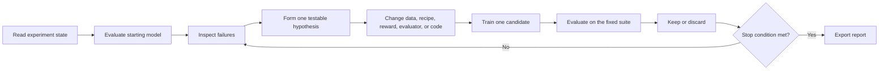

# AutoResearch campaigns

AutoResearch is BashGym's durable path for repeated model experiments. An
agent evaluates a starting model, studies the failures, changes one variable,
trains a candidate, evaluates it on the same suite, and uses the comparison to
choose the next experiment.


```mermaid
flowchart LR
    A["Read experiment state"] --> B["Evaluate starting model"]
    B --> C["Inspect failures"]
    C --> D["Form one testable hypothesis"]
    D --> E["Change data, recipe, reward, evaluator, or code"]
    E --> F["Train one candidate"]
    F --> G["Evaluate on the fixed suite"]
    G --> H["Keep or discard"]
    H --> I{"Stop condition met?"}
    I -->|No| C
    I -->|Yes| J["Export report"]
```

The experiment survives agent restarts because proposals, attempts, evaluation
evidence, comparisons, costs, and decisions are stored in the campaign and
experiment ledgers. Conversation history is not the experiment record.

For the component map, see [BashGym architecture](../PLATFORM_OVERVIEW.md).

## Who does what

| Host agent                                                     | BashGym                                                                    |
| -------------------------------------------------------------- | -------------------------------------------------------------------------- |
| Keeps the objective and next action in its native goal or plan | Returns compact durable state and the next valid action                    |
| Examines failed tasks, traces, slices, data, and prior results | Preserves the fixed evaluation contract and experiment lineage             |
| Forms a falsifiable hypothesis                                 | Validates baseline-first and one-variable proposal rules                   |
| Edits approved data, recipes, rewards, evaluators, or code     | Schedules registered data, training, and evaluation stages                 |
| Interprets the comparison and proposes the next experiment     | Verifies evaluation evidence and records baseline, keep, discard, or crash |
| Decides when the scientific question is answered               | Enforces configured attempt, cost, deadline, target, and proposal limits   |

There is intentionally no second planner inside BashGym. The resident
`AutoResearchLoopCoordinator` performs mechanical work such as ingesting a
completed evaluation, retrying a bounded failed action, recording a crash, and
enforcing a stop rule. When a new hypothesis is needed, it returns
`agent_action_required`; the host agent must propose the experiment.

## One iteration

### 1. Read state

`research state` combines the objective, current work, latest comparison,
budget, stop conditions, report reference, and `AutoResearchState.next_action`.
Refresh it after every result and whenever the agent resumes.

Possible research actions include preparing or starting the campaign,
submitting the baseline, waiting for a result, proposing a candidate, stopping,
or resolving a blocker. The state is derived from durable records rather than
from UI or chat state.

### 2. Establish the baseline

The baseline is evaluation-only. Its stage plan contains one required
development-evaluation stage, which evaluates the registered starting model on
the pinned suite. It does not train the starting model or build new data.

A simulated or fake result cannot establish the baseline. A real baseline is
accepted only through the authoritative evaluation projection with matching
campaign, study, run, suite, metric, and sealed evidence lineage.

A registered suite may also declare two evaluator canary IDs, a baseline repeat
count, and a maximum score spread. When it does, the sealed baseline output must
show that the known-good case passed, the known-bad case was rejected, and the
repeated scores stayed within that bound. The reported primary metric must equal
the repeat mean. Candidate evaluations remain single-pass unless their own method
requires repeated measurement.

### 3. Propose one controlled candidate

After the baseline, the agent inspects task-level failures and changes exactly
one declared primary variable. A candidate must:

- name the current incumbent as its parent;
- depend on the incumbent study;
- declare the changed variable and the variables held constant;
- fit inside the remaining experiment budget; and
- include captured Git lineage when the changed variable represents trainer,
  algorithm, environment, reward, evaluator, verifier, or other approved code.

Examples of useful variables are a dataset revision, sampling policy, learning
rate, training method, reward definition, evaluator implementation, or bounded
source change. A candidate is an experiment, not a claim that the intervention
will work.

### 4. Run the candidate stages

A candidate stage plan can be:

```text
optional data build -> full training -> fixed development evaluation
```

The data-build stage is omitted when the proposal uses an already registered
dataset. Training consumes the declared dataset and starting-model binding.
Evaluation consumes the trained output and the same pinned suite used by the
baseline.

The durable worker selects one proposal, schedules one stage at a time, claims
the work, executes outside SQLite, verifies the result, settles the reserved
cost, and advances the stage cursor. It can recover persisted work after a
process restart without relaunching a completed stage.

### 5. Compare, keep, or discard

`CampaignEvaluationProjector` reads verified evaluation evidence and derives
the campaign result. For a primary metric `m`:

```text
maximize: improvement = candidate - incumbent
minimize: improvement = incumbent - candidate
KEEP iff improvement > 0 and improvement >= minimum_improvement
     and every configured protected metric stays within max_regression
otherwise DISCARD
```

A kept candidate becomes the incumbent. A discarded candidate remains in the
history, but the prior incumbent stays unchanged. The agent should inspect the
aggregate metric, protected regressions that are part of the pinned suite, and
the underlying failed and recovered tasks before choosing the next variable.

### 6. Continue or report

The loop stops when a configured deadline, attempt limit, proposal limit, cost
limit, or target metric is reached. It may also end through an authorized
pause, cancellation, or conclusion. `research report` exports bounded Markdown
and JSON evidence from the same durable record.

## Use the agent platform directly

AutoResearch is designed to run inside an agent that already has an editor,
terminal, planning tools, and subagents.

- In Codex, put the campaign objective and stop conditions in `/goal`, then
  synchronize the task plan with `research state`.
- In Cursor, use Agent planning and todos. Install the project Agent Skills
  bundle with `bashgym operator skills install --host agents`.
- In Claude Code, use its task list and resume/continue workflow.
- In every host, use native file, terminal, browser, and subagent tools for
  failure analysis, dataset work, recipe changes, and evaluation review.

Do not put host session IDs, goal IDs, todos, or conversational scratch work in
the campaign ledger. Those belong to the agent host; experimental facts belong
to BashGym.

## Prepare one campaign

`research prepare` is the read-only discovery surface. It returns registered
templates, installations, model, data, compute, and evaluation choices. Keep
the returned `session_id` and pass it back to resume that exact guided setup.

```bash
bashgym research prepare \
  --workspace-id <workspace> \
  --credential-ref <credential-ref> --json

bashgym research prepare \
  --workspace-id <workspace> --session-id <returned-session-id> \
  --credential-ref <credential-ref> --json
```

Resolve only choices that are missing or ambiguous. Once every choice is exact,
record them in a private `autoresearch_onboarding_contract.v1` file. The
contract names:

- the BashGym data directory and local API base;
- a source-managed AutoResearch definition;
- an activation request for the selected execution target;
- an exact target-model registration request with an immutable revision;
- workspace, installation, resident-controller, credential-reference, and
  campaign identities.

Keep target addresses, credentials, and local paths in this operator-owned
contract and its referenced inputs. They do not belong in a campaign proposal
or public project configuration.

Preview the deterministic preparation before applying it:

```bash
bashgym research onboard --contract <onboarding.json> --json
```

The plan contains these ordered, replay-safe steps:

```text
target model -> activation -> resident services -> registry sync
             -> guided setup -> campaign preparation
```

Apply the same reviewed contract:

```bash
bashgym research onboard --contract <onboarding.json> --apply --json
```

Depending on the model request, the first step either registers an existing
model or acquires its pinned snapshot on the selected execution target. Model
weights remain on that target; BashGym records bounded identity, manifest, and
size metadata. The remaining steps activate the installation, install or start
the resident API and worker, sync the logical bindings, complete guided setup,
and create the requested campaign. A receipt after each step makes an exact
retry resume instead of repeating completed work.

Successful onboarding ends with `campaign_status: ready` and
`next_action: explicit_start_confirmation_required`. It never starts training.
Read `research state` for that campaign, present the exact model, data,
evaluation, compute, budget, and stop rules, then wait for a later explicit
Start.

## Start and continue

Starting compute is a separate action. Run it only after the user explicitly
confirms Start for that unchanged `READY` campaign:

```bash
bashgym research start \
  --workspace-id <workspace> --credential-ref <credential-ref> \
  --campaign <campaign-id> --expected-version <version> \
  --idempotency-key <key> --json
```

Read the canonical state after every result and whenever the host agent
resumes:

```bash
bashgym research state \
  --workspace-id <workspace> --credential-ref <credential-ref> \
  --campaign <campaign-id> --json
```

When BashGym is running a stage, use the read-only cursor wait instead of
creating a parallel scheduler or polling conversation state:

```bash
bashgym research wait \
  --workspace-id <workspace> --credential-ref <credential-ref> \
  --campaign <campaign-id> --after-cursor <cursor> \
  --timeout-seconds 30 --json
```

The response reports `changed`, `agent_action_required`, `timeout`, or
`terminal`, includes the latest research state, and returns `next_cursor` for
the next call. Update the host's native goal or plan from that state before
choosing another intervention.

Submit the evaluation-only baseline, then one candidate at a time. Proposal
files contain the typed data, training, evaluation, capability, cost, and stage
contracts; they do not contain transport commands.

```bash
bashgym research submit-iteration \
  --workspace-id <workspace> --credential-ref <credential-ref> \
  --campaign <campaign-id> --expected-version <version> \
  --proposal baseline.json --role baseline \
  --idempotency-key <key> --json

bashgym research submit-iteration \
  --workspace-id <workspace> --credential-ref <credential-ref> \
  --campaign <campaign-id> --expected-version <version> \
  --proposal candidate.json --role candidate \
  --parent-proposal <incumbent-proposal-id> \
  --idempotency-key <key> --json

bashgym research report \
  --workspace-id <workspace> --credential-ref <credential-ref> \
  --campaign <campaign-id> --expected-version <version> \
  --idempotency-key <key> --formats markdown,json --json
```

Use a fresh `expected-version` from `research state` for every mutation.
Idempotency keys make an exact retry safe; they do not authorize a different
proposal or campaign revision.

The reviewed operating instructions are in the
[BashGym operator skill](../../assistant/workspace/skills/bashgym-operator/SKILL.md)
and [training skill](../../assistant/workspace/skills/training/SKILL.md).

## Artifact and evidence flow

The current durable campaign executor uses registered SSH stage profiles.
Executable commands, credentials, target paths, and process configuration are
owned by the installed executor profile, not by an agent-authored proposal.

Data and model outputs can remain resident on the execution target between
adjacent stages:

- a verified data-build receipt supplies the dataset to training by immutable
  identity and digest;
- a verified full-training result supplies the candidate model to evaluation;
- the campaign ledger stores bounded artifact metadata, hashes, lineage, and
  opaque references rather than copying every dataset row or model file to the
  API process.

The worker verifies stage manifests and the evaluation projector checks the
sealed result before recording a real metric. If an execution target cannot
preserve resident outputs, its adapter must provide an equivalent verified
artifact contract; the proposal itself cannot invent one.

## Observation UI

The AutoResearch canvas and campaign view observe the same experiment record
used by the CLI and API. They can show the current hypothesis, active stage,
comparison history, budget, evidence, and report links. They do not propose the
next experiment, execute training, or maintain a separate state machine.

## What is executable today

| Responsibility                                        | Executable source                                                                                |
| ----------------------------------------------------- | ------------------------------------------------------------------------------------------------ |
| Agent research tools                                  | [`bashgym/mcp/campaign_server.py`](../../bashgym/mcp/campaign_server.py)                         |
| Campaign REST state and baseline/candidate routes     | [`bashgym/api/campaign_routes.py`](../../bashgym/api/campaign_routes.py)                         |
| Baseline-first rules, comparison, and stop conditions | [`bashgym/campaigns/autoresearch.py`](../../bashgym/campaigns/autoresearch.py)                   |
| Stage materialization and artifact lineage            | [`bashgym/campaigns/runtime.py`](../../bashgym/campaigns/runtime.py)                             |
| Scheduling, execution, recovery, and completion       | [`bashgym/campaigns/worker.py`](../../bashgym/campaigns/worker.py)                               |
| Worker assembly                                       | [`bashgym/campaigns/worker_service.py`](../../bashgym/campaigns/worker_service.py)               |
| Registered SSH execution contract                     | [`bashgym/campaigns/remote.py`](../../bashgym/campaigns/remote.py)                               |
| Sealed evaluation projection                          | [`bashgym/campaigns/autoresearch_evidence.py`](../../bashgym/campaigns/autoresearch_evidence.py) |
| Mechanical iteration coordination                     | [`bashgym/campaigns/autoresearch_loop.py`](../../bashgym/campaigns/autoresearch_loop.py)         |
| Compact state for agents                              | [`bashgym/campaigns/agent_brief.py`](../../bashgym/campaigns/agent_brief.py)                     |

The end-to-end
[`test_autoresearch_discovery_loop.py`](../../tests/campaigns/test_autoresearch_discovery_loop.py)
proves baseline evaluation, data-build-to-training and training-to-evaluation
handoffs, fixed-suite comparisons, keep/discard decisions, stopping, reporting,
and restart-safe reconstruction. Its deterministic adapter is a wiring proof,
not evidence that a model, trainer, dataset, or execution environment improves
quality.

## Current boundaries

- The host agent proposes hypotheses and candidate changes. There is no
  repository-resident scientific proposer.
- The durable campaign path currently resolves registered stages through its
  SSH execution adapter. It does not yet provide a generic in-process campaign
  adapter or a generic hosted-compute campaign adapter.
- Direct training endpoints and `gym/trainer.py` are separate execution paths;
  a direct run does not automatically become an AutoResearch iteration.
- The primary keep/discard decision uses the pinned evaluation suite, primary
  metric, metric direction, and minimum-improvement threshold. Other standalone
  held-out, environment, reward, and safety gates in the repository are not all
  automatically composed into that decision yet.
- Fake executors and smoke templates prove orchestration, persistence, and
  evidence wiring only. They cannot establish a real baseline or model-quality
  result.
- The older `/api/autoresearch/*` routes are optional compatibility code. New
  durable work uses `/api/campaigns/*` through the `research` tools.

These boundaries are implementation facts, not restrictions on which model,
dataset, or research question an installation may register.
