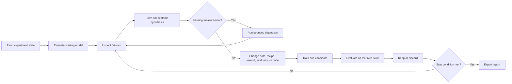

# AutoResearch campaigns

AutoResearch is BashGym's durable path for repeated model experiments. An
agent evaluates a starting model, studies the failures, changes one variable,
trains a candidate, evaluates it on the same suite, and uses the comparison to
choose the next experiment.


```mermaid
flowchart LR
    A["Read experiment state"] --> B["Evaluate starting model"]
    B --> C["Inspect failures"]
    C --> D["Form one testable hypothesis"]
    D --> Q{"Missing measurement?"}
    Q -->|Yes| P["Run bounded diagnostic"]
    P --> C
    Q -->|No| E["Change data, recipe, reward, evaluator, or code"]
    E --> F["Train one candidate"]
    F --> G["Evaluate on the fixed suite"]
    G --> H["Keep or discard"]
    H --> I{"Stop condition met?"}
    I -->|No| C
    I -->|Yes| J["Export report"]
```

The experiment survives agent restarts because proposals, attempts, evaluation
evidence, comparisons, costs, and decisions are stored in the campaign and
experiment ledgers. Conversation history is not the experiment record.

For the component map, see [BashGym architecture](../PLATFORM_OVERVIEW.md).

## Who does what

| Host agent                                                     | BashGym                                                                    |
| -------------------------------------------------------------- | -------------------------------------------------------------------------- |
| Keeps the objective and next action in its native goal or plan | Returns compact durable state and the next valid action                    |
| Examines failed tasks, traces, slices, data, and prior results | Preserves the fixed evaluation contract and experiment lineage             |
| Forms a falsifiable hypothesis and declared intervention       | Validates baseline-first, declared-change, and lineage rules               |
| Edits approved data, recipes, rewards, evaluators, or code     | Schedules registered data, training, and evaluation stages                 |
| Interprets the comparison and proposes the next experiment     | Verifies evaluation evidence and records baseline, keep, discard, or crash |
| Decides when the scientific question is answered               | Enforces configured attempt, cost, deadline, target, and proposal limits   |

There is intentionally no second planner inside BashGym. The resident
`AutoResearchLoopCoordinator` performs mechanical work such as ingesting a
completed evaluation, retrying a bounded failed action, recording a crash, and
enforcing a stop rule. When a new hypothesis is needed, it returns
`agent_action_required`; the host agent must propose the experiment.

## One iteration

### 1. Read state

`research state` combines the objective, current work, latest comparison,
budget, stop conditions, report reference, and `AutoResearchState.next_action`.
Refresh it after every result and whenever the agent resumes.

Possible research actions include preparing or starting the campaign,
submitting the baseline, waiting for a result, proposing a candidate, stopping,
or resolving a blocker. The state is derived from durable records rather than
from UI or chat state.

### 2. Establish the baseline

The baseline is evaluation-only. Its stage plan contains one required
development-evaluation stage, which evaluates the registered starting model on
the pinned suite. It does not train the starting model or build new data.

A simulated or fake result cannot establish the baseline. A real baseline is
accepted only through the authoritative evaluation projection with matching
campaign, study, run, suite, metric, and sealed evidence lineage.

A registered suite may also declare two evaluator canary IDs, a baseline repeat
count, and a maximum score spread. When it does, the sealed baseline output must
show that the known-good case passed, the known-bad case was rejected, and the
repeated scores stayed within that bound. The reported primary metric must equal
the repeat mean. Candidate evaluations remain single-pass unless their own method
requires repeated measurement.

### 3. Diagnose only when evidence is missing

`research state` already derives passive diagnostics from completed work:
fixed-suite failure categories, error-slice comparisons, checkpoint
trajectories, deterministic dataset-quality summaries, and training metrics
that the installed runner actually emitted. Reading these projections does not
schedule compute or spend campaign budget.

If a method choice or intervention still depends on a measurable unknown, the
agent can submit one diagnostic proposal. It authors the probe family,
question, falsifiable hypothesis, requested aggregate measurements, sample
limit, seed, safe parameters, and the methods the result may inform. No
pre-registered experiment-design ID is required.

Before submitting, inspect `diagnostic_capabilities` in `research state`:

- `available: false` means this installation has no diagnostic execution stage;
- when available, the projection gives the exact runner/version, sample and
  measurement ceilings, and its declared measurement capabilities;
- the capability IDs and measurement names are installation-authored and open,
  not a BashGym experiment enum.

The matrix is descriptive rather than restrictive. A bounded request outside
it remains valid, but the runner must return `unsupported`; BashGym never swaps
in a different probe, model, dataset, method, or execution target. A completed
diagnostic consumes its declared reservation and a proposal round, but not a
model-candidate attempt. It never changes the retained reference or produces a
KEEP/DISCARD decision.

The optional first-party runner covers five aggregate sources without exposing
raw examples to the diagnostic action:

- `plasticity_probe` projects a receipt from two already-completed probes that
  used the same fixed budget, metric direction, sample scope, and seed;
- `reward_integrity_probe` projects the existing decomposed reward and
  adversarial-canary evidence for the exact reward specification;
- `preference_integrity_probe` derives agreement confidence, ambiguity,
  position-bias, label-conflict, and held-out-overlap rates from bounded counts;
- `teacher_gap_probe` compares exact teacher and student model digests on one
  pinned evaluation suite and derives validated-output acceptance from counts;
- `recovery_trace_probe` compares paired no-hint and hinted outcomes for the
  same recovery cases and derives a 95% lower confidence bound on recovery
  lift.

These are evidence adapters, not generic model runners. They do not perform
fresh training, teacher inference, or session evaluation, and they do not
inspect raw chosen/rejected text or recovery rows. The teacher receipt binds
the suite, metric direction, teacher, student, and output-validation contract.
The recovery receipt binds the dataset and reader contract and supplies paired
outcome counts rather than an asserted lift. Missing or mismatched evidence
returns `unsupported` or a typed validation failure. The agent can still
propose a novel bounded diagnostic; executing it requires an
installation-owned runner that declares and produces those measurements.

Submit the diagnostic through the same proposal command:

```bash
bashgym research submit-iteration \
  --workspace-id <workspace> --credential-ref <credential-ref> \
  --campaign <campaign-id> --expected-version <version> \
  --proposal diagnostic.json --role diagnostic \
  --parent-proposal <current-reference-proposal-id> \
  --idempotency-key <key> --json
```

### 4. Propose one candidate intervention

After the baseline, the agent inspects task-level failures and chooses the
smallest experiment that can discriminate its hypothesis. There are two modes:

- `controlled` changes exactly one declared scientific path and may support a
  causal claim about that path;
- `exploratory` changes a declared bundle of 2–16 scientific paths and
  attributes the result to the complete bundle rather than one component.

A candidate must:

- name a completed real proposal in the same campaign as its exact parent;
- depend on that parent's study;
- declare every changed path and the variables held constant;
- give exploratory work a hypothesis-family ID so related branches remain
  recognizable across long sessions;
- fit inside the remaining experiment budget; and
- include captured Git lineage when the changed variable represents trainer,
  algorithm, environment, reward, evaluator, verifier, or other approved code.

A candidate whose stage plan runs a training stage must declare an integer
`seed` in its training recipe; submission is rejected with
`autoresearch_candidate_requires_training_seed` otherwise. A recipe schema
default such as the TMax recipe's `seed=42` does not satisfy this rule; the
seed must appear in the submitted recipe. Replication studies of the same
intervention vary only that seed, holding every other declared variable
constant. The decision packet reports the declared value at
`last_experiment.training_seed` and the held-constant variables at
`last_experiment.controlled_variables`.

Proposals are rejected with `proposal_credential_shaped_value` when any recipe or free-text field contains a credential-shaped string, and with `proposal_unresolved_placeholder` when a placeholder such as `REPLACE_ME` or `<ASK_USER` remains; credentials belong in the secret store and are referenced by name.

Examples of useful variables are a dataset revision, sampling policy, learning
rate, training method, reward definition, evaluator implementation, or bounded
source change. Code mutation remains controlled-only until its exact lineage is
captured. A candidate is an experiment, not a claim that the intervention will
work.

Every completed candidate is compared with the current retained reference for
KEEP or DISCARD. When the exact training parent is a different branch, the
history also reports the parent delta. A discarded but valid candidate may
remain useful as a branch parent; it does not become the retained reference.

### 5. Run the candidate stages

A candidate stage plan can be:

```text
optional data build -> full training -> fixed development evaluation
```

The data-build stage is omitted when the proposal uses an already registered
dataset. Training consumes the declared dataset and starting-model binding.
Evaluation consumes the trained output and the same pinned suite used by the
baseline.

A data build whose content key matches a data build already completed in the
workspace is reused instead of executed again. The reusing study still records
its own attempt and its own sealed manifest; that manifest names the producing
attempt as `reused_from_attempt_id`, the stage settles zero actual cost, and the
completion event carries the same field. Evaluation and training stages always
execute.

When a compatible trainer and evaluator are installed, activation may set
`--intermediate-checkpoint-limit N` (maximum 8). The training stage then retains
the newest `N` checkpoint directories and the fixed evaluator scores each one
on the same held-out suite. BashGym accepts those observations only when their
model-manifest digests match the sealed training inventory. Checkpoint scores
are diagnostic trajectory evidence: they can reveal an early peak or collapse,
but they cannot become the retained reference without a separate declared
candidate experiment.

A generated-dataset receipt may include bounded deterministic-verification
counts: generated and accepted rows, verifier pass/fail counts, duplicate and
contamination removals, and the verifier digest. BashGym checks those counts
against the retained shard manifest and places only the summary in the next
decision packet; rows and execution-target paths remain outside agent context.
The receipt also binds the effective generation configuration and generator
implementation by digest. Generation randomness and the deterministic train/
validation split are recorded separately: when the installed generator has no
seeded API, the receipt says `provider_unseeded` rather than implying that the
recipe's split seed made generation reproducible.

For verifier-based RL, the installed environment may define a decomposed reward
with named weighted components and optional hard component bounds. NeMo Gym
rollout evidence already preserves those component values. A bounded
`reward_integrity_probe` joins their distributions with BashGym's existing
reward-hacking canary summary and the exact reward-spec digest; it exposes no
verifier command, path, or raw rollout. GRPO/RLVR is advisory-eligible only when
all ordinary rollout thresholds pass, the reward spec is verified, the
campaign's minimum canary count is met, and both canary failures and hard-bound
violations stay within the campaign's explicit maximum rates. These checks do
not pick a method. They stop a useful blended reward from hiding a broken
non-negotiable component or a trivial exploit, while leaving the host agent free
to test a declared component weight, reward definition, data, or training
hypothesis.

For DPO, row-format validation is necessary but not sufficient. When the
installed runner exposes it, a `preference_integrity_probe` binds the exact
preference dataset digest and labeling-contract digest, then measures pair
count, agreement lower bound, ambiguous labels, position-order sensitivity,
contradictory labels for the same response pair, and held-out overlap. Only
aggregate rates enter campaign state and reports. DPO is advisory-eligible only
when those measurements clear the campaign's explicit thresholds. The agent
may repair the labeling protocol, rebalance or regenerate pairs, or test a
different method; BashGym does not choose the response or impose universal
cutoffs.

The durable worker selects one proposal, schedules one stage at a time, claims
the work, executes outside SQLite, verifies the result, settles the reserved
cost, and advances the stage cursor. It can recover persisted work after a
process restart without relaunching a completed stage.

### 6. Compare, keep, or discard

`CampaignEvaluationProjector` reads verified evaluation evidence and derives
the campaign result. For a primary metric `m`:

```text
maximize: improvement = candidate - incumbent
minimize: improvement = incumbent - candidate
KEEP iff improvement > 0 and improvement >= minimum_improvement
     and every configured protected metric stays within max_regression
otherwise DISCARD
```

Each decision records `protected_metric_margins`, the remaining headroom per
protected metric in metric units; a negative margin names the gate that
failed.

KEEP/DISCARD selects the next reference; it is not a complete scientific
interpretation. Before Start, the campaign should separate evaluation evidence
into five roles:

1. the primary objective used for reference selection;
2. protected metrics with explicit directions and maximum regressions;
3. informational metrics and behavioral error categories used to understand
   tradeoffs;
4. validity checks such as evaluator canaries, leakage checks, and
   reward-hacking checks;
5. replication or robustness expectations needed before making a general claim.

A crash, contaminated evaluation, invalid evaluator, or unverifiable result is
an execution/evidence failure. A protected-metric breach is an unacceptable
scientific regression because that boundary was declared before the run. An
unprotected regression is evidence of a tradeoff, not automatically a failed
candidate. Likewise, a discarded candidate with a useful secondary gain is
mixed evidence rather than proof that the hypothesis had no value.

A crash carries a `failure_class` of `infrastructure`, `permission`,
`configuration`, or `execution`, reported as `outcome_assessment.failure_kind`.
Only an `execution` crash counts toward `max_attempts`, because only that class
is evidence about the intervention. An `infrastructure`, `permission`, or
`configuration` crash leaves `attempts_used` unchanged.

Its spend still counts toward the campaign budget whenever the executor reports
measured usage; the registered SSH executor always reports wall-clock seconds,
so a repeatedly failing remote environment does draw down `max_total_cost`. A
terminal attempt with no measured usage settles at zero instead of charging
its whole reservation, so such a crash consumes neither an attempt nor budget.
For that case the backstop is the manifest's `max_proposal_rounds` ceiling,
which stops the campaign with `proposal_round_limit_reached` once the total
submitted proposals reach it.

A kept candidate becomes the incumbent. A discarded candidate remains in the
history, but the prior incumbent stays unchanged. The outcome assessment names
the result as a clear improvement, acceptable tradeoff, mixed evidence, no
demonstrated gain, unacceptable regression, invalid execution, or inconclusive.
The agent should inspect the aggregate metric, protected gates, behavioral
error categories, checkpoint trajectory, and replication evidence before
choosing the next intervention.

#### Evaluation size, seed uncertainty, and stopping

For each experiment, `research state` and the export project an
`experiment_power` packet from the exact referenced evaluation result. An exact
`example_count` or `sample_count` says how much evidence was observed; it does
not, by itself, say that the evaluation was large enough. Sample-size
sufficiency is reported only when the fixed evaluator records a predeclared
precision target or estimated-power target in typed power evidence. Otherwise
the status remains `not_assessed`; when no exact count is recorded, it is
`unavailable`.

Comparable candidates that differ only by declared training seed may report
between-run sample standard deviation and standard error. Those values describe
seed sensitivity. They are not a per-example confidence interval and do not
make differently configured runs comparable.

Repeated checkpoint or terminal evaluations are not treated as a sequential
test. The status remains `not_predeclared` unless the evaluator records a
predeclared plan digest, statistical method, number of looks, maximum sample
count, and stopping reason. BashGym carries that evidence into the agent packet
and report but does not choose a test, invent a confidence interval, or stop the
campaign from an undeclared threshold.

This boundary follows recent evidence that fine-tuning seeds can change both
aggregate and example-level outcomes ([Bui et al., 2025](https://arxiv.org/abs/2503.07329)),
that evaluation estimators must match the metric and comparison design
([Mitra, 2026](https://arxiv.org/abs/2603.28769)), and that valid adaptive
evaluation requires an explicit sequential design rather than repeated peeking
([Arviv et al., 2026](https://arxiv.org/abs/2607.08522)).

### 7. Continue or report

The loop stops when a configured deadline, attempt limit, proposal limit, cost
limit, or target metric is reached. It may also end through an authorized
pause, cancellation, or conclusion. `research report` exports bounded Markdown
and JSON evidence from the same durable record. The report preserves the
baseline and completed candidates in chronological order, including the exact
reference proposal, hypothesis, declared change, prediction, fixed-suite
primary result, configured protected-metric checks, dataset-quality summary,
KEEP or DISCARD decision, and evidence identifiers. `research state` and
`research wait` reuse the latest bounded portion of that same history so the
host agent does not have to reconstruct prior experiments from chat context.

This history is a deterministic projection, not a second research planner. It
does not retain prompts, raw dataset rows, model outputs, logs, or agent
transcripts, and it does not infer causality from one run. Candidates that share
a `hypothesis_family_id` are summarized together. A family is marked replicated
only when completed real candidates share the same immutable parent, reference,
data, training, evaluation, and stage-plan contract and differ only in the
declared seed. The history then reports the observed mean, sample standard
deviation, standard error, and range. These are
descriptive between-run statistics, not a confidence interval or proof that the
intervention generalizes. Diagnostics and factual summaries can guide the agent
toward what to inspect next, but they cannot change the fixed evaluation result,
override KEEP or DISCARD, or submit another experiment.

After every candidate in a hypothesis family has a result, the agent may record
an evidence-bound family conclusion as `supported`, `exhausted`, or
`inconclusive`. This lifecycle is separate from each candidate's KEEP or DISCARD
decision. A conclusion may name a new follow-up family and hypothesis, but it
does not submit the next experiment or restrict what the agent may propose.
Concluded families reject additional candidates so a restarted agent cannot
silently append work to a closed line of inquiry; the agent remains free to open
any newly named family.

Use `research conclude-family` (or the equivalent
`research_conclude_hypothesis_family` agent tool) with the current campaign
version, family ID, disposition, and concise evidence summary. Supply both a
follow-up family ID and follow-up hypothesis when carrying a new idea across
agent restarts. The conclusion advances the campaign event cursor, so
`research wait` observes it without polling conversational history. Reports
show evidence status and lifecycle status independently.

## Use the agent platform directly

AutoResearch is designed to run inside an agent that already has an editor,
terminal, planning tools, and subagents.

- In Codex, put the campaign objective and stop conditions in `/goal`, then
  synchronize the task plan with `research state`.
- In Cursor, use Agent planning and todos. Install the project Agent Skills
  bundle with `bashgym operator skills install --host agents`.
- In Claude Code, use its task list and resume/continue workflow.
- In every host, use native file, terminal, browser, and subagent tools for
  failure analysis, dataset work, recipe changes, and evaluation review.

Do not put host session IDs, goal IDs, todos, or conversational scratch work in
the campaign ledger. Those belong to the agent host; experimental facts belong
to BashGym.

## Prepare one campaign

`research prepare` is the read-only discovery surface. It returns registered
templates, installations, model, data, compute, and evaluation choices. Keep
the returned `session_id` and pass it back to resume that exact guided setup.

```bash
bashgym research prepare \
  --workspace-id <workspace> \
  --credential-ref <credential-ref> --json

bashgym research prepare \
  --workspace-id <workspace> --session-id <returned-session-id> \
  --credential-ref <credential-ref> --json
```

Resolve only choices that are missing or ambiguous. Once every choice is exact,
record them in a private `autoresearch_onboarding_contract.v1` file. The
contract names:

- the BashGym data directory and local API base;
- a source-managed AutoResearch definition;
- an activation request for the selected execution target;
- an exact target-model registration request with an immutable revision;
- workspace, installation, resident-controller, credential-reference, and
  campaign identities.
- the explicit campaign attempt count, budget unit and cap, and minimum
  improvement threshold. Attempts include the fixed baseline and candidate
  experiments; the installed template supplies ceilings, not defaults.

The selected evaluator fixes the primary metric, direction, and protected
metric gates. Guided validation displays that scientific contract and seals it
with the selected limits before campaign creation. A missing limit or a value
outside the approved template envelope prevents `READY`.

An installation that supports active diagnostic actions pins them during
activation with one typed runner contract:

```text
--diagnostic-script <runner.py>
--diagnostic-contract-file <diagnostic-contract.json>
--diagnostic-budget-reservation <cost>
[--diagnostic-input <pinned-input>]...
[--diagnostic-arg <installation-owned-argument>]...
```

The contract publishes runner identity, resource ceilings, and open capability
descriptors. These fields describe executable measurements; they do not select
a hypothesis or method. Omitting the complete group leaves active diagnostics
unavailable while preserving all passive diagnostics derived from stored
campaign evidence.

For BashGym's aggregate runner, create a canonical
`autoresearch_diagnostic_sources.json` bundle and use the shorter activation
form:

```text
--first-party-diagnostic-source-bundle autoresearch_diagnostic_sources.json
--diagnostic-budget-reservation <cost>
```

The bundle contains only typed aggregate receipts and content identities. It
must not contain prompts, responses, preference rows, filesystem paths,
credentials, or model files. Activation pins the runner and capability
contract; the agent still authors each question, hypothesis, sample bound,
seed, and requested measurements in the diagnostic proposal.

Keep target addresses, credentials, and local paths in this operator-owned
contract and its referenced inputs. They do not belong in a campaign proposal
or public project configuration.

Preview the deterministic preparation before applying it:

```bash
bashgym research onboard --contract <onboarding.json> --json
```

The plan contains these ordered, replay-safe steps:

```text
target model -> activation -> resident services -> registry sync
             -> guided setup -> campaign preparation
```

Apply the same reviewed contract:

```bash
bashgym research onboard --contract <onboarding.json> --apply --json
```

Depending on the model request, the first step either registers an existing
model or acquires its pinned snapshot on the selected execution target. Model
weights remain on that target; BashGym records bounded identity, manifest, and
size metadata. The remaining steps activate the installation, install or start
the resident API and worker, sync the logical bindings, complete guided setup,
and create the requested campaign. A receipt after each step makes an exact
retry resume instead of repeating completed work.

Successful onboarding ends with `campaign_status: ready` and
`next_action: explicit_start_confirmation_required`. It never starts training.
Read `research state` for that campaign, present the exact model, data,
evaluation, compute, budget, and stop rules, then wait for a later explicit
Start.

## Start and continue

Starting compute is a separate action. Run it only after the user explicitly
confirms Start for that unchanged `READY` campaign:

```bash
bashgym research start \
  --workspace-id <workspace> --credential-ref <credential-ref> \
  --campaign <campaign-id> --expected-version <version> \
  --idempotency-key <key> --json
```

Read the canonical state after every result and whenever the host agent
resumes:

```bash
bashgym research state \
  --workspace-id <workspace> --credential-ref <credential-ref> \
  --campaign <campaign-id> --json
```

When BashGym is running a stage, use the read-only cursor wait instead of
creating a parallel scheduler or polling conversation state:

```bash
bashgym research wait \
  --workspace-id <workspace> --credential-ref <credential-ref> \
  --campaign <campaign-id> --after-cursor <cursor> \
  --timeout-seconds 30 --json
```

The response reports `changed`, `agent_action_required`, `timeout`, or
`terminal`, includes the latest research state, and returns `next_cursor` for
the next call. Update the host's native goal or plan from that state before
choosing another intervention.

Submit the evaluation-only baseline, then one candidate at a time. Proposal
files contain the typed data, training, evaluation, capability, cost, and stage
contracts; they do not contain transport commands.

```bash
bashgym research submit-iteration \
  --workspace-id <workspace> --credential-ref <credential-ref> \
  --campaign <campaign-id> --expected-version <version> \
  --proposal baseline.json --role baseline \
  --idempotency-key <key> --json

# Optional: use only when a missing measurement changes the next decision.
bashgym research submit-iteration \
  --workspace-id <workspace> --credential-ref <credential-ref> \
  --campaign <campaign-id> --expected-version <version> \
  --proposal diagnostic.json --role diagnostic \
  --parent-proposal <current-reference-proposal-id> \
  --idempotency-key <key> --json

bashgym research submit-iteration \
  --workspace-id <workspace> --credential-ref <credential-ref> \
  --campaign <campaign-id> --expected-version <version> \
  --proposal candidate.json --role candidate \
  --parent-proposal <verified-parent-proposal-id> \
  --idempotency-key <key> --json

bashgym research report \
  --workspace-id <workspace> --credential-ref <credential-ref> \
  --campaign <campaign-id> --expected-version <version> \
  --idempotency-key <key> --formats markdown,json --json
```

Use a fresh `expected-version` from `research state` for every mutation.
Idempotency keys make an exact retry safe; they do not authorize a different
proposal or campaign revision.

The reviewed operating instructions are in the
[BashGym operator skill](../../assistant/workspace/skills/bashgym-operator/SKILL.md)
and [training skill](../../assistant/workspace/skills/training/SKILL.md).

## Artifact and evidence flow

The current durable campaign executor uses registered SSH stage profiles.
Executable commands, credentials, target paths, and process configuration are
owned by the installed executor profile, not by an agent-authored proposal.

Data and model outputs can remain resident on the execution target between
adjacent stages:

- a verified data-build receipt supplies the dataset to training by immutable
  identity and digest;
- a verified full-training result supplies the candidate model to evaluation;
- the campaign ledger stores bounded artifact metadata, hashes, lineage, and
  opaque references rather than copying every dataset row or model file to the
  API process.

A reused stage points at the source bytes rather than copying them. Before a
consumer binds remote-resident data, it resolves the reuse link to the attempt
that executed the build, so training and evaluation read that attempt's dataset
path, digest, and registered dataset version. A link may chain across several
reusing studies; every hop resolves to the one attempt that produced the bytes.

The worker verifies stage manifests and the evaluation projector checks the
sealed result before recording a real metric. If an execution target cannot
preserve resident outputs, its adapter must provide an equivalent verified
artifact contract; the proposal itself cannot invent one.

## Observation UI

The AutoResearch canvas and campaign view observe the same experiment record
used by the CLI and API. They can show the current hypothesis, active stage,
comparison history, budget, evidence, and report links. They do not propose the
next experiment, execute training, or maintain a separate state machine.

## What is executable today

| Responsibility                                        | Executable source                                                                                |
| ----------------------------------------------------- | ------------------------------------------------------------------------------------------------ |
| Agent research tools                                  | [`bashgym/mcp/campaign_server.py`](../../bashgym/mcp/campaign_server.py)                         |
| Campaign REST state and baseline/candidate routes     | [`bashgym/api/campaign_routes.py`](../../bashgym/api/campaign_routes.py)                         |
| Baseline-first rules, comparison, and stop conditions | [`bashgym/campaigns/autoresearch.py`](../../bashgym/campaigns/autoresearch.py)                   |
| Stage materialization and artifact lineage            | [`bashgym/campaigns/runtime.py`](../../bashgym/campaigns/runtime.py)                             |
| Scheduling, execution, recovery, and completion       | [`bashgym/campaigns/worker.py`](../../bashgym/campaigns/worker.py)                               |
| Worker assembly                                       | [`bashgym/campaigns/worker_service.py`](../../bashgym/campaigns/worker_service.py)               |
| Registered SSH execution contract                     | [`bashgym/campaigns/remote.py`](../../bashgym/campaigns/remote.py)                               |
| Sealed evaluation projection                          | [`bashgym/campaigns/autoresearch_evidence.py`](../../bashgym/campaigns/autoresearch_evidence.py) |
| Mechanical iteration coordination                     | [`bashgym/campaigns/autoresearch_loop.py`](../../bashgym/campaigns/autoresearch_loop.py)         |
| Compact state for agents                              | [`bashgym/campaigns/agent_brief.py`](../../bashgym/campaigns/agent_brief.py)                     |

The end-to-end
[`test_autoresearch_discovery_loop.py`](../../tests/campaigns/test_autoresearch_discovery_loop.py)
proves baseline evaluation, data-build-to-training and training-to-evaluation
handoffs, fixed-suite comparisons, keep/discard decisions, stopping, reporting,
and restart-safe reconstruction. Its deterministic adapter is a wiring proof,
not evidence that a model, trainer, dataset, or execution environment improves
quality.

## Current boundaries

- The host agent proposes hypotheses and candidate changes. There is no
  repository-resident scientific proposer.
- The durable campaign path currently resolves registered stages through its
  SSH execution adapter. It does not yet provide a generic in-process campaign
  adapter or a generic hosted-compute campaign adapter.
- Direct training endpoints and `gym/trainer.py` are separate execution paths;
  a direct run does not automatically become an AutoResearch iteration.
- The primary keep/discard decision uses the pinned evaluation suite, primary
  metric, metric direction, and minimum-improvement threshold. Other standalone
  held-out, environment, reward, and safety gates in the repository are not all
  automatically composed into that decision yet.
- Fake executors and smoke templates prove orchestration, persistence, and
  evidence wiring only. They cannot establish a real baseline or model-quality
  result.
- Result reuse matches completed results only. A running execution is never
  shared between studies, and training reuse is not implemented.
- `failure_class` is derived only from proven exit codes: 126 and 127 are
  `configuration`, 137 and 143 are `infrastructure`, 77 is `permission`, and
  every other code, including a missing one, is `execution`. Log-based failure
  classification is not implemented, so a genuine infrastructure fault that
  exits with an unrecognized code is still counted as an attempt.
- Durable work uses `/api/campaigns/*` through the `research` tools.

These boundaries are implementation facts, not restrictions on which model,
dataset, or research question an installation may register.
