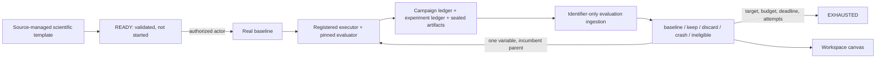
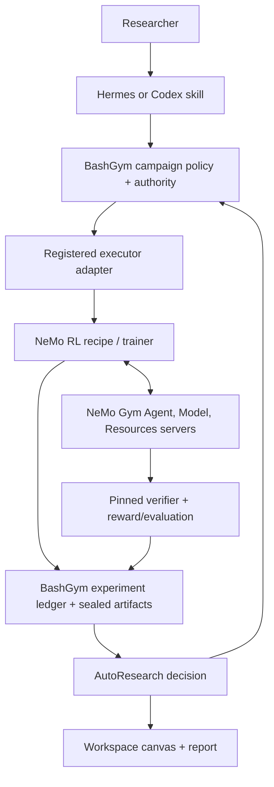

# BashGym AutoResearch: Current Capability and NVIDIA NeMo Alignment

Status: implementation brief for NVIDIA discussion, July 2026.

## Executive summary

BashGym now has a durable, baseline-first AutoResearch control plane that Hermes,
Codex, the CLI, REST clients, and the workspace canvas can operate without
creating separate experiment histories. It is not yet a NeMo Gym or NeMo RL
replacement. The intended integration is complementary:

- BashGym owns research intent, authority, budgets, durable state, evidence
  identity, restart recovery, and the human-facing canvas.
- NeMo RL can become a recipe-driven training executor.
- NeMo Gym can become the rollout, environment, tool, state-isolation, verifier,
  and reward substrate.
- Hermes and Codex remain interchangeable research operators through the
  source-managed BashGym skills.

The control plane is now materially more robust than a prompt plus Git branch and
TSV file. NVIDIA remains well ahead on the machinery that determines real RL
research quality: mature recipes, composable environments, multi-turn rollout
orchestration, exact token continuity, on-policy corrections, and training/
generation weight synchronization.

The next proof should be one small real BashGym campaign backed by an
installation-owned private-compute executor and pinned evaluator. The training
method is selected explicitly for that campaign rather than assumed. After that, the same
campaign contract can grow toward a NeMo Gym/NeMo RL adapter without rewriting
the governance or canvas layers.

## What exists now

### Durable scientific campaign

The authoritative AutoResearch path is a typed state machine over the existing
campaign database:



The campaign contract currently provides:

- immutable objective, target-model, data-scope, compute-profile, evaluation,
  promotion, budget, and stop-rule contracts;
- controller-owned validation that ends at `READY`, followed by a separate
  authenticated `START` gate;
- mandatory baseline-first execution;
- exactly one declared changed variable for each candidate, with the current
  incumbent as parent and prerequisite;
- durable proposal, study, action, attempt, artifact, metric, budget, event, and
  decision identities;
- explicit `real` and `simulated` provenance, with fake runs ineligible for
  quality claims;
- leases, idempotent mutations, optimistic concurrency, restart reconciliation,
  append-only evidence, and workspace isolation;
- deterministic stop checks for target metric, budget, deadline, attempt count,
  and proposal count.

### Portable templates and local bindings

One source-managed template ships with the package:

1. `autoresearch-control-smoke-v1` proves orchestration without GPU compute and
   is explicitly ineligible for quality claims.
The JSON loader is bounded, schema-validated, duplicate-safe, and packaged in
the wheel. BashGym intentionally does not ship a quality-claiming template tied
to an example model. A real campaign must resolve an installation-owned,
operator-selected trainable model revision together with exact data, compute,
and evaluator bindings before it can materialize. Machine authority remains in
installation-local profiles. That separation is the basis of the productization
model: scientific policy is portable; model selection, compute, data, evaluator,
and credential bindings are local and fail closed.

### Authoritative result boundary

Real results can no longer be submitted to the REST surface as caller-authored
metric/cost JSON. The operator supplies only:

- workspace ID;
- campaign ID;
- ledger project ID;
- evaluation-result ID.

BashGym derives and verifies the proposal role, study, run, action, all terminal
campaign attempts, ledger-attempt mapping, primary metric, evaluation suite,
verified model/data/environment context, real/simulated provenance, settled
study spend, and sealed artifact hash match. Result identity and recorded time
are server-owned. Exact replay is idempotent.

This is an important quality boundary, but two limitations remain:

- current campaign settlement treats the reserved amount as accounted actual
  cost; it is conservative spend, not yet measured device usage;
- ledger reads and the AutoResearch decision write are not yet one atomic
  transaction, and the resulting keep/discard decision is not yet projected
  back into the general experiment ledger as a decision/event pair.

### Resident worker and workspace canvas

The resident controller supports per-user Windows Task Scheduler, Linux systemd,
and macOS LaunchAgent service definitions. Scheduler leases are authoritative;
lifecycle files are diagnostic only.

The campaign API and canvas now project controller health independently as:

- `online`: current scheduler lease;
- `stale`: a controller was observed but its lease is no longer current;
- `offline`: no controller lease is present.

The canvas reads the same campaign and ledger projection as the CLI and API. It
shows baseline status, incumbent metric, budget, attempts, evidence, decisions,
and controller health; it does not implement a second state machine.

### Hermes and Codex operator skills

The repository contains source-managed `bashgym`, `bashgym-operator`, and
`training` skills. They encode the same behavior for Hermes and Codex:

- inspect live runtime before conversational memory;
- select an exact workspace/project and preserve lineage IDs;
- launch through BashGym rather than ad-hoc trainer scripts;
- distinguish smoke/runtime evidence from model-quality evidence;
- require held-out/environment evidence instead of promoting from train loss;
- respect compute, protected-eval, artifact, publication, and stop authority;
- resume from the durable campaign/ledger and curate bounded findings into
  GBrain rather than treating chat history as the experiment record.

These are BashGym's counterpart to NVIDIA's Brev etiquette, session-memory, and
AutoResearch skills. They should invoke the identifier-only evaluation-ingestion
path for real campaign outcomes.

## What NVIDIA's workflow gets right

The NVIDIA workflow is a disciplined research operating protocol, not merely an
experiment launcher. Its strongest ideas are:

- validate the complete machine/repository/model/training path before a long
  campaign;
- keep machine etiquette, durable session memory, and experiment policy as
  separate reusable skills;
- require objective, method, environment, baseline, and time budget in the
  campaign prompt;
- run a fixed baseline first, test one hypothesis at a time, and retain explicit
  keep/discard/crash history;
- take the metric from the repository's authoritative evaluator;
- preserve Git lineage for hypotheses that alter code;
- check stop rules before and after work;
- keep human review at goal, milestone, strategy, and final-interpretation gates;
- treat low-signal smokes and context drift as first-class failure modes.

The public demonstration is meaningful but should not be generalized beyond its
scope. NVIDIA reports a Qwen3-VL-2B-Instruct star-count campaign on one L40S
48-GB instance that moved from 25.0% exact accuracy on a fixed 64-example
held-out split to 96.875%, with the best scaled run using 4096 training examples,
512 validation examples, and 320 steps. That is a strong end-to-end workflow
demonstration, not evidence that every autonomous campaign will be efficient or
scientifically sound.

## Side-by-side assessment

| Capability | BashGym now | NVIDIA workflow / NeMo | Assessment |
|---|---|---|---|
| Agent operating instructions | Source-managed Hermes/Codex router, operator, training, eval, and authority rules | Brev etiquette, session memory, AutoResearch skill | Comparable pattern; both correctly externalize institutional knowledge |
| Campaign truth | Typed SQLite/WAL state, versioning, idempotency, leases, events, budgets, sealed evidence | Git branches, session diary, TSV/log ledger in the skill workflow | BashGym is stronger as a multi-operator product control plane |
| Baseline and hypothesis policy | Enforced baseline first, incumbent parent, one declared variable | Prescribed baseline first and one branch/hypothesis | BashGym enforces more of the policy in code |
| Result authority | Evaluation-result ID is resolved against run, attempt, suite, metric, budget, and artifact lineage | Agent reads the recipe/evaluator metric and logs it | BashGym's boundary is stronger; atomic projection still remains |
| Real execution | Campaign-authoritative `registered_training` resolves exact installation-owned private-compute profiles; no real quality iteration has been demonstrated yet | Demonstrated NeMo RL recipe execution on Brev | NVIDIA remains ahead on demonstrated execution |
| Operator-owned campaign execution | Private SSH transport is registered behind campaign authority with pinned materials and target-model digest | Local/Brev recipe execution is central to the walkthrough | BashGym has the control seam; the real baseline/candidate proof remains |
| Environment composition | BashGym environment and verifier features exist, but not behind the NeMo Gym server contract | Dataset + Agent Server + Model Server + Resources Server over async HTTP | NVIDIA is substantially ahead |
| Rollout isolation | Environment attempts and evidence exist; no claimed NeMo Gym parity | Per-rollout Resources Server sessions isolate tools/state and return verifier rewards | NVIDIA is ahead |
| Multi-turn RL correctness | Token strings/logprobs are retained for some rollout diagnostics | Exact message-level token IDs, on-policy fixes, multi-turn orchestration | Critical BashGym gap |
| Train/generation coordination | No NeMo Gym GRPO integration or explicit weight-sync contract | Rollout scheduling, policy loss, and training/generation weight synchronization | Critical BashGym gap |
| Human interface | Workspace canvas reconstructs live campaign, evidence, and controller status | IDE/chat, logs, reports | BashGym is stronger as a product surface |
| Fresh-clone setup | Control smoke, skills, atomic definition installer, and doctor ship; ledger/profile/service binding remains manual | Brev launchable plus setup skill supplies a demonstrated path | NVIDIA is easier for the demonstrated configuration |

## The correct integration boundary

BashGym should not replace NeMo Gym's environment services or NeMo RL's training
loop. NeMo should not replace BashGym's campaign authority and product UI.



NeMo Gym's architecture is deliberately composable: a JSONL dataset, Agent
Server, Model Server, and Resources Server communicate over asynchronous HTTP;
the Resources Server owns per-rollout state, environment tools, and verification.
Its documented RL integration footprint adds an OpenAI-compatible generation
server, on-policy token-ID corrections, Gym spin-up, rollout orchestration, and
GRPO-loop/weight synchronization. Those are the contracts BashGym should adapt
to rather than reimplement casually.

The hosted path is now named `use_nemo_customizer` and
`cloud:nemo-customizer`. Deprecated `use_nemo_gym` and `cloud:nemo` inputs are
accepted only as compatibility aliases for Customizer; they do not provide NeMo
Gym or NeMo RL integration.

## Next meaningful milestones

### P0: prove one real quality iteration

1. **Implemented:** installation-owned real definitions plus `bashgym campaign
   doctor` resolve exact model, dataset, evaluator, compute/material, and worker
   readiness without exposing private infrastructure.
   `bashgym campaign setup-autoresearch` now creates the definition atomically
   from explicit bindings and returns the exact secret-free binding plan.
2. **Implemented:** proposals use `registered_training`; the controller resolves
   an approved private-compute profile and preserves action/attempt identity,
   leases, reservations, sealing, restart recovery, and cancellation. The profile
   is also pinned to the full target-model contract digest.
3. Run an explicitly selected current trainable model as a baseline plus one
   controlled candidate on a small fixed held-out suite.
4. **Implemented:** completed campaign-linked evaluation writes automatically
   request authoritative ingestion and report ingested/deferred/not-applicable;
   the CLI remains a reconciliation/replay tool.
5. Commit the AutoResearch outcome and general-ledger decision/event atomically.

### P1: improve research quality per GPU-hour

1. Add low-signal detection using minimum steps/examples, metric variance,
   confidence intervals, and expected information gain.
2. Compare checkpoints, not only final checkpoints, against the pinned suite.
3. Produce error slices and targeted hard-case proposals from evaluator evidence.
4. Rank hypotheses by expected improvement, cost, risk, and reversibility.
5. Add Git worktree/branch/commit lineage only when a hypothesis changes trainer,
   environment, verifier, reward, or algorithm code; recipe-only scalar changes
   can remain ledger-native.

### P2: NeMo Gym / RL quality parity

1. Implement the NeMo Gym dataset, Agent Server, Model Server, and Resources
   Server adapter contracts behind a registered campaign executor profile.
2. Preserve exact prompt and generation token IDs across every message/turn;
   token strings and aggregate logprobs are insufficient for on-policy claims.
3. Support isolated multi-step/multi-turn rollouts and verifier rewards.
4. Integrate rollout scheduling, policy loss, and explicit generation/training
   weight synchronization with NeMo RL.
5. Validate against NVIDIA's integration success criteria and upstream tests.

## Productization verdict

The control plane and real-definition format are portable; first-run installation
is still more manual than it should be.

A clean clone can obtain the migrations, campaign contracts, control template,
atomic installation-definition builder/loader, Hermes/Codex skills, CLI/API
surfaces, doctor, fake smoke, and canvas code. A real definition can be bound to
a different machine without storing its host, key, or paths in source.

A clean clone cannot yet run a real campaign with one command. It must still
provide credentials, an approved dataset/evaluator, an executor profile, worker
configuration/service install, and exact installation-local paths. The setup
command now creates the portable definition and exact binding receipt; the doctor
proves the remaining bindings and explains unavailability, but the guided path
does not yet create the ledger records, worker profile, or service.

The product goal should be:

```text
clone -> bashgym setup -> campaign doctor -> control smoke -> real baseline
```

with no source edits, no personal device names, and no silent fallback from a
real profile to fake execution.

## Evidence and references

Primary external sources:

- [NVIDIA AutoResearch workflow article](https://developer.nvidia.com/blog/how-to-run-an-autoresearch-workflow-with-rl-agent-skills-and-nvidia-nemo/)
- [NVIDIA NeMo RL Auto Research skill](https://github.com/NVIDIA/skills/blob/main/skills/nemo-rl-auto-research/SKILL.md)
- [NeMo Gym architecture](https://docs.nvidia.com/nemo/gym/main/about/architecture)
- [NeMo Gym RL integration footprint](https://docs.nvidia.com/nemo/gym/main/contribute/rl-framework-integration/gym-integration-footprint-and-form-factor)
- [NeMo Gym on-policy corrections](https://docs.nvidia.com/nemo/gym/main/contribute/rl-framework-integration/openai-compatible-http-server-on-policy-correction)

BashGym implementation references:

- [Durable AutoResearch campaign](autoresearch-campaign.md)
- [Project-isolated experiment ledger](experiment-ledger.md)
- `bashgym/campaigns/autoresearch.py`
- `bashgym/campaigns/worker_service.py`
- `bashgym/api/campaign_routes.py`
- `frontend/src/components/terminal/nodes/CampaignNode.tsx`
- `assistant/workspace/skills/bashgym-operator/SKILL.md`
- `assistant/workspace/skills/training/SKILL.md`

Verified in this milestone:

- the atomic installer requires an explicit immutable trainable base and emits
  the exact secret-free ledger/private-compute binding plan;
- authoritative baseline ingestion derives metric, settled cost, attempts,
  provenance, and evidence and supports exact replay;
- completed campaign-linked evaluation writes automatically request ingestion
  without rolling back durable evaluation evidence when prerequisites defer it;
- campaign/API/CLI/controller test surface passes;
- focused campaign canvas tests pass;
- project-wide frontend TypeScript validation passes.
