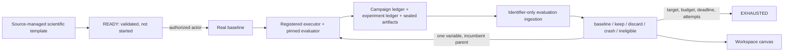
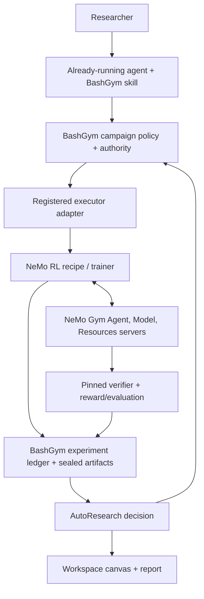

# BashGym AutoResearch: Current Capability and NVIDIA NeMo Alignment

Status: implementation brief for NVIDIA discussion, July 2026.

## Executive summary

BashGym now has a durable, baseline-first AutoResearch control plane that the
CLI, REST clients, workspace canvas, and packaged operator skills can operate
without creating separate experiment histories. The normal agent workflow
starts inside an already-running Codex, Claude Code, Hermes, or compatible
agent. BashGym installs and checks the locked public skill bundle in that host;
the shared operator skill discovers registered setup state, asks only for
missing or ambiguous choices, prepares a `READY` campaign, and stops for a
separate explicit Start approval. BashGym is not a NeMo Gym or NeMo RL
replacement. The intended integration is complementary:

- BashGym owns research intent, authority, budgets, durable state, evidence
  identity, restart recovery, and the human-facing canvas.
- NeMo RL can become a recipe-driven training executor.
- NeMo Gym can become the rollout, environment, tool, state-isolation, verifier,
  and reward substrate.
- Codex, Claude Code, Hermes, and compatible hosts use the same packaged BashGym
  operating instructions. They are interfaces over the campaign control plane,
  not launchers or separate sources of campaign truth.

This is an NVIDIA-informed, platform-native architecture. BashGym keeps its
campaign controller, evidence and human-authority model, offline-visible Control
Room, and primary local/private-compute lane independent of NeMo. NeMo RL and
NeMo Gym plug in only where their training and environment machinery adds value.

The control plane is now materially more robust than a prompt plus Git branch and
TSV file. NVIDIA remains well ahead on the machinery that determines real RL
research quality: mature recipes, composable environments, multi-turn rollout
orchestration, exact token continuity, on-policy corrections, and training/
generation weight synchronization.

That small real BashGym proof now exists: a registered private-compute baseline
and one controlled candidate were evaluated on a fixed held-out suite, with the
decision written atomically to both research and general experiment ledgers.
The next proof is the optional NeMo Gym path: trajectory collection, an observed
policy-to-generation refit, and a bounded GRPO candidate using an already
approved compatible model. No model should be downloaded or substituted merely
to complete that backend test.

The backend also retains a sealed campaign-agent/MCP boundary with two fixed
read-only actions and an optional scope-bound Codex PTY adapter. This is
low-level compatibility and security plumbing. It is not mounted in the primary
Control Room, is not the canonical agent entry point, and is not required to
prepare or Start a campaign.

## What exists now

### Durable scientific campaign

The authoritative AutoResearch path is a typed state machine over the existing
campaign database:



The campaign contract currently provides:

- immutable objective, target-model, data-scope, compute-profile, evaluation,
  promotion, budget, and stop-rule contracts;
- controller-owned validation that ends at `READY`, followed by a separate
  authenticated `START` gate;
- mandatory baseline-first execution;
- exactly one declared changed variable for each candidate, with the current
  incumbent as parent and prerequisite;
- durable proposal, study, action, attempt, artifact, metric, budget, event, and
  decision identities;
- explicit `real` and `simulated` provenance, with fake runs ineligible for
  quality claims;
- leases, idempotent mutations, optimistic concurrency, restart reconciliation,
  append-only evidence, and workspace isolation;
- deterministic stop checks for target metric, budget, deadline, attempt count,
  and proposal count.

### Portable templates and local bindings

One source-managed template ships with the package:

1. `autoresearch-control-smoke-v1` proves orchestration without GPU compute and
   is explicitly ineligible for quality claims.
   The JSON loader is bounded, schema-validated, duplicate-safe, and packaged in
   the wheel. BashGym intentionally does not ship a quality-claiming template tied
   to an example model. A real campaign must resolve an installation-owned,
   operator-selected trainable model revision together with exact data, compute,
   and evaluator bindings before it can materialize. Machine authority remains in
   installation-local profiles. That separation is the basis of the productization
   model: scientific policy is portable; model selection, compute, data, evaluator,
   and credential bindings are local and fail closed.

### Authoritative result boundary

Real results can no longer be submitted to the REST surface as caller-authored
metric/cost JSON. The operator supplies only:

- workspace ID;
- campaign ID;
- ledger project ID;
- evaluation-result ID.

BashGym derives and verifies the proposal role, study, run, action, all terminal
campaign attempts, ledger-attempt mapping, primary metric, evaluation suite,
verified model/data/environment context, real/simulated provenance, settled
study spend, and sealed artifact hash match. Result identity and recorded time
are server-owned. Exact replay is idempotent.

This is an important quality boundary. One cost limitation remains:

- current campaign settlement treats the reserved amount as accounted actual
  cost; it is conservative spend, not yet measured device usage;
- measured device usage is not yet the authoritative cost source for every
  trainer backend.

### Resident worker and workspace canvas

The resident controller supports per-user Windows Task Scheduler, Linux systemd,
and macOS LaunchAgent service definitions. Scheduler leases are authoritative;
lifecycle files are diagnostic only.

The campaign API and canvas now project controller health independently as:

- `online`: current scheduler lease;
- `stale`: a controller was observed but its lease is no longer current;
- `offline`: no controller lease is present.

The canvas reads the same campaign and ledger projection as the CLI and API. It
shows baseline status, incumbent metric, budget, attempts, evidence, decisions,
and controller health; it does not implement a second state machine.

### Compact Control Room and human visibility

AutoResearch is now a first-class sidebar destination directly below Training,
not a duplicate tab inside the direct-run monitor. Its compact Control Room uses
one atomic, versioned campaign projection and arranges active work/evidence in a
primary column with controller, launch authority, budget, and collection context
in a narrow rail. The entire shell and last verified evidence remain visible
while the API is reconciling or offline.

WebSocket traffic is an identifier-only hint, never campaign state. Every hint
causes an authenticated compact reconciliation; lifecycle controls are disabled
outside the exact live workspace/campaign authority. Start is renderer-visible
only for a live `READY` campaign, but the backend recomputes installation
bindings and the controller execution identity before writing the transition.
Success and rejection both reconcile rather than treating the response as final
campaign state.

The ordered setup backend is mounted and model-neutral. Its context projection
bounds templates, installations, and each binding kind, reports explicit
truncation, and exposes only public logical IDs and safe labels. Workspace- and
actor-scoped sessions advance through six ordered selections and can resume from
an externally sealed receipt chain after restart; inaccessible and stale choices
fail closed. The matching guided renderer now keeps the six-step registered-
resource path visible through service loss, resumes its sealed workspace
session, and stops at campaign creation so Start remains a separate human
authority decision.

The full blinded human-work queue is durable and mounted: evaluation/restart
reconciliation produces review work, claim and submission are revision-bound
and idempotent, signed receipts gate promotion, and the rest of the Control Room
remains visible during service loss. Recovery doctor/eligibility evidence feeds
a fenced resident-worker consumer with externally sealed accepted, executing,
and terminal lifecycle state; controls fail closed unless the projection proves
the registered consumer has a live controller lease.

The optional campaign-agent backend provides sealed human grants, constrained
campaign capabilities, per-action authorization, short-lived host-session
attestations, and one-time X25519/HKDF/ChaCha20-Poly1305 credential envelopes.
It stores ciphertext rather than raw bearer material. Electron main has fixed
credential-bearing heartbeat/observe/artifact transports, and its isolated
loopback MCP host exposes only `campaign_observe` and `campaign_artifacts` with
bounded schemas. Electron main directly launches and attests one scope-bound
Codex PTY, claims and activates its credential, maintains heartbeat authority,
and closes MCP/backend authority on every terminal lifecycle boundary. The
renderer receives only the public terminal identity for Workspace adoption; it
cannot call credential routes, and the MCP host has no generic forwarder or
mutation tools. A clean packaged-runtime activation/non-leak receipt remains a
compatibility proof. This adapter is not mounted in the primary Control Room and
is not required by the agent-in-place workflow. Other host adapters and mutation
actions remain separately bounded work; origin checks should not be weakened to
claim parity.

### Agent-host operator skills

The repository contains source-managed `bashgym`, `bashgym-operator`, and
`training` skills within a seven-skill public bundle. Current source provides
`bashgym operator skills install --host codex|claude|hermes` and `skills check`
to deploy the exact locked bundle into the selected host's discovery root and
verify its receipt without removing unrelated skills. This is skill
installation, not agent registration or launch. The skills encode the same
behavior across supported hosts:

- inspect live runtime before conversational memory;
- select an exact workspace/project and preserve lineage IDs;
- launch through BashGym rather than ad-hoc trainer scripts;
- distinguish smoke/runtime evidence from model-quality evidence;
- require held-out/environment evidence instead of promoting from train loss;
- respect compute, protected-eval, artifact, publication, and stop authority;
- resume from the durable campaign/ledger and curate bounded findings into
  GBrain rather than treating chat history as the experiment record.

These are BashGym's counterpart to NVIDIA's Brev etiquette, session-memory, and
AutoResearch skills. For a new campaign, the operator skill treats an initial
natural-language request as preparation authority only. It discovers the
registered six-step setup state, selects only an unambiguous singleton, asks for
only missing or ambiguous choices, runs doctor and validation, creates the
campaign at `READY`, presents the exact campaign contract, and stops for a later
explicit Start confirmation.

The setup backend, Control Room, and current-source CLI implement that contract.
The direct context, step, doctor, validation, and create wrappers have focused
end-to-end CLI coverage. The skill uses those wrappers and the identifier-only
evaluation-ingestion path for real outcomes. Installed-wheel install/check now
passes for all three supported hosts; the installed-bundle guided flow through
`READY` remains a release gate.

## What NVIDIA's workflow gets right

The NVIDIA workflow is a disciplined research operating protocol, not merely an
experiment launcher. Its strongest ideas are:

- validate the complete machine/repository/model/training path before a long
  campaign;
- keep machine etiquette, durable session memory, and experiment policy as
  separate reusable skills;
- require objective, method, environment, baseline, and time budget in the
  campaign prompt;
- run a fixed baseline first, test one hypothesis at a time, and retain explicit
  keep/discard/crash history;
- take the metric from the repository's authoritative evaluator;
- preserve Git lineage for hypotheses that alter code;
- check stop rules before and after work;
- keep human review at goal, milestone, strategy, and final-interpretation gates;
- treat low-signal smokes and context drift as first-class failure modes.

The public demonstration is meaningful but should not be generalized beyond its
scope. NVIDIA reports a Qwen3-VL-2B-Instruct star-count campaign on one L40S
48-GB instance that moved from 25.0% exact accuracy on a fixed 64-example
held-out split to 96.875%, with the best scaled run using 4096 training examples,
512 validation examples, and 320 steps. That is a strong end-to-end workflow
demonstration, not evidence that every autonomous campaign will be efficient or
scientifically sound.

## Side-by-side assessment

| Capability                        | BashGym now                                                                                                                                                                                                                                                                                         | NVIDIA workflow / NeMo                                                                | Assessment                                                                                                                                                                              |
| --------------------------------- | --------------------------------------------------------------------------------------------------------------------------------------------------------------------------------------------------------------------------------------------------------------------------------------------------- | ------------------------------------------------------------------------------------- | --------------------------------------------------------------------------------------------------------------------------------------------------------------------------------------- |
| Agent operating instructions      | Seven packaged generic workspace skills, installed-wheel install/check for Codex, Claude Code, and Hermes, and current-source guided CLI wrappers                                                                                                                                                   | Brev etiquette, session memory, AutoResearch skill                                    | Comparable pattern; both correctly externalize institutional knowledge; BashGym still needs an installed-bundle guided preparation proof                                                |
| Campaign truth                    | Typed SQLite/WAL state, versioning, idempotency, leases, events, budgets, sealed evidence                                                                                                                                                                                                           | Git branches, session diary, TSV/log ledger in the skill workflow                     | BashGym is stronger as a multi-operator product control plane                                                                                                                           |
| Baseline and hypothesis policy    | Enforced baseline first, incumbent parent, one declared variable                                                                                                                                                                                                                                    | Prescribed baseline first and one branch/hypothesis                                   | BashGym enforces more of the policy in code                                                                                                                                             |
| Result authority                  | Evaluation-result ID is resolved against run, attempt, suite, metric, budget, and artifact lineage; research/general-ledger decision is atomic                                                                                                                                                      | Agent reads the recipe/evaluator metric and logs it                                   | BashGym has the stronger product boundary                                                                                                                                               |
| Real execution                    | Campaign-authoritative `registered_training` completed a bounded baseline/candidate comparison on operator-owned compute                                                                                                                                                                            | Demonstrated NeMo RL recipe execution on Brev                                         | Both have real execution; NVIDIA remains ahead on demonstrated RL scale                                                                                                                 |
| Operator-owned campaign execution | Private SSH transport is registered behind campaign authority with pinned materials and target-model digest                                                                                                                                                                                         | Local/Brev recipe execution is central to the walkthrough                             | Comparable execution topology; BashGym adds durable authority and recovery                                                                                                              |
| Environment composition           | Deterministic Gym resources/data/config bundle and exact Gym entrypoint contract implemented; live server proof pending                                                                                                                                                                             | Dataset + Agent Server + Model Server + Resources Server over async HTTP              | Contract gap narrowed; NVIDIA remains ahead on runtime proof and breadth                                                                                                                |
| Rollout isolation                 | Unique session and async-order evidence is enforced; live concurrent Gym lifecycle remains unproven                                                                                                                                                                                                 | Per-rollout Resources Server sessions isolate tools/state and return verifier rewards | NVIDIA remains ahead                                                                                                                                                                    |
| Multi-turn RL correctness         | Exact message-level prompt/generation IDs and logprobs are required by the evidence contract; live multi-turn proof pending                                                                                                                                                                         | Exact message-level token IDs, on-policy fixes, multi-turn orchestration              | Contract exists; NVIDIA runtime proof remains ahead                                                                                                                                     |
| Train/generation coordination     | Gym launch requires async vLLM and refit evidence, but no compatible-model live refit has run                                                                                                                                                                                                       | Rollout scheduling, policy loss, and training/generation weight synchronization       | Critical remaining live-proof gap                                                                                                                                                       |
| Human interface                   | Compact offline-visible Control Room, workspace-canvas nodes, durable blinded review, and fenced recovery execution share one authority and stay visible offline                                                                                                                                    | IDE/chat, logs, reports                                                               | BashGym has the stronger oversight shell; NVIDIA has the more proven sample-level research workflow                                                                                     |
| Fresh-clone setup                 | Control smoke, seven generic workspace skills packaged through a 17-file allowlist, installed-wheel host install/check, source-level guided CLI wrappers, atomic definition installer, doctor, plan-first registry sync, and bounded resumable setup UI; installed-bundle guided-flow proof remains | Brev launchable plus setup skill supplies a demonstrated path                         | BashGym's control plane is portable across installations; NVIDIA remains easier for its demonstrated configuration, and BashGym's wider Git tree retains documented legacy cleanup work |

## The correct integration boundary

BashGym should not replace NeMo Gym's environment services or NeMo RL's training
loop. NeMo should not replace BashGym's campaign authority and product UI.



NeMo Gym's architecture is deliberately composable: a JSONL dataset, Agent
Server, Model Server, and Resources Server communicate over asynchronous HTTP;
the Resources Server owns per-rollout state, environment tools, and verification.
Its documented RL integration footprint adds an OpenAI-compatible generation
server, on-policy token-ID corrections, Gym spin-up, rollout orchestration, and
GRPO-loop/weight synchronization. Those are the contracts BashGym should adapt
to rather than reimplement casually.

The hosted path is now named `use_nemo_customizer` and
`cloud:nemo-customizer`. Deprecated `use_nemo_gym` and `cloud:nemo` inputs are
accepted only as compatibility aliases for Customizer; they do not provide NeMo
Gym or NeMo RL integration.

## Next meaningful milestones

### P0: prove one real quality iteration

1. **Implemented:** installation-owned real definitions plus `bashgym campaign
doctor` resolve exact model, dataset, evaluator, compute/material, and worker
   readiness without exposing private infrastructure.
   `bashgym campaign setup-autoresearch` now creates the definition atomically
   from explicit bindings and returns the exact secret-free binding plan.
2. **Implemented:** proposals use `registered_training`; the controller resolves
   an approved private-compute profile and preserves action/attempt identity,
   leases, reservations, sealing, restart recovery, and cancellation. The profile
   is also pinned to the full target-model contract digest.
3. **Implemented:** an explicitly selected installed trainable model ran as a
   baseline plus one controlled candidate on a fixed held-out suite.
4. **Implemented:** completed campaign-linked evaluation writes automatically
   request authoritative ingestion and report ingested/deferred/not-applicable;
   the CLI remains a reconciliation/replay tool.
5. **Implemented:** commit the AutoResearch outcome and general-ledger
   decision/event atomically.

### P1: improve research quality per GPU-hour

Implemented: low-signal detection, checkpoint comparison, error slices, ranked
evidence-linked hypotheses, and Git worktree/branch/commit lineage for code
mutations. Recipe-only scalar changes remain ledger-native.

### P2: NeMo Gym / RL quality parity

1. **Implemented contract:** deterministic Gym bundle/archive, exact
   Gym-specific GRPO entrypoint, pinned Gym source, approved resource mount,
   training vLLM config, async HTTP generation, and trajectory-collection mode.
2. **Implemented contract:** exact prompt/generation token IDs and logprobs,
   deterministic component rewards, refit identity, campaign-attempt binding,
   artifact sealing, and AutoResearch evidence references.
3. Run isolated multi-step/multi-turn rollouts and verifier rewards on an
   already-approved compatible model.
4. Observe and seal the exact generation/training weight refit; never infer it
   from process success.
5. Validate the live run against NVIDIA's integration success criteria and
   upstream tests, then run one baseline/candidate comparison through NeMo RL.

## Productization verdict

The installed control plane and real-definition format are portable; real
hardware activation is still more manual than it should be. This verdict is
specific to the current AutoResearch path. Legacy machine-specific utilities
and environment aliases elsewhere in the repository remain productization debt.

A clean clone can obtain the migrations, campaign contracts, control template,
atomic installation-definition builder/loader, seven generic workspace skills
packaged through an explicit 17-file allowlist, CLI/API surfaces, doctor,
packaged docs, and canvas code. `bashgym campaign
control-smoke --json` now proves the durable scheduler, simulated execution,
sealing, metrics, ineligible decision, and restart recovery without a GPU or API
key. A real definition can be bound to a different machine without storing its
host, key, or paths in source.

Current source also installs and checks the locked skill bundle in explicit
Codex, Claude Code, or Hermes discovery roots without removing unrelated skills.
That host-install path is distinct from launching an agent. The direct guided
CLI wrappers, guided backend, and Control Room implement the same ordered setup
contract in current source. Installed-wheel install/check passes for all three
roots; the full guided flow from the installed bundle remains release work.

A clean clone can now plan or apply the missing installation records with
`bashgym campaign activate-autoresearch`. The command resolves an operator-
registered SSH device, preflights it, hashes exact dataset/evaluator/training
material, verifies private Git scopes and entrypoints, creates or replays ledger
records, atomically merges protected source/executor profiles, optionally
installs the per-user resident worker, and returns the direct doctor result.
It never selects a model or backend and it refuses identity conflicts.

After activation, `bashgym campaign sync-autoresearch-registry` creates a
read-only, bounded, secret-free plan from exact installed executor, dataset, and
evaluator evidence. Applying that reviewed plan requires an explicit
installation ID plus installation-owned controller authority and writes the
logical registry atomically and idempotently. The guided-setup context then
publishes bounded discovery, while externally sealed six-step sessions preserve
workspace/actor scope and restart continuity. This reduces manual copying; it
does not move host names, key paths, source credentials, runtime paths, or lease
secrets into the repository.

The campaign-agent REST/persistence layer, fixed main-only action transports,
isolated two-tool MCP host, and main-spawned Codex lifecycle remain optional
read-only compatibility plumbing. Credential claim, heartbeat, PTY/MCP binding,
scope-correct Workspace adoption, and teardown remain main-owned without
exposing the credential to the renderer or terminal. They are not mounted in
the primary Control Room and are not required by the shared skill workflow.
Clean packaged-runtime proof is still required before claiming that optional
adapter as release-ready; other host adapters and mutation actions are separate
work.

The desktop is also model-neutral: live hardware discovery may recommend
compatible candidates, but it cannot silently populate the Training or
AutoResearch base-model field. An operator selection is required before launch.

The remaining proof is hardware-gated: run that installed path with an existing
operator-approved trainable model through a bounded real baseline and
authoritative evaluation. Local hardware currently uses the same protected SSH
executor (including localhost SSH); BashGym does not claim a native same-process
campaign executor yet.

The product goal should be:

```text
clone -> install -> install/check agent skills -> control smoke -> register local/private bindings -> prepare READY -> explicit Start -> real baseline
```

with no source edits, no personal device names, and no silent fallback from a
real profile to fake execution.

## Evidence and references

Primary external sources:

- [NVIDIA AutoResearch workflow article](https://developer.nvidia.com/blog/how-to-run-an-autoresearch-workflow-with-rl-agent-skills-and-nvidia-nemo/)
- [NVIDIA NeMo RL Auto Research skill](https://github.com/NVIDIA/skills/blob/main/skills/nemo-rl-auto-research/SKILL.md)
- [NeMo Gym architecture](https://docs.nvidia.com/nemo/gym/main/about/architecture)
- [NeMo Gym RL integration footprint](https://docs.nvidia.com/nemo/gym/main/contribute/rl-framework-integration/gym-integration-footprint-and-form-factor)
- [NeMo Gym on-policy corrections](https://docs.nvidia.com/nemo/gym/main/contribute/rl-framework-integration/openai-compatible-http-server-on-policy-correction)

BashGym implementation references:

- [Durable AutoResearch campaign](autoresearch-campaign.md)
- [Project-isolated experiment ledger CLI](agent-cli.md)
- `bashgym/campaigns/autoresearch.py`
- `bashgym/campaigns/guided_setup.py`
- `bashgym/campaigns/registry_sync.py`
- `bashgym/campaigns/campaign_recovery.py`
- `bashgym/campaigns/campaign_agents.py`
- `bashgym/campaigns/campaign_agent_sessions.py`
- `bashgym/campaigns/worker_service.py`
- `bashgym/api/campaign_routes.py`
- `bashgym/api/campaign_agent_routes.py`
- `frontend/electron/campaignBridge.ts`
- `frontend/electron/campaignAgentMcpHost.ts`
- `frontend/src/components/terminal/nodes/CampaignNode.tsx`
- `assistant/workspace/skills/bashgym-operator/SKILL.md`
- `assistant/workspace/skills/training/SKILL.md`

Verified in this milestone:

- the atomic installer requires an explicit immutable trainable base and emits
  the exact secret-free ledger/private-compute binding plan;
- authoritative baseline ingestion derives metric, settled cost, attempts,
  provenance, and evidence and supports exact replay;
- completed campaign-linked evaluation writes automatically request ingestion
  without rolling back durable evaluation evidence when prerequisites defer it;
- guided setup bounds discovery, persists ordered scope-bound session choices,
  and verifies its external receipt chain on resume;
- registry synchronization plans without writes or private data, then applies
  only with reviewed installation authority in an atomic idempotent transaction;
- recovery requests are externally sealed and consumed through resident-worker
  accepted, executing, and terminal lifecycle states;
- optional campaign-agent grants, attachments, action authorization, host-session
  attestations, encrypted one-time delivery, fixed main-only action transports,
  the isolated two-tool MCP host, and the scope-bound Codex PTY lifecycle fail
  closed across activation and teardown;
- the clean wheel packages seven generic workspace skills through an explicit
  17-file allowlist and verifies both installed discovery and representative
  documented commands from an arbitrary working directory;
- source-level host installation/checking and direct guided-setup CLI wrappers
  are implemented for Codex, Claude Code, and Hermes; installed-wheel host and
  guided-flow proofs remain pending release verification;
- the sequential campaign suite passes 379 tests with one intentional skip;
- the campaign API route/WebSocket slice passes 97 tests, and the installed
  CLI/operator/packaging/fixture slice passes 314 tests;
- all 448 frontend tests, zero-warning lint, TypeScript validation, and web plus
  renderer/main/preload production builds pass;
- an existing Windows unpacked artifact passes the offline preload and real PTY
  lifecycle smoke; the same probe is wired after native CI builds on Windows,
  Linux, and macOS.
