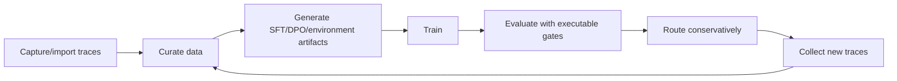

# BashGym External AI/ML Review Packet

This packet is for sharing BashGym with ML researchers, infra engineers, and
agent-eval practitioners. It states what is implemented, what is still pending,
what claims we are not making yet, and exactly where feedback would help.

Companion docs:

- [training-methods-reference.md](training-methods-reference.md)
- [capability-map.md](capability-map.md)
- [tmax-terminal-rl-recipe.md](tmax-terminal-rl-recipe.md)
- [world-models.md](world-models.md)
- [metrics-runbook.md](metrics-runbook.md)
- [session-distillation.md](session-distillation.md)
- [private-compute-eval-checklist.md](private-compute-eval-checklist.md)

---

## Executive Summary

BashGym is a training and evaluation platform for open-model coding agents built
around verified terminal work.

The core thesis is that useful agent training data is not just prompt/response
text. It is a full trajectory:

```text
task + repo/context + commands/tool calls
  -> terminal observations / diffs / tests / verifier result
  -> training artifact + evaluation evidence
```

BashGym turns those trajectories into supervised examples, preference pairs,
executable terminal environments, rollout replay, verifier rewards, and model
promotion gates. The platform is evaluation-first: loss curves, reward curves,
and world-model diagnostics can guide training, but promotion depends on
heldout behavior, executable pass@k, tamper controls, spurious-reward checks,
and external benchmark evidence.

The current claim is narrow:

> BashGym has a coherent, auditable platform contract for turning verified
> terminal work into open-model training data, running multiple training
> methods, and requiring behavior/safety evidence before model promotion.

We are not yet claiming broad state-of-the-art model performance.

---

## What We Want Reviewed

We want reviewers to evaluate whether BashGym's training/evaluation
architecture is technically sound, whether the method boundaries are honest, and
whether the platform exposes the right artifacts for reproducible open-model
agent improvement.

Highest-value feedback areas:

1. Whether the method sequence is right: SFT/distillation before RL unless
   reward contrast already exists.
2. Whether terminal environments and DPPO replay are the right abstractions for
   multi-step coding-agent RL.
3. Whether ECHO/RWML world-model objectives are technically coherent and
   correctly framed as auxiliary diagnostics.
4. Whether the release gates are strong enough to prevent reward hacking,
   benchmark leakage, and superficial metric wins.
5. Whether the platform exposes enough run metadata for another ML team to
   reproduce, audit, or challenge a result.

---

## Platform Thesis

BashGym makes the executable environment the unit of training and evaluation.

A terminal-agent model should not be judged only by next-token loss or chat
preference. It should be judged by whether it can act in a repo, run commands,
observe failures, make edits, pass verifiers, avoid protected-file tampering,
and improve on unseen tasks.

The platform loop:



BashGym should make model improvement auditable at every stage, not a black-box
fine-tune followed by subjective acceptance.

---

## Current Capability Matrix

| Area | Current capability | Status |
|---|---|---|
| SFT | Gold trace and curated JSONL training for tool-call format, repo conventions, command style, and first student baseline. | Ready |
| DPO | Chosen/rejected pair training after SFT. | Ready |
| GRPO/RLVR | Verifier-backed terminal RL with reward groups, pass@k, active sampling, and zero-std filtering. | Ready with evidence |
| Distillation | Teacher-to-student behavior transfer when the student is too weak for RL. | Ready |
| Session Distillation | Hint-injected self-distillation over failed trace spans with masked KL/CE. | Ready with evidence |
| Cascade/domain-staged training | Domain-staged curriculum training with later merge/distillation path. | Ready with evidence |
| DPPO replay | Terminal rollout replay with behavior/train logprobs and trust-region mask planning for external backends. | Backend-dependent, compute-gated |
| ECHO/RWML | JEPA-style terminal world-model contracts, replay payloads, and adapter hooks. | Backend-dependent, diagnostic |
| Heldout/eval gates | Heldout trace eval, environment pass@k, holdout gate, base-vs-candidate comparison. | Ready |
| Safety/eval controls | Spurious-reward controls, reward-hacking canaries, tamper/protected-file checks. | Ready |
| External benchmark ingest | Public benchmark evidence ingestion and release-manifest attachment. | Ready with evidence |
| Private/cloud backend smoke | Local smoke bundle and launch contract exist; installed-backend proof is pending. | Partially proven |

Status meanings:

- **Ready:** implemented and callable/configurable today.
- **Ready with evidence:** usable when valid datasets, traces, verifiers, or
  release evidence are supplied.
- **Backend-dependent:** contracts/adapters/plans exist, but a real backend must
  prove execution.
- **Diagnostic:** useful for analysis/curriculum, not a release gate alone.
- **Compute-gated:** local artifacts can be prepared; final proof requires
  private/cloud backend execution.

---

## Training Methods At A Glance

| Method | BashGym role | Required data/artifacts | Evidence that matters |
|---|---|---|---|
| SFT | First student baseline. | Gold traces or curated `messages` JSONL. | Eval loss plus heldout behavior and executable pass@k. |
| DPO | Preference refinement after SFT. | Same-prompt chosen/rejected pairs. | Reward margin, preference accuracy, no heldout regression. |
| ORPO/KTO/IPO/SimPO | Ecosystem references. | Preference-style labels, method-specific format. | Heldout behavior; not first-class BashGym workflows yet. |
| PPO/RLHF | External backend candidate. | Reward model/verifier, rollouts, KL telemetry. | Behavior gates plus reward-hacking controls. |
| GRPO/RLVR | First-class verifier-backed terminal RL. | Executable environments with reward contrast. | `reward_std`, `frac_reward_zero_std`, pass@k, timeout/tamper. |
| RLOO/REINFORCE-family | Possible future backend algorithm family. | Rollouts and rewards. | Same gates as GRPO/RLVR; not first-class today. |
| Distillation | Bridge when student is too weak for RL. | Teacher outputs/traces. | Student pass@k and tool-format behavior. |
| Cascade/domain-staged training | Curriculum and anti-forgetting path. | Domain-labeled data/envs. | Per-domain holdouts and final generalist holdout. |
| DPPO replay | Backend handoff for terminal rollouts. | Replay JSONL with rewards and logprobs. | Smoke bundle, backend logs, mask telemetry, pass@k before/after. |
| ECHO/RWML | Auxiliary terminal world-model diagnostics. | Replay with `world_model` payloads. | ECHO/RWML quality correlated with pass@k and safety, not standalone. |

Detailed method notes are in
[training-methods-reference.md](training-methods-reference.md).

---

## Data And Artifact Contracts

BashGym preserves artifacts because reproducibility depends on more than a
checkpoint.

| Artifact | Purpose |
|---|---|
| `training_examples.jsonl` | SFT/distillation examples with messages, tools, metadata, source trace, and quality score. |
| `dpo_pairs.jsonl` | Same-prompt chosen/rejected preference data with pair provenance. |
| `EnvironmentSpec` | Executable task contract: instruction, workspace/files, verifier, rollout limits, protected files. |
| `metrics.jsonl` | Training/run telemetry: loss, reward, pass@k, timeout/tamper, world-model metrics, hardware health. |
| `dppo_replay.jsonl` | Terminal rollout trajectories with reward, behavior/train logprobs, and optional world-model payloads. |
| `session_distillation_records.jsonl` | Original/hinted contexts, target span, loss mask, reader confidence, verifier outcome, and provenance. |
| `backend_smoke_readiness.json` | Local DPPO/ECHO/RWML handoff status before private/cloud backend work. |
| `release_evidence.json` | Heldout verdict, environment gates, external benchmarks, and diagnostic world-model quality. |

Recommended addition before serious external review:

### Run Card

Every serious run should have a single run card tying together:

```yaml
run_id:
git_commit:
branch:
base_model:
model_family_profile:
training_method:
training_command:
training_config:
data_artifacts:
  training_examples:
  dpo_pairs:
  environments:
  dppo_replay:
split_manifest:
decontamination_manifest:
backend:
hardware:
seed:
thresholds:
metrics_path:
release_evidence_path:
smoke_bundle_path:
outputs:
known_limitations:
decision:
```

This is the most important missing reproducibility artifact.

---

## Evaluation Philosophy

BashGym's evaluation policy is deliberately conservative:

- Loss is training health, not release evidence.
- Reward is useful only when verifier quality and reward contrast are healthy.
- Preference accuracy is not enough without heldout behavior.
- World-model metrics are diagnostic until correlated with behavior.
- pass@k, heldout gates, base-vs-candidate comparisons, spurious controls,
  tamper canaries, and external benchmarks are promotion evidence.

A trained student does not need to replace the teacher everywhere. BashGym is
designed for conservative routing: send the student only to task regions where
evidence shows it is good enough, and fall back elsewhere.

Minimum promotion package:

- Heldout trace eval is not worse than baseline.
- Environment pass@k improves or meets threshold.
- Grouped holdout gate passes.
- Base-vs-candidate comparison passes when available.
- Spurious-reward controls stay clear.
- Reward-hacking/tamper canaries fail closed.
- External benchmark evidence is attached for broad claims.
- DPPO/ECHO/RWML runs preserve smoke readiness and backend logs.
- World-model quality remains diagnostic.

---

## Platform Surfaces To Inspect

| Surface | What reviewers should inspect |
|---|---|
| Agent CLI | `bashgym manifest --json`, `bashgym training capabilities --json`, `bashgym training plan --strategy <strategy> --json`, `bashgym training analyze ... --json`, `bashgym training smoke-bundle ... --json`. |
| Training API | Start, monitor, pause/resume/stop, export, inspect runs, managed submit. |
| Environment API | Import/materialize terminal environments, local/model rollout, pass@k, holdouts, DPPO replay. |
| Eval API | Heldout eval, verdicts, external benchmark ingest, reward-hacking controls, DPPO smoke planning. |
| Device/hardware API | Private compute readiness, GPU/system/model-fit checks. |
| UI | Training Config, Training Monitor, Training Guides, World-Model Quality panel, Environment Lab, Evaluator, Models, Settings/Devices. |

---

## Claims We Are Not Making Yet

We are not yet claiming:

- BashGym-trained models beat frontier coding agents broadly.
- Any specific open model family is the final target.
- DPPO is fully proven in production before an installed-backend smoke succeeds.
- ECHO/RWML world-model metrics improve downstream agent performance yet.
- Loss, reward, KL, entropy, or preference accuracy alone justify promotion.
- External benchmark scores are valid without leakage/decontamination manifests.
- The student should replace the teacher globally.

The honest current state:

- SFT and DPO workflows are ready.
- GRPO/RLVR is ready when executable tasks and reward contrast exist.
- Evaluator/release gates are strong and implemented.
- Session Distillation contracts are implemented, but need local runtime and
  heldout recovery-decision proof.
- DPPO/ECHO/RWML contracts are implemented, but need installed-backend
  private/cloud proof.
- The expert-facing weak spot is proof and reproducibility packaging, not the
  basic architecture.

---

## Known Risks And Recommended Fixes

| Priority | Risk | Recommended fix before broad claims |
|---|---|---|
| P0 | Private/cloud backend proof is still pending for DPPO/ECHO/RWML. | Run one tiny installed-backend smoke with saved logs, metrics, launch env, and output listing. |
| P0 | No canonical run card ties config, data, commit, hardware, thresholds, and outputs together. | Add run-card schema and require it for serious runs. |
| P0 | ECHO/RWML claims could be overread as proven world-model gains. | Keep wording conservative: contracts/adapters implemented; behavior correlation pending. |
| P1 | Eval rigor needs claim-tier thresholds. | Define local-smoke, narrow-routing, and broad-claim evidence tiers. |
| P1 | External backend boundary is contract-based, not first-class integration. | Pick one primary backend, likely SkyRL or verl, and maintain one shim/integration test. |
| P1 | Safety controls can be optional if evidence is not attached. | Make no tamper, no spurious pass, and verifier error thresholds mandatory for promotion. |
| P1 | Dataset quality needs reviewer-friendly cards. | Add dataset cards for gold traces, failed traces, synthetic data, public data, and terminal environments. |
| P2 | Metric thresholds are starter heuristics. | Separate observed metrics, warning thresholds, and release blockers; calibrate after real runs. |

---

## Reviewer Questions

### For ML Researchers

1. Is the method sequence correct: SFT/distillation before RL unless reward
   contrast already exists?
2. Are GRPO/RLVR the right first RL methods for terminal-agent tasks?
3. Is DPPO replay the right abstraction for multi-step terminal rollouts?
4. Are ECHO and RWML useful auxiliary objectives, or should BashGym use a
   different world-model formulation?
5. What evidence would convince you that world-model quality improves agent
   behavior?
6. What metrics are missing from the training-health and release-evidence stack?
7. Are there failure modes where current gates could approve a bad model?

### For Infra Engineers

1. Is the replay/artifact contract sufficient for external trainer backends?
2. Are smoke-bundle and launch-env artifacts enough to debug private/cloud backend
   failures?
3. What operational metrics should be mandatory before scaling a run?
4. Are there reproducibility gaps in config snapshots, data manifests, backend
   versions, or hardware profiles?
5. What should be added to make failed runs easier to resume, replay, or bisect?
6. Which backend should be canonical first: TRL, verl, SkyRL, OpenRLHF, Axolotl,
   or another stack?

### For Agent-Eval Practitioners

1. Are pass@k, holdout gates, comparison, spurious controls, and tamper canaries
   enough for first release gates?
2. How should terminal environments be split to avoid leakage by repo, task
   family, fixture, or solution pattern?
3. What reward-hacking canaries should be mandatory for coding agents?
4. How should external benchmarks be attached without overclaiming?
5. What confidence intervals or bootstrap procedures should be standard before
   promotion?
6. What does "good enough to route narrowly" mean for practical coding-agent
   workflows?

### General Final Questions

1. What is the strongest part of BashGym's approach?
2. What is the weakest technical assumption?
3. What should be removed or de-scoped?
4. What should be proven before longer private/cloud runs?
5. What would make this credible to open-source ML contributors?
6. What is the most important missing artifact for reproducibility?

---

## Suggested Outreach Message

```text
We are building BashGym, a training/eval platform for open-model coding agents.
The core idea is to train from verified terminal trajectories rather than plain
prompt/response data, then promote models only when they pass executable
behavior and safety gates.

We would value your review of the architecture. In particular, we want critical
feedback on our method sequencing, terminal RL replay contract, ECHO/RWML
world-model framing, and evaluation gates.

We are not asking you to validate broad performance claims. We are specifically
asking whether the platform contract and evidence ladder are technically sound
enough to justify deeper backend/compute runs and broader open-source
collaboration.
```

---

## Recommended Attachments

Attach or link:

- [overview.md](overview.md)
- [training-methods-reference.md](training-methods-reference.md)
- [capability-map.md](capability-map.md)
- [strategy-guide.md](strategy-guide.md)
- [metrics-runbook.md](metrics-runbook.md)
- [world-models.md](world-models.md)
- [tmax-terminal-rl-recipe.md](tmax-terminal-rl-recipe.md)
- [session-distillation.md](session-distillation.md)
- [private-compute-eval-checklist.md](private-compute-eval-checklist.md)
- Example `bashgym training capabilities --json`
- Example `bashgym training plan --strategy sft --json`
- Example `bashgym training plan --strategy session-distillation --json`
- Example `bashgym training plan --strategy grpo --data terminal_envs --hardware private_compute --json`
- Example `bashgym training analyze --json`
- Example smoke-bundle output after the private/cloud backend smoke succeeds

---

## Source References

- Hugging Face TRL: https://huggingface.co/docs/trl/en/index
- TRL SFT Trainer: https://huggingface.co/docs/trl/en/sft_trainer
- TRL DPO Trainer: https://huggingface.co/docs/trl/en/dpo_trainer
- TRL GRPO Trainer: https://huggingface.co/docs/trl/en/grpo_trainer
- Unsloth docs: https://unsloth.ai/docs
- verl docs: https://verl.readthedocs.io/
- SkyRL docs: https://docs.skyrl.ai/
- OpenRLHF docs: https://openrlhf.readthedocs.io/
- Axolotl RLHF docs: https://docs.axolotl.ai/docs/rlhf.html
- I-JEPA: https://arxiv.org/abs/2301.08243
- LeCun, A Path Towards Autonomous Machine Intelligence: https://openreview.net/pdf?id=BZ5a1r-kVsf
