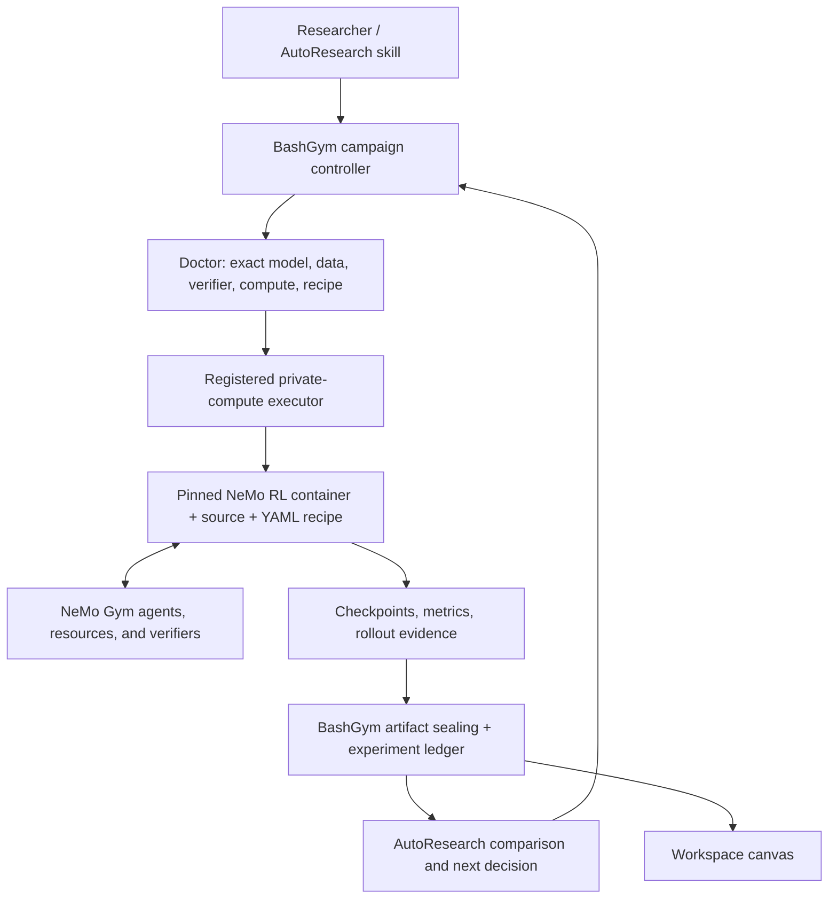

# NeMo RL as a BashGym Training Backend

Status: architecture decision, verified runtime fit, and first native parity
slice, 2026-07-14.

## Decision

Integrate NeMo RL as an optional, installation-owned training backend behind
BashGym's existing `registered_training` campaign executor. Do not replace the
BashGym campaign controller, experiment ledger, private-compute registry,
artifact sealer, or workspace canvas.

Use the lightest proven trainer for bounded SFT/LoRA experiments. Use NeMo RL
when a study needs capabilities its runtime already solves well:

| Study shape | Preferred backend |
|---|---|
| Small SFT/LoRA baseline or candidate | Existing BashGym Unsloth/plain-transformers path |
| Single-turn GRPO with a simple verifier | Existing path first; NeMo RL when rollout throughput or refit becomes material |
| Multi-step or multi-turn RL | NeMo RL plus NeMo Gym |
| DAPO on the existing single-node trainer | Existing path with explicit asymmetric clipping; NeMo RL remains an option |
| GDPO multi-reward training | BashGym contract/math is adapter-ready; NeMo RL is the first full-loop backend |
| GSPO, asynchronous RL, or on-policy distillation | NeMo RL |
| Multi-GPU or multi-node post-training | NeMo RL DTensor or Megatron backend |
| Hosted NeMo Customizer | Separate optional `cloud:nemo-customizer` lane |

This preserves a small local development loop without rebuilding NeMo RL's
resource, isolation, rollout, and weight-synchronization machinery inside
BashGym.

## Native formulas and environment contracts

NeMo RL remains optional. BashGym now owns the generally useful parts that do
not require NeMo's runtime:

- `bashgym.gym.policy_optimization` implements asymmetric and dual-clipped
  policy objectives, GDPO per-component normalization, DAPO overlong reward
  shaping, and global token/sequence normalization without Torch, Ray, TRL, or
  NeMo imports;
- the existing TRL/Unsloth GRPO generators now pass explicit `epsilon` and
  `epsilon_high` values, so DAPO Clip-Higher is an actual training setting and
  not merely a `loss_type` label;
- `RewardComponentSpec` gives environments named, weighted reward components;
- local rollouts preserve both the scalar total and each named component in
  attempt evidence, and fail closed if a component-aware verifier omits or
  misstates its reward output.

A component-aware verifier prints a JSON object on stdout, preferably as its
last line:

```json
{
  "reward_components": {
    "correctness": 1.0,
    "format": 0.5
  },
  "total_reward": 1.1
}
```

`total_reward` is optional and, when present, must equal the weighted component
total declared by the environment. This keeps scalar GRPO/evaluation consumers
backward compatible while retaining the richer signal needed by GDPO.

The implementations follow the published formulas described in NVIDIA's
[GRPO/GDPO guide](https://docs.nvidia.com/nemo/rl/0.6.0/guides/grpo.html),
[loss-normalization design](https://docs.nvidia.com/nemo/rl/0.6.0/design-docs/loss-functions.html),
[environment guide](https://docs.nvidia.com/nemo/rl/0.6.0/guides/environments.html),
and [DAPO guide](https://docs.nvidia.com/nemo/rl/0.5.0/guides/dapo.html).
They are independent BashGym implementations, not copied NeMo source. NeMo RL
itself is Apache-2.0 licensed.

The next adapter step is to feed the named component columns into a real GDPO
trainer and compare its advantages against the native reference math. Exact
generation token IDs, training/inference importance correction, distributed
global counts, async scheduling, and weight refit remain backend/runtime work;
the presence of these pure functions does not claim those capabilities.

## Why it fits

[NeMo RL v0.6](https://github.com/NVIDIA-NeMo/RL) supplies Ray-based resource
placement and worker isolation, DTensor and Megatron training backends, vLLM and
SGLang generation, sequence packing, LoRA for SFT/GRPO/DPO, VLM support,
GRPO/DAPO/GDPO/GSPO, asynchronous RL, and on-policy distillation. Its default
configuration can run a one-GPU GRPO smoke, while the same actor interfaces can
scale to larger clusters.

[The NeMo Gym integration](https://docs.nvidia.com/nemo/rl/nightly/design-docs/nemo-gym-integration.html)
runs Gym as a Ray actor, exposes NeMo RL's vLLM worker through an
OpenAI-compatible HTTP server, collects multi-turn rollouts, obtains token IDs
from the generation tokenizer, and refits generation workers after policy
updates. These are correctness boundaries, not just performance features.

[NeMo RL model support](https://docs.nvidia.com/nemo/rl/latest/about/model-support.html)
has broad Hugging Face coverage through `AutoModelForCausalLM` and
`AutoModelForImageTextToText`, with a narrower list of optimized and reproduced
recipes. A model being present in the Hugging Face cache is therefore not enough
to claim support: BashGym must distinguish `broad_api_compatible`,
`recipe_reproduced`, and `optimized` during doctor checks.

The current installation audit established that a registered private-compute
target already has Docker and the NVIDIA container runtime, and that the NeMo RL
v0.6.0 image publishes both AMD64 and ARM64 manifests. NeMo RL, Ray, and vLLM are
not installed in the target's base Python environment and the image is not
cached. A containerized integration is consequently the cleanest and most
portable path. No image was pulled and no training process was launched during
this audit.

## Ownership boundary



BashGym owns authorization, budgets, model/data/evaluator identity, proposal and
attempt lineage, leases, cancellation, output collection, sealing, evaluation
ingestion, keep/discard decisions, and UI projection.

NeMo RL owns the Ray cluster, actor placement, policy training, generation
workers, rollout scheduling, optimizer state, checkpoint production, and
training-to-generation weight synchronization. NeMo Gym owns environment and
agent server lifecycles, per-rollout state, tools, and verifier reward.

## Installation contract

The portable repository should ship schemas, a bootstrap command, wrapper code,
and tests. The operator installation should supply the mutable/private facts:

- registered private-compute profile and credential reference;
- NeMo RL release or source commit;
- platform-specific container image digest, never only a mutable tag;
- exact model ID and immutable model revision;
- exact recipe/config digest and explicit overrides;
- dataset and evaluation-suite IDs plus immutable artifacts;
- NeMo Gym environment/agent/resource config digests when used;
- secret references, cache paths, output paths, and budget limits.

`campaign doctor` must fail closed when the source/image, model support level,
GPU runtime, disk, recipe, data, verifier, worker, or output collection contract
is unresolved. Doctor may inspect a registry manifest, but pulling a large image
or downloading a model must remain an explicit setup action.

## Milestones

### M0 — name the products correctly

Completed. `use_nemo_customizer` and `cloud:nemo-customizer` now name the hosted
Microservices path. Deprecated `use_nemo_gym` and `cloud:nemo` inputs remain
compatibility aliases for Customizer only.

### M1 — productizable runtime bootstrap

1. Add `bashgym campaign setup-nemo-rl` for a registered private target.
2. Resolve and record the target platform's image digest from a selected NeMo RL
   release.
3. Pin or verify a NeMo RL source checkout compatible with that image.
4. Extend doctor with Docker, NVIDIA runtime, shared-memory, cache, disk, source,
   image, and model-support checks.
5. Keep image pull and model download as explicit, resumable setup actions.

### M2 — registered NeMo RL recipe executor

1. Add a small host wrapper that accepts only a validated recipe contract and
   invokes Docker with typed argv, bounded mounts, and secret references.
2. Run it through `registered_training` so campaign attempts retain leases,
   budget reservation/settlement, restart recovery, cancellation, and sealing.
3. Require `training_manifest.json`, `training_metrics.jsonl`, retained
   checkpoints/adapters, exit status, and the exact effective config.
4. Parse NeMo RL metrics and checkpoint identities into the existing experiment
   ledger rather than creating a second tracking database.

### M3 — bounded infrastructure smoke

1. Do not inherit the official example's older default checkpoint implicitly.
2. Select an explicit modern open checkpoint. Reuse an installed checkpoint only
   after a one-step model-load/forward doctor proves its NeMo AutoModel path.
3. Run a no-update load/rollout smoke, then a maximum 10-step single-GPU GRPO
   smoke with a deterministic verifier.
4. Compare exact held-out reward before and after; retain evidence without
   automatic promotion.

### M4 — BashGym environment through NeMo Gym

1. Adapt one small deterministic BashGym environment to NeMo Gym's dataset,
   agent, resources, and verifier contracts.
2. Preserve generation token IDs and message/turn boundaries in evidence.
3. Prove isolated concurrent rollouts, cancellation, reward determinism, and
   generation/training refit.

### M5 — AutoResearch campaign

Run baseline, one controlled candidate, authoritative evaluation, atomic
AutoResearch/general-ledger decision, and canvas projection using the registered
NeMo RL recipe. Only then expand to DAPO, async RL, or larger model recipes.

## Explicit non-goals

- Do not import the NeMo RL dependency graph into the BashGym desktop Python
  environment.
- Do not reimplement Ray placement, vLLM serving, on-policy token correction, or
  weight refit inside BashGym.
- Do not interpret NeMo Customizer, NeMo Gym, and NeMo RL as interchangeable.
- Do not hard-code a personal host, username, key, path, device name, or hardware
  SKU in source-managed materials.
- Do not use a cached inference quant as a trainable base or silently download a
  model because an example recipe names it.
