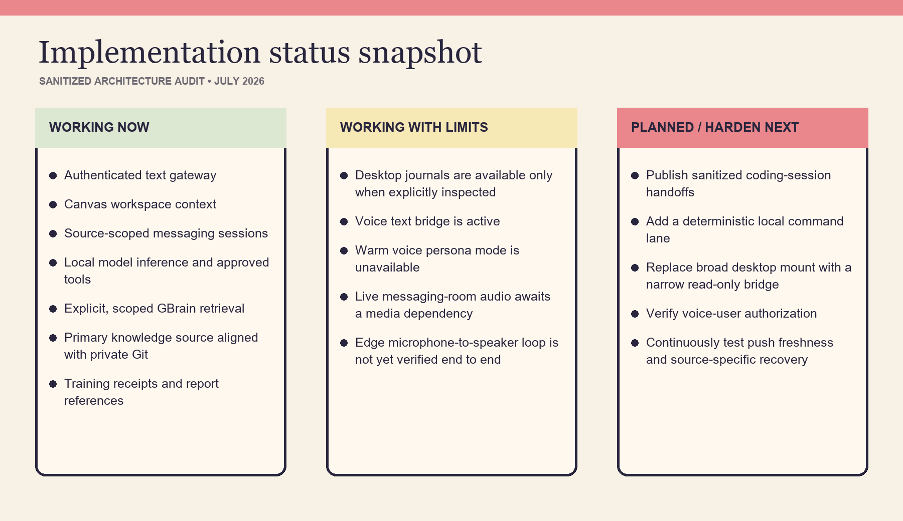
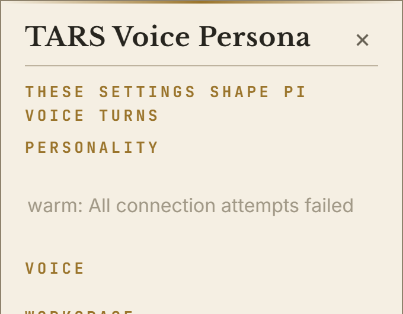

# A Local Agent, Knowledge, and Voice Architecture

## An anonymized field guide for explaining a private AI/ML workspace

**Architecture audit snapshot:** July 2026

**Audience:** builders, technical collaborators, and people learning how to describe the system

**Privacy:** device aliases, usernames, addresses, repository names, client names, channel identifiers, credentials, and private content have been removed.

---

## The one-sentence version

A home workstation provides the visual and conversational interfaces, while a dedicated local compute host runs the agent, models, tools, training workflows, and an explicitly queried knowledge service whose authored records are recoverable from a private Git repository.

## The four-layer mental model

| Layer | Job | Examples |
|---|---|---|
| Interaction | Where a person asks, observes, and approves | Visual AI/ML canvas, messaging, coding sessions, voice |
| Agent | Where requests are authenticated, scoped, reasoned about, and executed | Gateway, source-scoped sessions, local models, approved tools |
| Knowledge | Where current evidence is reconciled with durable context | Live run state, GBrain retrieval, curated training receipts |
| Durability | Where authored knowledge can be backed up and restored | Markdown sources, local search index, private Git repository |

The home workstation is the control and display plane. The dedicated host is the execution and knowledge plane. This split keeps heavy inference and automation close to the data and training environment while preserving a comfortable interface on the workstation.

## What each named component means

- **Hermes** is the local agent runtime. It owns the conversation loop, tool use, model calls, and source-scoped session continuity.
- **GBrain** is the durable knowledge and retrieval service. It stores curated decisions, outcomes, procedures, and evidence pointers. It is not a live operations database.
- **TARS** is the voice and persona layer. It converts speech to text, routes that text through the same agent runtime, and converts the response back to speech. It is not a second agent.
- **The visual AI/ML canvas** is an interaction surface for prompts, linked nodes, run status, evaluation evidence, and reports. It does not replace the agent host.

## How the home workstation connects

The architecture uses several deliberately separate lanes:

1. **Canvas request lane.** The desktop application creates a managed SSH port-forward to an agent API that appears local to the application. The request includes bearer authentication, a workspace-scoped session key, and sanitized canvas context.
2. **Messaging lane.** A message enters through the agent gateway and resumes a session scoped to that source. Its transcript is not automatically shared with the canvas.
3. **Voice lane.** Speech is transcribed close to the microphone. The resulting text crosses a trusted local network to a text bridge, resumes a voice-scoped session, and returns response text for speech synthesis.
4. **Coding-session lane.** Selected workstation journals can be inspected through a separate filesystem bridge. Availability does not mean automatic ingestion: the agent must explicitly read the relevant material.
5. **Durability lane.** Authored GBrain source files commit and push to a private Git repository. Scheduled pulls support recovery. This lane is outside the interactive request path.

The current filesystem bridge exposes more of the workstation than the ideal design and is writable at the operating-system level. The hardened target is a narrow, read-only mount containing only approved session handoffs or dashboard assets.

## What happens during one canvas request

1. The canvas derives a stable session key from the current workspace.
2. It builds a redacted summary of the linked nodes and workspace state.
3. The desktop application confirms the managed tunnel and sends the request to a localhost endpoint.
4. The gateway authenticates the request and resumes the source-scoped Hermes session.
5. Hermes reasons with the supplied context, a local model, and approved tools.
6. If durable history is needed, Hermes explicitly queries a bounded GBrain source.
7. If the request concerns a live training run, job manifests, evaluator output, and artifacts remain the operational source of truth.
8. The response returns to the canvas. Curated milestones may later be written to GBrain, but raw logs and full metric series stay with the training system.

## Automatic context versus explicit context

### Automatic

- The canvas sends sanitized workspace context with each prompt.
- Each interaction surface uses a stable, source-specific session identity.
- Gateway authentication and transport are handled by the integration.
- The runtime can use its configured local model and approved tools.

### Explicit

- GBrain retrieval must be requested or selected by the agent for the current question.
- Coding-agent journals must be inspected or published as sanitized handoffs.
- Training, evaluation, promotion, and rollback actions require the relevant workflow and evidence.
- Cross-surface reconciliation must compare provenance and freshness rather than assume a shared transcript.

### Not implied

- Messaging, canvas, voice, and coding sessions are not one giant conversation.
- A mounted directory is not automatically indexed knowledge.
- GBrain does not continuously ingest every log or private file.
- Old skill text is never authoritative for current run state.

## The freshness order

For operational questions, use the most current evidence first. Historical context becomes valuable only after current state is established.

1. **Live jobs, manifests, and evaluator output** answer what is happening now.
2. **Scoped GBrain receipts** explain prior decisions, goals, and verified outcomes.
3. **Sanitized coding-session handoffs** can bridge recent implementation context once that publishing flow is enabled.
4. **Broader memory and older sessions** are supporting context, not authority.
5. Conflicts are reconciled explicitly and the response should state where its evidence came from.

## GBrain durability and Git

GBrain has two kinds of state:

- **Authored source material** such as Markdown records, procedures, decisions, and training summaries. This is human-readable and suitable for private Git backup.
- **Derived search state** such as indexes and embeddings. This can be rebuilt from the authored sources and does not need to be treated as the canonical backup.

The main knowledge source is configured to commit and push after authored changes and to pull on a schedule for recovery. At audit time, the primary source was clean and aligned with its private remote. Isolated sources may have different durability policies, so “GBrain is backed up” should always identify which source is meant.

### What belongs in GBrain

- Goals, evaluation gates, and promotion criteria
- Dataset and model identifiers without secrets
- Run summaries and final metric snapshots
- Decisions, failures, lessons, and next actions
- Stable links or paths to reports and artifacts

### What stays outside GBrain

- Raw training logs and full metric streams
- Model checkpoints and large datasets
- Credentials, tokens, private transcripts, and unrestricted home-directory content
- Ephemeral process state that is already owned by the job runner

## Training and evaluation loop

The local agent can act as an operator around an AI/ML workspace without turning the canvas into the training engine.

1. **Preflight.** Confirm the task type, base model, dataset versions, compute budget, environment, target metrics, and stop conditions.
2. **Launch.** Start the approved training workflow on the execution host and record an immutable run identity.
3. **Observe.** Read live process state, manifests, resource telemetry, checkpoints, and loss curves.
4. **Evaluate.** Run task-appropriate benchmarks and compare the candidate with the retained baseline.
5. **Decide.** Promote, continue, revise the data/training design, or stop. A failed gate preserves the baseline.
6. **Report.** Generate charts, a session report, evidence pointers, and a concise decision receipt.
7. **Curate.** Write only the stable outcome, rationale, and artifact references to GBrain.

This loop is task-general. Embedding fine-tuning is one campaign profile; the same operator pattern can support supervised fine-tuning, preference optimization, reinforcement-learning workflows, distillation, adapters, and future full-model training.

## Voice and persona path

The voice path reuses the same agent runtime:

1. A microphone captures audio.
2. A local wake-word and endpointing layer determines when an utterance begins and ends.
3. A local speech-to-text model produces text.
4. The voice client sends that text over a trusted local network to the text bridge.
5. Hermes resumes the voice-scoped session and may use a local model, approved tools, or explicit GBrain retrieval.
6. The response text returns to the voice client.
7. A selected text-to-speech engine renders the answer for the speaker.

A planned deterministic router can handle known home commands on a separate lane, keeping simple actions fast and predictable while leaving ambiguous or conversational requests to the agent.

## Voice implementation snapshot

At audit time, the text bridge was active and the persona interface was reachable. The warm persona service was unavailable, the edge microphone-to-speaker loop was not end-to-end verified, and live messaging-room audio required a missing media dependency. Those are implementation status items, not changes to the architecture.

Recommended hardening before describing voice as production-ready:

- Restore and test the warm persona service, including its HTTP client dependency.
- Install and verify the required audio transcoding tool for live voice rooms.
- Complete microphone, wake-word, transcription, response, synthesis, and speaker testing as one trace.
- Add or verify a voice-user allowlist and per-source authorization.
- Keep voice traffic on a trusted network or authenticated tunnel; a LAN listener is not automatically safe.

## Trust boundaries

| Boundary | Current behavior | Hardened target |
|---|---|---|
| Canvas to agent host | Authenticated API through a managed SSH port-forward | Retain; rotate credentials and preserve redaction tests |
| Messaging to agent | Source-scoped gateway session | Verify sender/channel policy and tool permissions |
| Voice to text bridge | Trusted-LAN text request | Add explicit caller authorization or tunnel |
| Workstation journals | Separate filesystem bridge, explicit reads | Replace broad writable mount with narrow read-only handoff folder |
| Agent to GBrain | Explicit scoped retrieval | Require provenance, freshness, and source boundaries |
| GBrain to Git | Private authored-source backup | Monitor push failures and verify each source’s policy |
| Agent to training jobs | Approved local workflows | Enforce preflight, stop conditions, evidence, and promotion gates |

## How to describe the system

### 30-second version

“The interface lives on a normal workstation, but the agent, models, training tools, and durable knowledge run on a dedicated local host. Canvas, messaging, and voice each connect through an authenticated, source-scoped session. The agent uses current job evidence first and queries GBrain only when durable history is useful. GBrain stores curated decisions and outcomes, while its authored source is backed up to private Git. Voice is another input and output layer around the same agent, not a separate brain.”

### Two-minute version

“I split the system into interaction, execution, knowledge, and durability. The workstation is the control plane: it has the AI/ML canvas, coding sessions, messaging, and the voice client. A dedicated local compute host is the execution plane: an authenticated gateway resumes a session for the source that called it, then the Hermes runtime can use local models, approved tools, or training workflows.

The important distinction is between live operational truth and durable knowledge. If I ask what a training job is doing, the agent reads the current process, manifest, evaluator output, and artifacts first. GBrain is explicitly queried for goals, prior decisions, and verified outcomes. It stores short, curated receipts instead of copying every log. Those authored records are human-readable and backed up to a private Git repository; the search index can be rebuilt.

The voice layer follows the same path. Audio is transcribed locally, text is sent to the bridge, the same agent handles the request, and the response is synthesized back to speech. That keeps one reasoning and permission model across canvas, messaging, and voice while allowing each surface to retain its own session and privacy boundary.”

### Technical request walkthrough

Use this sequence when someone wants implementation detail:

1. Name the interaction surface and its session scope.
2. Explain the authenticated transport to the local execution host.
3. Identify the context supplied automatically by that surface.
4. State which data requires explicit retrieval or inspection.
5. Identify the current source of truth for the question.
6. Describe the model/tool action and its permission boundary.
7. Show where the response, report, and durable receipt go.
8. End with the recovery path and the remaining trust assumptions.

## What not to claim

- Do not say all surfaces share the same transcript.
- Do not say GBrain automatically knows every coding session or file.
- Do not say every GBrain source is Git-backed without checking it.
- Do not say the voice loop is fully production-ready until the edge device and live-room dependencies pass end-to-end tests.
- Do not describe a broad writable desktop mount as a read-only knowledge bridge.
- Do not treat stale skill instructions as evidence of a current job, model, or dataset state.

## Glossary

| Term | Meaning |
|---|---|
| Agent runtime | The reasoning and tool-execution loop that handles a scoped session |
| Control plane | Interfaces used to ask, observe, configure, and approve |
| Execution plane | Compute host that runs models, tools, training, and knowledge services |
| GBrain receipt | A curated, durable record of a goal, decision, result, or evidence pointer |
| Provenance | Where a fact came from and how fresh it is |
| Session scope | The boundary that keeps one surface or workspace conversation distinct |
| SSH port-forward | An encrypted connection that exposes a remote service as a local endpoint |
| SSHFS bridge | A filesystem mounted over SSH; availability does not imply ingestion |
| STT / TTS | Speech-to-text / text-to-speech |

## Reusable assets

The `diagrams` folder includes Mermaid source, SVG, PNG, and editable Excalidraw files for the overall architecture, context freshness order, and voice loop. The SVGs are suitable for documents and slides; the Excalidraw files can be rearranged for future versions.
